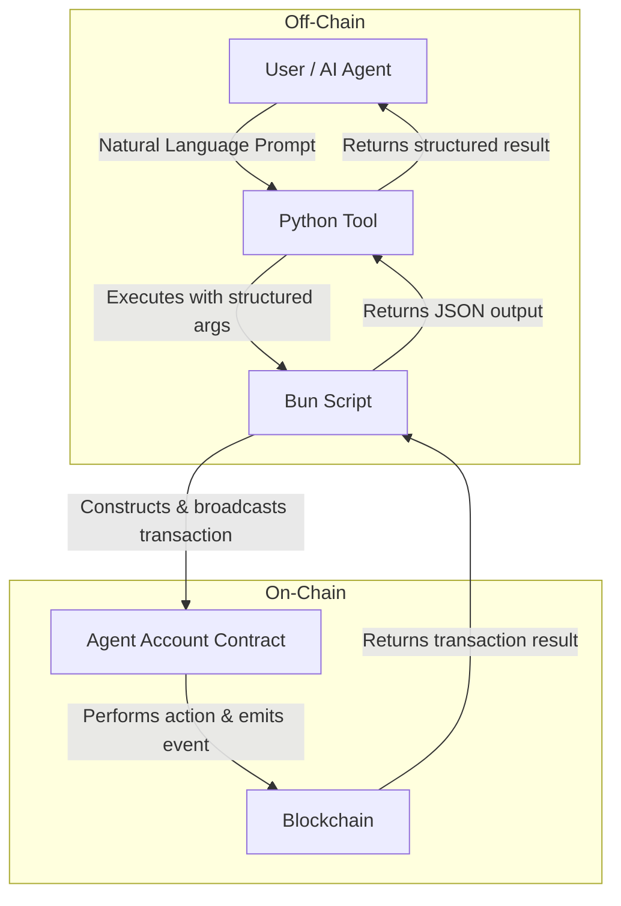

# Agent Account Tools

Agent Account tools provide a high-level interface for interacting with `aibtc-agent-account` smart contracts. These tools are designed for easy integration with AI agent frameworks, simplifying complex on-chain interactions like asset management and DAO governance. They act as wrappers around underlying scripts, abstracting away low-level details like ABI encoding.

The core purpose of an Agent Account is to create a secure proxy where an owner can deposit assets, and an agent can perform specific, permissioned actions on the owner's behalf without having direct withdrawal access.

## Key Features

- **Secure Asset Delegation**: Owners retain exclusive withdrawal rights while delegating on-chain actions.
- **Permissioned DAO Governance**: Agents can create, vote on, and conclude proposals if permitted by the owner.
- **Controlled DEX Trading**: Agents can execute trades on approved DEXs with owner-granted permissions.
- **Simplified Interactions**: Tools handle complex data formatting (e.g., encoding strings to buffers) automatically.
- **Read-Only Functions**: Provides tools to query account configuration and status without executing a transaction.

## Tool Overview

| Tool Name                              | Description                                                       |
| -------------------------------------- | ----------------------------------------------------------------- |
| `agentaccount_deploy`                  | Deploys a new agent account contract.                             |
| `agentaccount_deposit_stx`             | Deposits STX into an agent account.                               |
| `agentaccount_deposit_ft`              | Deposits Fungible Tokens (FTs) into an agent account.             |
| `agentaccount_approve_contract`        | Approves an external contract for interaction.                    |
| `agentaccount_revoke_contract`         | Revokes approval for an external contract.                        |
| `agentaccount_create_action_proposal`  | Creates a new DAO action proposal.                                |
| `agentaccount_vote_on_action_proposal` | Casts a vote on a DAO action proposal.                            |
| `agentaccount_veto_action_proposal`    | Casts a veto vote on a DAO action proposal.                       |
| `agentaccount_conclude_action_proposal`| Concludes a DAO action proposal.                                  |
| `agentaccount_faktory_buy_asset`       | Buys an asset on a Faktory DEX.                                   |
| `agentaccount_faktory_sell_asset`      | Sells an asset on a Faktory DEX.                                  |
| `agentaccount_get_configuration`       | Retrieves the configuration of an agent account.                  |
| `agentaccount_is_approved_contract`    | Checks if a contract is approved for interaction.                 |

## How It Works



The user or a higher-level AI agent provides a prompt. The appropriate Python tool is selected and executed with structured arguments. This tool calls an underlying Bun (TypeScript) script, which handles the low-level task of constructing and broadcasting the Stacks transaction. The result is then passed back up the chain.

## Tool Details

### `agentaccount_deploy`

**Purpose**: Deploys a new agent account contract with a specified owner and agent.

**Input Parameters**:
- `owner_address`: `str` - The Stacks address of the account owner.
- `agent_address`: `str` - The Stacks address of the designated agent.
- `save_to_file`: `bool` - Whether to save the contract details to a local file.

**Output**:
```json
{
  "success": true,
  "txid": "0x...",
  "contract_address": "ST1PQHQKV0RJXZFY1DGX8MNSNYVE3VGZJSRTPGZGM.aibtc-agent-account-..."
}
```

**Example Prompt**:
```
Deploy a new agent account where the owner is 'ST1PQHQKV0RJXZFY1DGX8MNSNYVE3VGZJSRTPGZGM' and the agent is 'ST2CY5V39NHDPWSXMW9QDT3HC3GD6Q6XX4CFRK9AG'.
```

### `agentaccount_deposit_stx`

**Purpose**: Deposits STX into an agent account. Can be called by the owner or the agent.

**Input Parameters**:
- `agent_account_contract`: `str` - The contract principal of the agent account.
- `amount`: `int` - The amount of STX to deposit in microSTX.

**Output**:
```json
{
  "success": true,
  "txid": "0x...",
  "data": { "amount": 1000000, "recipient": "ST1PQHQKV0RJXZFY1DGX8MNSNYVE3VGZJSRTPGZGM.aibtc-agent-account-..." }
}
```

**Example Prompt**:
```
Deposit 1,000,000 microSTX into the agent account 'ST1PQHQKV0RJXZFY1DGX8MNSNYVE3VGZJSRTPGZGM.aibtc-agent-account-...'.
```

### `agentaccount_deposit_ft`

**Purpose**: Deposits a specified Fungible Token (FT) into an agent account.

**Input Parameters**:
- `agent_account_contract`: `str` - The contract principal of the agent account.
- `ft_contract`: `str` - The contract principal of the FT to deposit.
- `amount`: `int` - The amount of the token to deposit, in its smallest unit.

**Output**:
```json
{
  "success": true,
  "txid": "0x...",
  "data": { "amount": 5000, "token_contract": "...", "recipient": "..." }
}
```

**Example Prompt**:
```
Deposit 5000 units of the token 'ST35K818S3K2GSNEBC3M35GA3W8Q7X72KF4RVM3QA.aibtc-token' into the agent account 'ST1PQHQKV0RJXZFY1DGX8MNSNYVE3VGZJSRTPGZGM.aibtc-agent-account-...'.
```

### `agentaccount_approve_contract`

**Purpose**: Approves an external contract, allowing the agent account to interact with it.

**Input Parameters**:
- `agent_account_contract`: `str` - The contract principal of the agent account.
- `contract_to_approve`: `str` - The contract principal to approve.

**Output**:
```json
{
  "success": true,
  "txid": "0x...",
  "data": { "approved_contract": "..." }
}
```

**Example Prompt**:
```
Approve the contract 'ST35K818S3K2GSNEBC3M35GA3W8Q7X72KF4RVM3QA.slow7-action-proposal-voting' for use with agent account 'ST1PQHQKV0RJXZFY1DGX8MNSNYVE3VGZJSRTPGZGM.aibtc-agent-account-...'.
```

### `agentaccount_create_action_proposal`

**Purpose**: Creates a new DAO action proposal using the agent account.

**Input Parameters**:
- `agent_account_contract`: `str` - The agent account to use.
- `dao_action_proposal_voting_contract`: `str` - The voting contract for the proposal.
- `action_contract_to_execute`: `str` - The action contract the proposal will execute.
- `dao_token_contract`: `str` - The DAO's governance token contract.
- `message_to_send`: `str` - The message for the proposal (if the action is `send-message`).
- `memo`: `Optional[str]` - An optional memo for the proposal.

**Output**:
```json
{
  "success": true,
  "txid": "0x...",
  "data": { "proposal_contract": "...", "action_contract": "..." }
}
```

**Example Prompt**:
```
Using agent account 'ST1PQHQKV0RJXZFY1DGX8MNSNYVE3VGZJSRTPGZGM.aibtc-acct-...', create an action proposal on the '...slow7-action-proposal-voting' contract to execute the '...slow7-action-send-message' action with the message "Hello from agent" and DAO token '...slow7-token'.
```

### `agentaccount_faktory_buy_asset`

**Purpose**: Buys an asset on a Faktory DEX using sBTC held in the agent account.

**Input Parameters**:
- `agent_account_contract`: `str` - The agent account to use.
- `faktory_dex_contract`: `str` - The DEX contract to trade on.
- `asset_contract`: `str` - The contract of the asset to buy.
- `amount_to_spend`: `float` - The amount of sBTC to spend.
- `slippage`: `Optional[int]` - Slippage tolerance percentage (defaults to 1).

**Output**:
```json
{
  "success": true,
  "txid": "0x...",
  "data": { "asset_bought": "...", "amount_spent_sbtc": 0.5 }
}
```

**Example Prompt**:
```
Use the agent account '...' to buy an asset on the '...slow7-token-dex'. Spend 0.5 sBTC to buy the token '...slow7-token' with 1% slippage.
```

## Workflow Examples

### Full DAO Proposal Workflow

1.  **Deploy an Agent Account**:
    ```
    Deploy a new agent account. Owner: 'ST1PQHQKV0RJXZFY1DGX8MNSNYVE3VGZJSRTPGZGM', Agent: 'ST2CY5V39NHDPWSXMW9QDT3HC3GD6Q6XX4CFRK9AG'.
    ```
2.  **Approve the Voting Contract**:
    ```
    For agent account 'ST1PQ...-acct-...', approve the contract 'ST35K...-proposal-voting'.
    ```
3.  **Create the Proposal**:
    ```
    Using agent account 'ST1PQ...-acct-...', create a proposal on 'ST35K...-proposal-voting' to execute 'ST35K...-send-message' with the message "DAO funding round announcement" and DAO token 'ST35K...-slow7-token'.
    ```
4.  **Vote on the Proposal**:
    ```
    Using agent account 'ST1PQ...-acct-...', vote 'yes' on proposal ID 1 of the 'ST35K...-proposal-voting' contract.
    ```
5.  **Conclude the Proposal**:
    ```
    Using agent account 'ST1PQ...-acct-...', conclude proposal ID 1 on 'ST35K...-proposal-voting', which executes the action 'ST35K...-send-message' with DAO token 'ST35K...-slow7-token'.
    ```

## Error Handling

The tools return a standardized JSON object on failure, including an error message and the contract's error code.

| Error Code | Constant                    | Common Cause                                                              |
| ---------- | --------------------------- | ------------------------------------------------------------------------- |
| `u1100`    | `ERR_CALLER_NOT_OWNER`      | An agent attempted an owner-only action.                                  |
| `u1101`    | `ERR_CONTRACT_NOT_APPROVED` | The target contract (e.g., a DEX or voting contract) was not approved.    |
| `u1103`    | `ERR_OPERATION_NOT_ALLOWED` | The agent does not have the required permission flag set by the owner.    |

## Security Considerations

- **Owner Control**: The owner always retains ultimate control over assets and permissions. Withdrawals are owner-exclusive.
- **Agent Permissions**: The agent's capabilities are strictly defined by three boolean flags that the owner can toggle at any time. By default, trading is disabled.
- **Contract Allowlist**: The agent account can only interact with explicitly approved contracts, preventing calls to malicious or unintended contracts.

## Related Tools

- **DAO Tools**: For direct interaction with DAO contracts, without an agent account proxy.
- **Faktory Tools**: For direct interaction with Faktory DEXs.
- **Wallet Tools**: For managing the agent's own wallet, which is used to pay transaction fees for agent account actions.
