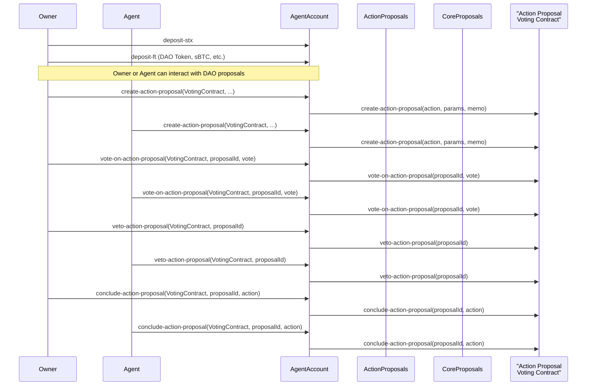
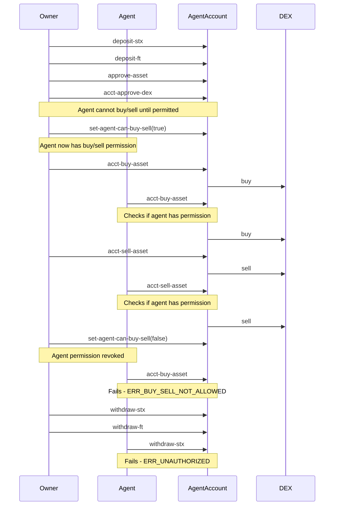

# aibtc-agent-account

The `aibtc-agent-account` contract is a specialized smart contract designed to facilitate interactions between a user (the owner) and an agent. It provides a secure mechanism for managing STX and Fungible Tokens, where only the owner can withdraw assets. The agent, with permissions granted by the owner, can perform actions such as participating in DAO proposals and trading on approved DEXs. This contract aims to provide a clear separation of roles and capabilities, ensuring the owner retains ultimate control over their funds while allowing an agent to act on their behalf within defined boundaries.

## Quick Reference

| Property       | Value                           |
| -------------- | ------------------------------- |
| Contract Name  | `aibtc-agent-account`           |
| Version        | `1.0.0`                         |
| Implements     | `.aibtc-agent-account-traits.aibtc-account`, `.aibtc-agent-account-traits.aibtc-proposals`, `.aibtc-agent-account-traits.faktory-dex-approval`, `.aibtc-agent-account-traits.faktory-buy-sell` |
| Key Parameters | `ACCOUNT_OWNER`, `ACCOUNT_AGENT`, `SBTC_TOKEN`, `DAO_TOKEN`, `DAO_TOKEN_DEX` |

**Constants**:
- `DEPLOYED_BURN_BLOCK`: Bitcoin block height at deployment.
- `DEPLOYED_STACKS_BLOCK`: Stacks block height at deployment.
- `SELF`: Contract's own principal.
- `ACCOUNT_OWNER`: Principal of the account owner (user).
- `ACCOUNT_AGENT`: Principal of the account agent.
- `SBTC_TOKEN`: Contract principal for the sBTC token.
- `DAO_TOKEN`: Contract principal for the DAO token.
- `DAO_TOKEN_DEX`: Contract principal for the DAO token DEX.

**Error Constants**:
- `ERR_UNAUTHORIZED (err u1100)`
- `ERR_UNKNOWN_ASSET (err u1101)`
- `ERR_OPERATION_FAILED (err u1102)`
- `ERR_BUY_SELL_NOT_ALLOWED (err u1103)`

## Print Events

| Event                                       | Description                                     | Data Payload Fields                                                                 |
| ------------------------------------------- | ----------------------------------------------- | ----------------------------------------------------------------------------------- |
| `aibtc-agent-account/deposit-stx`           | Emitted when STX is deposited                   | `contractCaller`, `txSender`, `amount`, `recipient` (SELF)                          |
| `aibtc-agent-account/deposit-ft`            | Emitted when a fungible token is deposited      | `amount`, `assetContract`, `sender` (txSender), `caller` (contractCaller), `recipient` (SELF) |
| `aibtc-agent-account/withdraw-stx`          | Emitted when STX is withdrawn                   | `amount`, `sender` (SELF), `caller` (contractCaller), `recipient` (ACCOUNT_OWNER)     |
| `aibtc-agent-account/withdraw-ft`           | Emitted when a fungible token is withdrawn      | `amount`, `assetContract`, `sender` (SELF), `caller` (contractCaller), `recipient` (ACCOUNT_OWNER) |
| `aibtc-agent-account/approve-asset`         | Emitted when an asset is approved               | `asset`, `approved` (true), `sender` (txSender), `caller` (contractCaller)          |
| `aibtc-agent-account/revoke-asset`          | Emitted when an asset approval is revoked       | `asset`, `approved` (false), `sender` (txSender), `caller` (contractCaller)         |
| `aibtc-agent-account/create-action-proposal`| Emitted when an action proposal is created    | `proposalContract`, `action`, `parameters`, `sender` (txSender), `caller` (contractCaller) |
| `aibtc-agent-account/vote-on-action-proposal`| Emitted when voting on an action proposal     | `proposalContract`, `proposalId`, `vote`, `sender` (txSender), `caller` (contractCaller) |
| `aibtc-agent-account/veto-action-proposal`  | Emitted when an action proposal is vetoed       | `proposalContract`, `proposalId`, `sender` (txSender), `caller` (contractCaller)    |
| `aibtc-agent-account/conclude-action-proposal`| Emitted when concluding an action proposal    | `proposalContract`, `proposalId`, `action`, `sender` (txSender), `caller` (contractCaller) |
| `aibtc-agent-account/acct-buy-asset`        | Emitted when buying an asset via Faktory DEX    | `dexContract`, `asset`, `amount`, `sender` (txSender), `caller` (contractCaller)    |
| `aibtc-agent-account/acct-sell-asset`       | Emitted when selling an asset via Faktory DEX   | `dexContract`, `asset`, `amount`, `sender` (txSender), `caller` (contractCaller)    |
| `aibtc-agent-account/acct-approve-dex`      | Emitted when a Faktory DEX is approved          | `dexContract`, `approved` (true), `sender` (txSender), `caller` (contractCaller)    |
| `aibtc-agent-account/acct-revoke-dex`       | Emitted when a Faktory DEX approval is revoked  | `dexContract`, `approved` (false), `sender` (txSender), `caller` (contractCaller)   |
| `aibtc-agent-account/set-agent-can-buy-sell`| Emitted when agent buy/sell permission is set | `canBuySell`, `sender` (txSender), `caller` (contractCaller)                      |
| `aibtc-agent-account/user-agent-account-created` | Emitted when the agent account is created  | `account` (SELF), `agent` (ACCOUNT_AGENT), `owner` (ACCOUNT_OWNER), `daoToken` (DAO_TOKEN), `daoTokenDex` (DAO_TOKEN_DEX), `sbtcToken` (SBTC_TOKEN) |

## Public Functions

### Asset Management Functions

| Function        | Description                                   | Parameters                     |
| --------------- | --------------------------------------------- | ------------------------------ |
| `deposit-stx`   | Deposit STX to the agent account              | `amount`: uint                 |
| `deposit-ft`    | Deposit fungible tokens to the agent account  | `ft`: ft-trait, `amount`: uint |
| `withdraw-stx`  | Withdraw STX from the agent account           | `amount`: uint                 |
| `withdraw-ft`   | Withdraw fungible tokens from the agent account | `ft`: ft-trait, `amount`: uint |
| `approve-asset` | Add an asset to the approved list             | `asset`: principal             |
| `revoke-asset`  | Remove an asset from the approved list        | `asset`: principal             |

### DAO Interaction Functions

| Function                   | Description                          | Parameters                                                                                  |
| -------------------------- | ------------------------------------ | ------------------------------------------------------------------------------------------- |
| `create-action-proposal`   | Create an action proposal            | `voting-contract`: action-proposal-voting-trait, `action`: action-trait, `parameters`: (buff 2048), `memo`: (optional (string-ascii 1024)) |
| `vote-on-action-proposal`  | Vote on an action proposal           | `voting-contract`: action-proposal-voting-trait, `proposalId`: uint, `vote`: bool           |
| `veto-action-proposal`     | Veto an action proposal              | `voting-contract`: action-proposal-voting-trait, `proposalId`: uint                         |
| `conclude-action-proposal` | Conclude an action proposal          | `voting-contract`: action-proposal-voting-trait, `proposalId`: uint, `action`: action-trait |

### Faktory DEX Trading Functions

| Function                 | Description                                | Parameters                                                      |
| ------------------------ | ------------------------------------------ | --------------------------------------------------------------- |
| `acct-buy-asset`         | Buy an asset from a Faktory DEX            | `faktory-dex`: `<dao-faktory-dex>`, `asset`: `<faktory-token>`, `amount`: uint |
| `acct-sell-asset`        | Sell an asset to a Faktory DEX             | `faktory-dex`: `<dao-faktory-dex>`, `asset`: `<faktory-token>`, `amount`: uint |
| `acct-approve-dex`       | Add a DEX to the approved list             | `faktory-dex`: `<dao-faktory-dex>`                               |
| `acct-revoke-dex`        | Remove a DEX from the approved list        | `faktory-dex`: `<dao-faktory-dex>`                               |
| `set-agent-can-buy-sell` | Set whether the agent can buy/sell assets  | `canBuySell`: bool                                             |

## Read-Only Functions

| Function            | Description                             | Parameters         | Returns                                                                                                                               |
| ------------------- | --------------------------------------- | ------------------ | ------------------------------------------------------------------------------------------------------------------------------------- |
| `is-approved-asset` | Check if an asset is approved           | `asset`: principal | `bool`                                                                                                                                |
| `is-approved-dex`   | Check if a DEX is approved              | `dex`: principal   | `bool`                                                                                                                                |
| `get-configuration` | Get the agent account configuration     | None               | `{ account: principal, agent: principal, owner: principal, daoToken: principal, daoTokenDex: principal, sbtcToken: principal }`      |

## Private Functions

| Function           | Description                                       | Parameters |
| ------------------ | ------------------------------------------------- | ---------- |
| `is-authorized`    | Check if caller is either the owner or the agent  | None       |
| `is-owner`         | Check if caller is the owner                      | None       |
| `is-agent`         | Check if caller is the agent                      | None       |
| `buy-sell-allowed` | Check if buy/sell operations are allowed for caller | None     |

## Error Codes

| Code  | Constant                 | Description                               |
| ----- | ------------------------ | ----------------------------------------- |
| u1100 | ERR_UNAUTHORIZED         | Caller is not authorized.                 |
| u1101 | ERR_UNKNOWN_ASSET        | Asset is not in the approved list.        |
| u1102 | ERR_OPERATION_FAILED     | The requested operation failed.           |
| u1103 | ERR_BUY_SELL_NOT_ALLOWED | Buy/sell operation not allowed for agent. |

## Security Features

- Only the owner can withdraw assets
- Only the owner and agent can interact with DAOs
- Assets must be explicitly approved before they can be deposited or withdrawn
- DEXes must be explicitly approved before they can be used for trading
- Agent buy/sell permissions can be toggled by the owner
- Pre-approved tokens and DEXes are configured at deployment
- All actions are logged with detailed print events
- Permission checks are performed via private functions (`is-authorized`, `is-owner`, `is-agent`, `buy-sell-allowed`)

## Security Considerations

### Access Control

The agent account implements strict access control:
- **Owner-only functions**: `withdraw-stx`, `withdraw-ft`, `approve-asset`, `revoke-asset`, `acct-approve-dex`, `acct-revoke-dex`, `set-agent-can-buy-sell`. These functions assert `(is-owner)`.
- **Owner and Agent functions**: `create-action-proposal`, `vote-on-action-proposal`, `veto-action-proposal`, `conclude-action-proposal`. These functions assert `(is-authorized)`, which checks if the caller is the owner or the agent.
- **Trading functions**: `acct-buy-asset`, `acct-sell-asset`. These functions assert `(buy-sell-allowed)`, which allows the owner, or the agent if `agentCanBuySell` is true.
- **Public deposit functions**: `deposit-stx`, `deposit-ft`. Anyone can deposit assets to the agent account, provided the FT is an approved asset for `deposit-ft`.

### Asset Protection

Assets in the agent account are protected by:
1. Requiring explicit approval of assets before they can be deposited or withdrawn
2. Limiting withdrawal capability to the owner only
3. Requiring explicit approval of DEXes before they can be used for trading
4. Requiring explicit permission for the agent to perform buy/sell operations

### Transparency

All actions are logged with detailed print events, providing:
1. Complete audit trail of all interactions
2. Visibility into who initiated each action
3. Details of all asset movements

### Immutability

- The user and agent addresses cannot be changed after deployment
- The contract cannot be upgraded after deployment

## Usage Scenarios

### Asset Management

The agent account allows users to securely store and manage their assets (STX and fungible tokens) with the following benefits:

- Secure storage with controlled access
- Ability to approve/revoke specific tokens
- Transparent transaction logging

### DAO Participation

The agent account enables participation in DAO governance through:

- Proposal creation
- Voting on proposals
- Concluding proposals

This allows the user to delegate certain DAO interactions to their agent while maintaining control over the assets.

## Interaction Flows

### DAO Proposal Interaction Flow



### DEX Trading Interaction Flow



### DEX Trading

The agent account enables trading on Faktory DEXes:

- Owner can always buy and sell assets
- Agent can buy and sell assets only if explicitly permitted by the owner via the set-agent-can-buy-sell function
- The owner can enable or disable agent trading permission at any time
- Only approved DEXes can be used for trading
- All trading activity is logged with detailed print events

## Deployment and Initialization

### Deployment Information

The contract stores deployment information as constants:
- `DEPLOYED_BURN_BLOCK`: The Bitcoin block height at deployment
- `DEPLOYED_STACKS_BLOCK`: The Stacks block height at deployment
- `SELF`: The contract's own principal (used for as-contract calls)

### Configuration

When deployed, the agent account is configured with:

- Owner principal (account owner with full access)
- Agent principal (limited access, can vote on proposals and trade if permitted)
- Pre-approved tokens (sBTC and DAO token)
- Pre-approved DEXes (DAO token DEX)

### Initialization

The contract automatically initializes on deployment with:
1. Setting up approved assets (sBTC and DAO token)
2. Setting up approved DEXes (DAO token DEX)
3. Setting agent trading permission to false by default
4. Emitting a creation event with the configuration details

```clarity
;; initialize approved contracts and DEXes during contract deployment (within the `begin` block)
(map-set ApprovedAssets SBTC_TOKEN true)
(map-set ApprovedAssets DAO_TOKEN true)
(map-set ApprovedDexes DAO_TOKEN_DEX true)
;; The agentCanBuySell data variable is initialized to false by default.

;; print creation event
(print {
  notification: "aibtc-agent-account/user-agent-account-created",
  payload: (get-configuration) ;; This retrieves owner, agent, tokens, etc.
})
```

## Related Contracts and Traits

The `aibtc-agent-account` contract interacts with or implements the following:

**Implemented Traits:**
- `.aibtc-agent-account-traits.aibtc-account`: Defines standard account functionalities.
- `.aibtc-agent-account-traits.aibtc-proposals`: Defines proposal interaction functionalities.
- `.aibtc-agent-account-traits.faktory-dex-approval`: Defines DEX approval functionalities.
- `.aibtc-agent-account-traits.faktory-buy-sell`: Defines DEX trading functionalities.

**Used Traits:**
- `'SP3FBR2AGK5H9QBDH3EEN6DF8EK8JY7RX8QJ5SVTE.sip-010-trait-ft-standard.sip-010-trait` (ft-trait): For fungible token interactions.
- `.aibtc-dao-traits.action` (action-trait): For defining actions in proposals.
- `.aibtc-dao-traits.action-proposal-voting` (action-proposal-voting-trait): For interacting with action proposal voting contracts.
- `.aibtc-dao-traits.faktory-dex` (dao-faktory-dex): For interacting with Faktory DEX contracts.
- `'STTWD9SPRQVD3P733V89SV0P8RZRZNQADG034F0A.faktory-trait-v1.sip-010-trait` (faktory-token): For interacting with Faktory-compatible tokens.

**Key Contract Dependencies (Constants):**
- `'STV9K21TBFAK4KNRJXF5DFP8N7W46G4V9RJ5XDY2.sbtc-token` (SBTC_TOKEN): The sBTC token contract.
- `.aibtc-faktory` (DAO_TOKEN): The DAO's primary token contract.
- `.aibtc-faktory-dex` (DAO_TOKEN_DEX): The DAO's primary token DEX contract.

