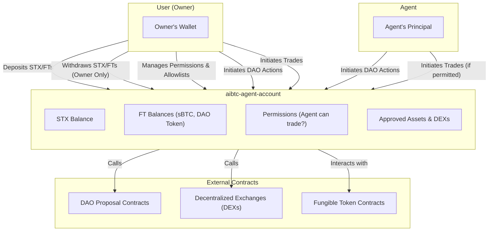
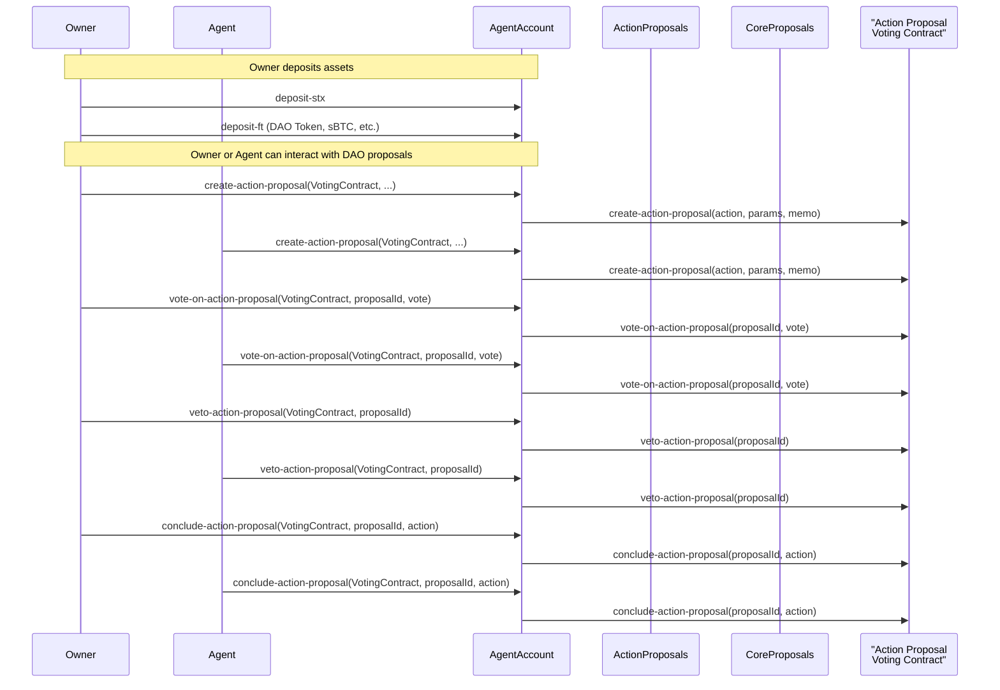
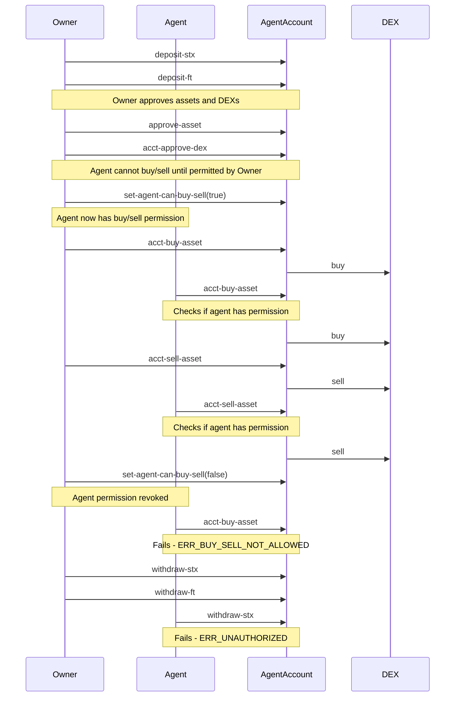

# aibtc-agent-account

The `aibtc-agent-account` contract is a specialized smart contract designed to facilitate interactions between a user (the owner) and an agent. It provides a secure mechanism for managing STX and Fungible Tokens, where only the owner can withdraw assets. The agent, with permissions granted by the owner, can perform actions such as participating in DAO proposals and trading on approved DEXs. This contract aims to provide a clear separation of roles and capabilities, ensuring the owner retains ultimate control over their funds while allowing an agent to act on their behalf within defined boundaries.

## Key Features

- **Secure Asset Management**: Owner-controlled withdrawals for STX and FTs.
- **Delegated DAO Interaction**: Agent can participate in DAO proposals on behalf of the owner.
- **Controlled DEX Trading**: Agent can trade on approved DEXs if permitted by the owner.
- **Role-Based Access Control**: Clear separation of permissions for owner and agent.
- **Asset & DEX Allowlisting**: Owner controls which assets and DEXs can be interacted with.
- **Transparent Operations**: All significant actions emit detailed print events.
- **Immutable Core Logic**: Owner and agent addresses are set at deployment and cannot be changed.

## How It Works

The `aibtc-agent-account` acts as a secure vault and an operational proxy for a user (the `ACCOUNT_OWNER`). The user deposits assets (STX or FTs) into this contract. While only the `ACCOUNT_OWNER` can withdraw these assets, both the `ACCOUNT_OWNER` and a designated `ACCOUNT_AGENT` can initiate DAO-related actions, such as creating or voting on proposals, using the assets held within the account.

For trading on decentralized exchanges (DEXs), the `ACCOUNT_OWNER` must first approve specific DEX contracts and can then grant the `ACCOUNT_AGENT` permission to buy or sell assets on those DEXs. This permission can be toggled by the owner.

The contract maintains lists of approved assets and DEXs, ensuring interactions are limited to known and trusted entities. All operations are logged via print events, providing a transparent audit trail.



## Quick Reference

| Property                | Value                                                                                                                                                                                          |
| ----------------------- | ---------------------------------------------------------------------------------------------------------------------------------------------------------------------------------------------- |
| Contract Name           | `aibtc-agent-account`                                                                                                                                                                          |
| Implements              | `.aibtc-agent-account-traits.aibtc-account`, `.aibtc-agent-account-traits.aibtc-proposals`, `.aibtc-agent-account-traits.faktory-dex-approval`, `.aibtc-agent-account-traits.faktory-buy-sell` |
| Key Constants           | `ACCOUNT_OWNER`, `ACCOUNT_AGENT`, `SBTC_TOKEN`, `DAO_TOKEN`, `DAO_TOKEN_DEX`, `DEPLOYED_BURN_BLOCK`, `DEPLOYED_STACKS_BLOCK`, `SELF`                                                            |
| Initial Approved Assets | `SBTC_TOKEN`, `DAO_TOKEN`                                                                                                                                                                      |
| Initial Approved DEX    | `DAO_TOKEN_DEX`                                                                                                                                                                                |

## Print Events

| Event                                            | Description                                    | Data Payload Fields                                                                                                                                 |
| ------------------------------------------------ | ---------------------------------------------- | --------------------------------------------------------------------------------------------------------------------------------------------------- |
| `aibtc-agent-account/deposit-stx`                | Emitted when STX is deposited                  | `contractCaller`, `txSender`, `amount`, `recipient` (SELF)                                                                                          |
| `aibtc-agent-account/deposit-ft`                 | Emitted when a fungible token is deposited     | `amount`, `assetContract`, `sender` (txSender), `caller` (contractCaller), `recipient` (SELF)                                                       |
| `aibtc-agent-account/withdraw-stx`               | Emitted when STX is withdrawn                  | `amount`, `sender` (SELF), `caller` (contractCaller), `recipient` (ACCOUNT_OWNER)                                                                   |
| `aibtc-agent-account/withdraw-ft`                | Emitted when a fungible token is withdrawn     | `amount`, `assetContract`, `sender` (SELF), `caller` (contractCaller), `recipient` (ACCOUNT_OWNER)                                                  |
| `aibtc-agent-account/approve-asset`              | Emitted when an asset is approved              | `asset`, `approved` (true), `sender` (txSender), `caller` (contractCaller)                                                                          |
| `aibtc-agent-account/revoke-asset`               | Emitted when an asset approval is revoked      | `asset`, `approved` (false), `sender` (txSender), `caller` (contractCaller)                                                                         |
| `aibtc-agent-account/create-action-proposal`     | Emitted when an action proposal is created     | `proposalContract`, `action`, `parameters`, `sender` (txSender), `caller` (contractCaller)                                                          |
| `aibtc-agent-account/vote-on-action-proposal`    | Emitted when voting on an action proposal      | `proposalContract`, `proposalId`, `vote`, `sender` (txSender), `caller` (contractCaller)                                                            |
| `aibtc-agent-account/veto-action-proposal`       | Emitted when an action proposal is vetoed      | `proposalContract`, `proposalId`, `sender` (txSender), `caller` (contractCaller)                                                                    |
| `aibtc-agent-account/conclude-action-proposal`   | Emitted when concluding an action proposal     | `proposalContract`, `proposalId`, `action`, `sender` (txSender), `caller` (contractCaller)                                                          |
| `aibtc-agent-account/acct-buy-asset`             | Emitted when buying an asset via Faktory DEX   | `dexContract`, `asset`, `amount`, `sender` (txSender), `caller` (contractCaller)                                                                    |
| `aibtc-agent-account/acct-sell-asset`            | Emitted when selling an asset via Faktory DEX  | `dexContract`, `asset`, `amount`, `sender` (txSender), `caller` (contractCaller)                                                                    |
| `aibtc-agent-account/acct-approve-dex`           | Emitted when a Faktory DEX is approved         | `dexContract`, `approved` (true), `sender` (txSender), `caller` (contractCaller)                                                                    |
| `aibtc-agent-account/acct-revoke-dex`            | Emitted when a Faktory DEX approval is revoked | `dexContract`, `approved` (false), `sender` (txSender), `caller` (contractCaller)                                                                   |
| `aibtc-agent-account/set-agent-can-buy-sell`     | Emitted when agent buy/sell permission is set  | `canBuySell`, `sender` (txSender), `caller` (contractCaller)                                                                                        |
| `aibtc-agent-account/user-agent-account-created` | Emitted when the agent account is created      | `account` (SELF), `agent` (ACCOUNT_AGENT), `owner` (ACCOUNT_OWNER), `daoToken` (DAO_TOKEN), `daoTokenDex` (DAO_TOKEN_DEX), `sbtcToken` (SBTC_TOKEN) |

## Public Functions

### `deposit-stx`
**Purpose**: Deposits STX into the agent account.
**Parameters**:
  - `amount`: `uint` - The amount of STX to deposit.
**Returns**: `(response (bool true) uint)` - Success or error code.
**Authorization**: Anyone can call this function.

### `deposit-ft`
**Purpose**: Deposits a specified amount of a fungible token (FT) into the agent account.
**Parameters**:
  - `ft`: `<ft-trait>` - The contract principal of the fungible token.
  - `amount`: `uint` - The amount of the token to deposit.
**Returns**: `(response (bool true) uint)` - Success or error code.
**Authorization**: Anyone can call this function.
**Notes**: The asset must be an approved asset (`is-approved-asset` must be true).

### `withdraw-stx`
**Purpose**: Withdraws STX from the agent account to the `ACCOUNT_OWNER`.
**Parameters**:
  - `amount`: `uint` - The amount of STX to withdraw.
**Returns**: `(response (bool true) uint)` - Success or error code.
**Authorization**: Only `ACCOUNT_OWNER`.

### `withdraw-ft`
**Purpose**: Withdraws a specified amount of a fungible token (FT) from the agent account to the `ACCOUNT_OWNER`.
**Parameters**:
  - `ft`: `<ft-trait>` - The contract principal of the fungible token.
  - `amount`: `uint` - The amount of the token to withdraw.
**Returns**: `(response (bool true) uint)` - Success or error code.
**Authorization**: Only `ACCOUNT_OWNER`.
**Notes**: The asset must be an approved asset.

### `approve-asset`
**Purpose**: Approves a fungible token asset, allowing it to be deposited and managed by the account.
**Parameters**:
  - `asset`: `principal` - The contract principal of the asset to approve.
**Returns**: `(response (bool true) uint)` - Success or error code.
**Authorization**: Only `ACCOUNT_OWNER`.

### `revoke-asset`
**Purpose**: Revokes approval for a fungible token asset.
**Parameters**:
  - `asset`: `principal` - The contract principal of the asset to revoke.
**Returns**: `(response (bool true) uint)` - Success or error code.
**Authorization**: Only `ACCOUNT_OWNER`.

### `create-action-proposal`
**Purpose**: Creates an action proposal through a specified voting contract.
**Parameters**:
  - `voting-contract`: `<action-proposal-voting-trait>` - The contract principal of the voting contract.
  - `action`: `<action-trait>` - The contract principal of the action to be proposed.
  - `parameters`: `(buff 2048)` - ABI-encoded parameters for the action.
  - `memo`: `(optional (string-ascii 1024))` - An optional memo for the proposal.
**Returns**: `(response principal uint)` - Success (returning proposal ID) or error code.
**Authorization**: `ACCOUNT_OWNER` or `ACCOUNT_AGENT`.

### `vote-on-action-proposal`
**Purpose**: Casts a vote on an existing action proposal.
**Parameters**:
  - `voting-contract`: `<action-proposal-voting-trait>` - The contract principal of the voting contract.
  - `proposalId`: `uint` - The ID of the proposal to vote on.
  - `vote`: `bool` - The vote (`true` for yes, `false` for no).
**Returns**: `(response bool uint)` - Success or error code.
**Authorization**: `ACCOUNT_OWNER` or `ACCOUNT_AGENT`.

### `veto-action-proposal`
**Purpose**: Vetoes an action proposal.
**Parameters**:
  - `voting-contract`: `<action-proposal-voting-trait>` - The contract principal of the voting contract.
  - `proposalId`: `uint` - The ID of the proposal to veto.
**Returns**: `(response bool uint)` - Success or error code.
**Authorization**: `ACCOUNT_OWNER` or `ACCOUNT_AGENT`.

### `conclude-action-proposal`
**Purpose**: Concludes an action proposal, potentially executing it if passed.
**Parameters**:
  - `voting-contract`: `<action-proposal-voting-trait>` - The contract principal of the voting contract.
  - `proposalId`: `uint` - The ID of the proposal to conclude.
  - `action`: `<action-trait>` - The contract principal of the action associated with the proposal.
**Returns**: `(response bool uint)` - Success or error code.
**Authorization**: `ACCOUNT_OWNER` or `ACCOUNT_AGENT`.

### `acct-buy-asset`
**Purpose**: Buys an asset from an approved Faktory DEX.
**Parameters**:
  - `faktory-dex`: `<dao-faktory-dex>` - The contract principal of the DEX.
  - `asset`: `<faktory-token>` - The contract principal of the asset to buy.
  - `amount`: `uint` - The amount of the asset to buy.
**Returns**: `(response bool uint)` - Success or error code.
**Authorization**: `ACCOUNT_OWNER`, or `ACCOUNT_AGENT` if `agentCanBuySell` is true.
**Notes**: The DEX must be an approved DEX.

### `acct-sell-asset`
**Purpose**: Sells an asset to an approved Faktory DEX.
**Parameters**:
  - `faktory-dex`: `<dao-faktory-dex>` - The contract principal of the DEX.
  - `asset`: `<faktory-token>` - The contract principal of the asset to sell.
  - `amount`: `uint` - The amount of the asset to sell.
**Returns**: `(response bool uint)` - Success or error code.
**Authorization**: `ACCOUNT_OWNER`, or `ACCOUNT_AGENT` if `agentCanBuySell` is true.
**Notes**: The DEX must be an approved DEX.

### `acct-approve-dex`
**Purpose**: Approves a Faktory DEX for trading.
**Parameters**:
  - `faktory-dex`: `<dao-faktory-dex>` - The contract principal of the DEX to approve.
**Returns**: `(response (bool true) uint)` - Success or error code.
**Authorization**: Only `ACCOUNT_OWNER`.

### `acct-revoke-dex`
**Purpose**: Revokes approval for a Faktory DEX.
**Parameters**:
  - `faktory-dex`: `<dao-faktory-dex>` - The contract principal of the DEX to revoke.
**Returns**: `(response (bool true) uint)` - Success or error code.
**Authorization**: Only `ACCOUNT_OWNER`.

### `set-agent-can-buy-sell`
**Purpose**: Sets or revokes the `ACCOUNT_AGENT`'s permission to buy and sell assets on approved DEXs.
**Parameters**:
  - `canBuySell`: `bool` - `true` to allow, `false` to disallow.
**Returns**: `(response (bool true) uint)` - Success or error code.
**Authorization**: Only `ACCOUNT_OWNER`.

## Read-Only Functions

### `is-approved-asset`
**Purpose**: Checks if a given asset principal is on the approved list.
**Parameters**:
  - `asset`: `principal` - The asset contract principal to check.
**Returns**: `bool` - `true` if approved, `false` otherwise.

### `is-approved-dex`
**Purpose**: Checks if a given DEX principal is on the approved list.
**Parameters**:
  - `dex`: `principal` - The DEX contract principal to check.
**Returns**: `bool` - `true` if approved, `false` otherwise.

### `get-configuration`
**Purpose**: Retrieves the core configuration of the agent account.
**Parameters**: None.
**Returns**: `(response { account: principal, agent: principal, owner: principal, daoToken: principal, daoTokenDex: principal, sbtcToken: principal } none)` - A tuple containing key principals.

## Error Handling

| Error Code | Constant                 | Description                                         | Resolution                                                                                                |
| ---------- | ------------------------ | --------------------------------------------------- | --------------------------------------------------------------------------------------------------------- |
| u1100      | ERR_UNAUTHORIZED         | Caller is not authorized to perform the action.     | Ensure the `tx-sender` is the `ACCOUNT_OWNER` or `ACCOUNT_AGENT` as required by the function.             |
| u1101      | ERR_UNKNOWN_ASSET        | The specified asset is not in the approved list.    | The `ACCOUNT_OWNER` must call `approve-asset` for the asset or `acct-approve-dex` for the DEX first.      |
| u1102      | ERR_OPERATION_FAILED     | A general failure occurred during the operation.    | This may indicate an issue with an external contract call; check transaction details and related contracts. |
| u1103      | ERR_BUY_SELL_NOT_ALLOWED | The `ACCOUNT_AGENT` attempted a trade action when not permitted. | The `ACCOUNT_OWNER` must call `set-agent-can-buy-sell` with `true` to enable agent trading.           |


## Security Considerations

### Access Control

The agent account implements strict access control:

- **Owner-only functions**: `withdraw-stx`, `withdraw-ft`, `approve-asset`, `revoke-asset`, `acct-approve-dex`, `acct-revoke-dex`, `set-agent-can-buy-sell`. These functions assert `(is-owner)`.
- **Owner and Agent functions**: `create-action-proposal`, `vote-on-action-proposal`, `veto-action-proposal`, `conclude-action-proposal`. These functions assert `(is-authorized)`, which checks if the caller is the owner or the agent.
- **Trading functions**: `acct-buy-asset`, `acct-sell-asset`. These functions assert `(buy-sell-allowed)`, which allows the owner, or the agent if `agentCanBuySell` is true.
- **Public deposit functions**: `deposit-stx`, `deposit-ft`. Anyone can deposit assets to the agent account, provided the FT is an approved asset for `deposit-ft`.

### Asset Protection

Assets in the agent account are protected by:

1. Requiring explicit approval of assets before they can be deposited or withdrawn
2. Limiting withdrawal capability to the owner only
3. Requiring explicit approval of DEXes before they can be used for trading
4. Requiring explicit permission for the agent to perform buy/sell operations

### Transparency

All actions are logged with detailed print events, providing:

1. Complete audit trail of all interactions
2. Visibility into who initiated each action
3. Details of all asset movements

### Immutability

- The user and agent addresses cannot be changed after deployment
- The contract cannot be upgraded after deployment

## Usage Scenarios

### Asset Management

The agent account allows users to securely store and manage their assets (STX and fungible tokens) with the following benefits:

- Secure storage with controlled access
- Ability to approve/revoke specific tokens
- Transparent transaction logging

### DAO Participation

The agent account enables participation in DAO governance through:

- Proposal creation
- Voting on proposals
- Concluding proposals

This allows the user to delegate certain DAO interactions to their agent while maintaining control over the assets.

## Interaction Flows

### DAO Proposal Interaction Flow



### DEX Trading Interaction Flow



### DEX Trading

The agent account enables trading on Faktory DEXes:

- Owner can always buy and sell assets
- Agent can buy and sell assets only if explicitly permitted by the owner via the set-agent-can-buy-sell function
- The owner can enable or disable agent trading permission at any time
- Only approved DEXes can be used for trading
- All trading activity is logged with detailed print events

## Deployment and Initialization

### Deployment Information

The contract stores deployment information as constants:

- `DEPLOYED_BURN_BLOCK`: The Bitcoin block height at deployment
- `DEPLOYED_STACKS_BLOCK`: The Stacks block height at deployment
- `SELF`: The contract's own principal (used for as-contract calls)

### Configuration

When deployed, the agent account is configured with:

- Owner principal (account owner with full access)
- Agent principal (limited access, can vote on proposals and trade if permitted)
- Pre-approved tokens (sBTC and DAO token)
- Pre-approved DEXes (DAO token DEX)

### Initialization

The contract automatically initializes on deployment with:

1. Setting up approved assets (sBTC and DAO token)
2. Setting up approved DEXes (DAO token DEX)
3. Setting agent trading permission to false by default
4. Emitting a creation event with the configuration details

```clarity
;; initialize approved contracts and DEXes during contract deployment (within the `begin` block)
(map-set ApprovedAssets SBTC_TOKEN true)
(map-set ApprovedAssets DAO_TOKEN true)
(map-set ApprovedDexes DAO_TOKEN_DEX true)
;; The agentCanBuySell data variable is initialized to false by default.

;; print creation event
(print {
  notification: "aibtc-agent-account/user-agent-account-created",
  payload: (get-configuration) ;; This retrieves owner, agent, tokens, etc.
})
```

## Related Contracts and Traits

The `aibtc-agent-account` contract interacts with or implements the following:

**Implemented Traits:**

- `.aibtc-agent-account-traits.aibtc-account`: Defines standard account functionalities.
- `.aibtc-agent-account-traits.aibtc-proposals`: Defines proposal interaction functionalities.
- `.aibtc-agent-account-traits.faktory-dex-approval`: Defines DEX approval functionalities.
- `.aibtc-agent-account-traits.faktory-buy-sell`: Defines DEX trading functionalities.

**Used Traits:**

- `'SP3FBR2AGK5H9QBDH3EEN6DF8EK8JY7RX8QJ5SVTE.sip-010-trait-ft-standard.sip-010-trait` (ft-trait): For fungible token interactions.
- `.aibtc-dao-traits.action` (action-trait): For defining actions in proposals.
- `.aibtc-dao-traits.action-proposal-voting` (action-proposal-voting-trait): For interacting with action proposal voting contracts.
- `.aibtc-dao-traits.faktory-dex` (dao-faktory-dex): For interacting with Faktory DEX contracts.
- `'STTWD9SPRQVD3P733V89SV0P8RZRZNQADG034F0A.faktory-trait-v1.sip-010-trait` (faktory-token): For interacting with Faktory-compatible tokens.

**Key Contract Dependencies (Constants):**

- `'STV9K21TBFAK4KNRJXF5DFP8N7W46G4V9RJ5XDY2.sbtc-token` (SBTC_TOKEN): The sBTC token contract.
- `.aibtc-faktory` (DAO_TOKEN): The DAO's primary token contract.
- `.aibtc-faktory-dex` (DAO_TOKEN_DEX): The DAO's primary token DEX contract.
