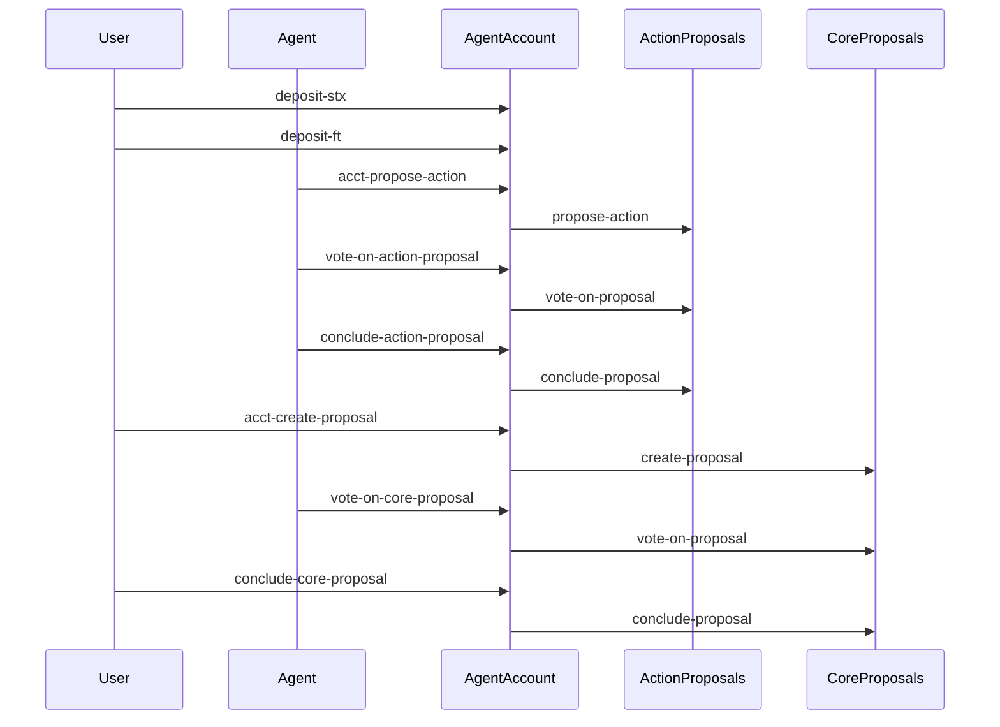
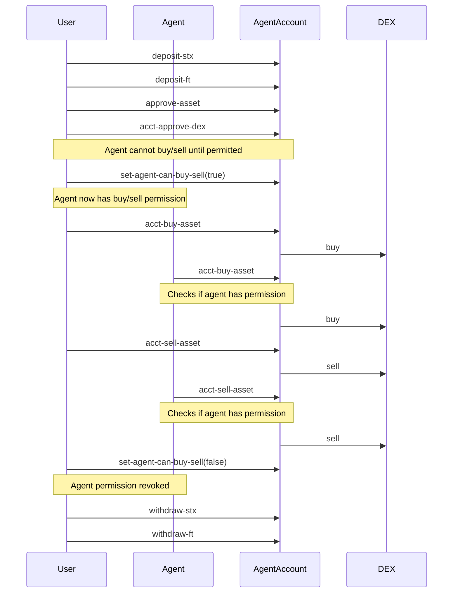

# Agent Account

The Agent Account contract (`aibtc-user-agent-account`) provides a secure interface between a user and an agent for managing assets and interacting with DAOs. It enables key features to allow user self-custody and control and agent interaction with DAO proposals.

## Contract Overview

- **Title**: aibtc-user-agent-account
- **Version**: 1.0.0
- **Implements**: 
  - `aibtc-user-agent-account-traits.aibtc-account` trait
  - `aibtc-user-agent-account-traits.aibtc-proposals-v3` trait
  - `aibtc-user-agent-account-traits.faktory-dex-approval` trait
  - `aibtc-user-agent-account-traits.faktory-buy-sell` trait

## Print Events

| Event                      | Description                                | Data                                                   |
| -------------------------- | ------------------------------------------ | ------------------------------------------------------ |
| `deposit-stx`              | Emitted when STX is deposited              | Amount, sender, caller, recipient                      |
| `deposit-ft`               | Emitted when a fungible token is deposited | Amount, asset contract, sender, caller, recipient      |
| `withdraw-stx`             | Emitted when STX is withdrawn              | Amount, sender, caller, recipient                      |
| `withdraw-ft`              | Emitted when a fungible token is withdrawn | Amount, asset contract, sender, caller, recipient      |
| `approve-asset`            | Emitted when an asset is approved          | Asset, approved status, sender, caller                 |
| `revoke-asset`             | Emitted when an asset approval is revoked  | Asset, approved status, sender, caller                 |
| `acct-approve-dex`         | Emitted when a DEX is approved             | DEX contract, approved status, sender, caller          |
| `acct-revoke-dex`          | Emitted when a DEX approval is revoked     | DEX contract, approved status, sender, caller          |
| `set-agent-can-buy-sell`   | Emitted when agent buy/sell is toggled     | Can buy/sell status, sender, caller                    |
| `acct-buy-asset`           | Emitted when buying an asset               | DEX contract, asset, amount, sender, caller            |
| `acct-sell-asset`          | Emitted when selling an asset              | DEX contract, asset, amount, sender, caller            |
| `acct-propose-action`      | Emitted when proposing an action           | Proposal contract, action, parameters, sender, caller  |
| `acct-create-proposal`     | Emitted when creating a proposal           | Proposal contract, proposal, sender, caller            |
| `vote-on-action-proposal`  | Emitted when voting on an action proposal  | Proposal contract, proposal ID, vote, sender, caller   |
| `vote-on-core-proposal`    | Emitted when voting on a core proposal     | Proposal contract, proposal, vote, sender, caller      |
| `conclude-action-proposal` | Emitted when concluding an action proposal | Proposal contract, proposal ID, action, sender, caller |
| `conclude-core-proposal`   | Emitted when concluding a core proposal    | Proposal contract, proposal, sender, caller            |
| `user-agent-account-created` | Emitted when the agent account is created | Configuration details                                  |

## Public Functions

### Asset Management Functions

| Function        | Description                                   | Parameters                     |
| --------------- | --------------------------------------------- | ------------------------------ |
| `deposit-stx`   | Deposit STX to the agent account              | `amount`: uint                 |
| `deposit-ft`    | Deposit fungible tokens to the agent account  | `ft`: ft-trait, `amount`: uint |
| `withdraw-stx`  | Withdraw STX from the agent account           | `amount`: uint                 |
| `withdraw-ft`   | Withdraw fungible tokens from the agent account | `ft`: ft-trait, `amount`: uint |
| `approve-asset` | Add an asset to the approved list             | `asset`: principal             |
| `revoke-asset`  | Remove an asset from the approved list        | `asset`: principal             |

### DAO Interaction Functions

| Function                   | Description                          | Parameters                                                                                  |
| -------------------------- | ------------------------------------ | ------------------------------------------------------------------------------------------- |
| `acct-propose-action`      | Propose an action to a DAO           | `action-proposals`: action-proposals-trait, `action`: action-trait, `parameters`: buff 2048, `memo`: optional string-ascii 1024 |
| `acct-create-proposal`     | Create a proposal in a DAO           | `core-proposals`: core-proposals-trait, `proposal`: proposal-trait, `memo`: optional string-ascii 1024 |
| `vote-on-action-proposal`  | Vote on an action proposal           | `action-proposals`: action-proposals-trait, `proposalId`: uint, `vote`: bool                |
| `vote-on-core-proposal`    | Vote on a core proposal              | `core-proposals`: core-proposals-trait, `proposal`: proposal-trait, `vote`: bool            |
| `conclude-action-proposal` | Conclude an action proposal          | `action-proposals`: action-proposals-trait, `proposalId`: uint, `action`: action-trait      |
| `conclude-core-proposal`   | Conclude a core proposal             | `core-proposals`: core-proposals-trait, `proposal`: proposal-trait                          |

### Faktory DEX Trading Functions

| Function                 | Description                                | Parameters                                                      |
| ------------------------ | ------------------------------------------ | --------------------------------------------------------------- |
| `acct-buy-asset`         | Buy an asset from a Faktory DEX            | `faktory-dex`: dao-faktory-dex, `asset`: faktory-token, `amount`: uint |
| `acct-sell-asset`        | Sell an asset to a Faktory DEX             | `faktory-dex`: dao-faktory-dex, `asset`: faktory-token, `amount`: uint |
| `acct-approve-dex`       | Add a DEX to the approved list             | `faktory-dex`: dao-faktory-dex                                 |
| `acct-revoke-dex`        | Remove a DEX from the approved list        | `faktory-dex`: dao-faktory-dex                                 |
| `set-agent-can-buy-sell` | Set whether the agent can buy/sell assets  | `canBuySell`: bool                                             |

## Read-Only Functions

| Function            | Description                             | Parameters         |
| ------------------- | --------------------------------------- | ------------------ |
| `is-approved-asset` | Check if an asset is approved           | `asset`: principal |
| `is-approved-dex`   | Check if a DEX is approved              | `dex`: principal   |
| `get-balance-stx`   | Get the STX balance of the agent account | None               |
| `get-configuration` | Get the agent account configuration      | None               |

## Error Codes

| Code  | Constant               | Description                       |
| ----- | ---------------------- | --------------------------------- |
| u9000 | ERR_UNAUTHORIZED       | Caller is not authorized          |
| u9001 | ERR_UNKNOWN_ASSET      | Asset is not in the approved list |
| u9002 | ERR_OPERATION_FAILED   | Operation failed                  |
| u9003 | ERR_BUY_SELL_NOT_ALLOWED | Buy/sell operation not allowed for agent |

## Security Features

- Only the user can withdraw assets
- Only the user and agent can interact with DAOs
- Assets must be explicitly approved before they can be deposited or withdrawn
- DEXes must be explicitly approved before they can be used for trading
- Agent buy/sell permissions can be toggled by the user
- Pre-approved tokens and DEXes are configured at deployment
- All actions are logged with detailed print events

## Security Considerations

### Access Control

The agent account implements strict access control:
- **User-only functions**: withdraw-stx, withdraw-ft, approve-asset, revoke-asset, acct-approve-dex, acct-revoke-dex, set-agent-can-buy-sell
- **User and Agent functions**: acct-propose-action, acct-create-proposal, vote-on-action-proposal, vote-on-core-proposal, conclude-action-proposal, conclude-core-proposal
- **Agent trading functions**: acct-buy-asset, acct-sell-asset (only when explicitly permitted by the user via set-agent-can-buy-sell)
- **Public functions**: deposit-stx, deposit-ft (anyone can deposit assets to the agent account)

### Asset Protection

Assets in the agent account are protected by:
1. Requiring explicit approval of assets before they can be deposited or withdrawn
2. Limiting withdrawal capability to the user only
3. Requiring explicit approval of DEXes before they can be used for trading
4. Requiring explicit permission for the agent to perform buy/sell operations

### Transparency

All actions are logged with detailed print events, providing:
1. Complete audit trail of all interactions
2. Visibility into who initiated each action
3. Details of all asset movements

### Immutability

- The user and agent addresses cannot be changed after deployment
- The contract cannot be upgraded after deployment

## Usage Scenarios

### Asset Management

The agent account allows users to securely store and manage their assets (STX and fungible tokens) with the following benefits:

- Secure storage with controlled access
- Ability to approve/revoke specific tokens
- Transparent transaction logging

### DAO Participation

The agent account enables participation in DAO governance through:

- Proposal creation
- Voting on proposals
- Concluding proposals

This allows the user to delegate certain DAO interactions to their agent while maintaining control over the assets.

## Interaction Flows

### DAO Proposal Interaction Flow



### DEX Trading Interaction Flow



### DEX Trading

The agent account enables trading on Faktory DEXes:

- User can always buy and sell assets
- Agent can buy and sell assets only if explicitly permitted by the user via the set-agent-can-buy-sell function
- The user can enable or disable agent trading permission at any time
- Only approved DEXes can be used for trading
- All trading activity is logged with detailed print events

## Deployment Configuration

When deployed, the agent account is configured with:

- User principal (account owner)
- Agent principal (proposal voter)
- Pre-approved tokens (sBTC and DAO token)
- Pre-approved DEXes (DAO token DEX)

## Contract Naming Convention

Agent account contracts follow a specific naming convention that incorporates both the owner and agent addresses:

```
aibtc-user-agent-account-OWNER_FIRST5-OWNER_LAST5-AGENT_FIRST5-AGENT_LAST5
```

Where:

- `OWNER_FIRST5` represents the first 5 characters of the owner's Stacks address
- `OWNER_LAST5` represents the last 5 characters of the owner's Stacks address
- `AGENT_FIRST5` represents the first 5 characters of the agent's Stacks address
- `AGENT_LAST5` represents the last 5 characters of the agent's Stacks address

For example, if an agent with address `ST2CY5V39NHDPWSXMW9QDT3HC3GD6Q6XX4CFRK9AG` were to deploy an agent account for an owner with address `ST1PQHQKV0RJXZFY1DGX8MNSNYVE3VGZJSRTPGZGM`, it would be named:

```
aibtc-user-agent-account-ST1PQ-PGZGM-ST2CY-RK9AG
```

This naming convention ensures that:

1. Each user-agent pair has a unique agent account
2. Agent accounts are easily identifiable by both the owner's and agent's addresses
3. One agent can deploy multiple agent accounts for different users
4. Multiple agents can deploy different agent accounts for the same user
