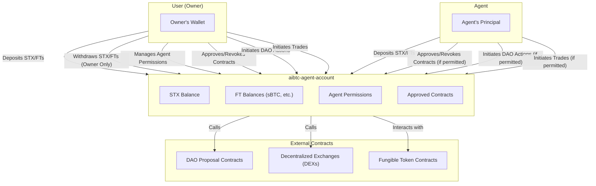
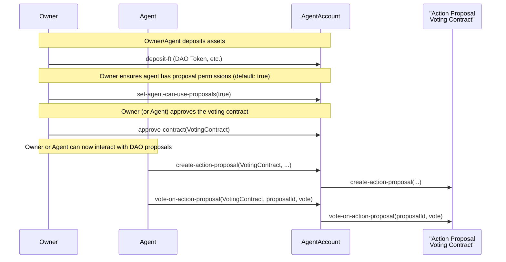
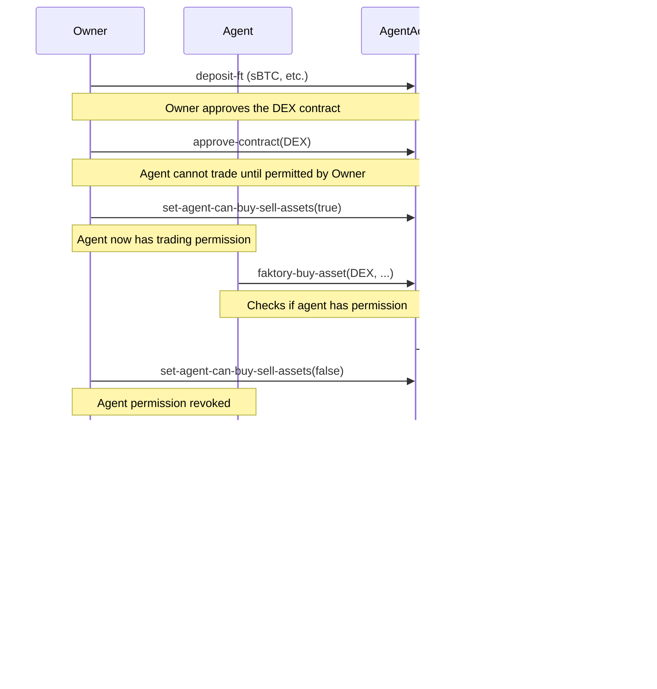

# aibtc-agent-account

The `aibtc-agent-account` contract is a specialized smart contract designed to facilitate interactions between a user (the owner) and an agent. It provides a secure mechanism for managing STX and Fungible Tokens, where only the owner can withdraw assets. The agent, with permissions granted by the owner, can perform actions such as participating in DAO proposals and trading on approved DEXs. This contract aims to provide a clear separation of roles and capabilities, ensuring the owner retains ultimate control over their funds while allowing an agent to act on their behalf within defined boundaries.

## Key Features

- **Secure Asset Management**: Owner-controlled withdrawals for STX and FTs.
- **Delegated DAO Interaction**: Agent can participate in DAO proposals on behalf of the owner.
- **Controlled DEX Trading**: Agent can trade on approved DEXs if permitted by the owner.
- **Role-Based Access Control**: Clear separation of permissions for owner and agent.
- **Contract Allowlisting**: Owner controls which contracts (tokens, DEXs, proposal contracts) can be interacted with.
- **Transparent Operations**: All significant actions emit detailed print events.
- **Immutable Core Logic**: Owner and agent addresses are set at deployment and cannot be changed.

## How It Works

The `aibtc-agent-account` acts as a secure vault and an operational proxy for a user (the `ACCOUNT_OWNER`). The user or agent deposits assets (STX or FTs) into this contract. While only the `ACCOUNT_OWNER` can withdraw these assets, both the `ACCOUNT_OWNER` and a designated `ACCOUNT_AGENT` can initiate DAO-related actions, such as creating or voting on proposals, using the assets held within the account.

The contract maintains a single allowlist of `ApprovedContracts`. Before the account can interact with any external contract (like a token, a DEX, or a proposal contract), that contract's principal must be added to this list.

The `ACCOUNT_OWNER` has granular control over the `ACCOUNT_AGENT`'s permissions via three boolean flags:
1.  `agentCanUseProposals`: Allows the agent to create, vote on, veto, and conclude proposals. (Default: `true`)
2.  `agentCanApproveRevokeContracts`: Allows the agent to approve or revoke contracts from the allowlist. (Default: `true`)
3.  `agentCanBuySellAssets`: Allows the agent to trade on approved DEXs. (Default: `false`)

The owner can change these permissions at any time. All operations are logged via print events, providing a transparent audit trail.


```mermaid
flowchart TD
    subgraph User["User (Owner)"]
        direction LR
        U_Wallet["Owner's Wallet"]
    end

    subgraph AgentPrincipal["Agent"]
        direction LR
        A_Principal["Agent's Principal"]
    end

    subgraph AgentAccountContract["aibtc-agent-account"]
        direction TB
        AA_STX["STX Balance"]
        AA_FTs["FT Balances (sBTC, etc.)"]
        AA_Permissions["Agent Permissions"]
        AA_Allowlists["Approved Contracts"]
    end

    subgraph ExternalContracts["External Contracts"]
        direction TB
        DAO_Proposals["DAO Proposal Contracts"]
        DEX_Contracts["Decentralized Exchanges (DEXs)"]
        FT_Contracts["Fungible Token Contracts"]
    end

    User -- "Deposits STX/FTs" --> AgentAccountContract
    AgentPrincipal -- "Deposits STX/FTs" --> AgentAccountContract
    User -- "Withdraws STX/FTs (Owner Only)" --> AgentAccountContract
    User -- "Manages Agent Permissions" --> AgentAccountContract

    User -- "Approves/Revokes Contracts" --> AgentAccountContract
    AgentPrincipal -- "Approves/Revokes Contracts (if permitted)" --> AgentAccountContract

    User -- "Initiates DAO Actions" --> AgentAccountContract
    AgentPrincipal -- "Initiates DAO Actions (if permitted)" --> AgentAccountContract

    User -- "Initiates Trades" --> AgentAccountContract
    AgentPrincipal -- "Initiates Trades (if permitted)" --> AgentAccountContract

    AgentAccountContract -- "Calls" --> DAO_Proposals
    AgentAccountContract -- "Calls" --> DEX_Contracts
    AgentAccountContract -- "Interacts with" --> FT_Contracts
```

## Quick Reference

| Property                   | Value                                                                                                                                                                                          |
| -------------------------- | ---------------------------------------------------------------------------------------------------------------------------------------------------------------------------------------------- |
| Contract Name              | `aibtc-agent-account`                                                                                                                                                                          |
| Version                    | `2.0.0`                                                                                                                                                                                        |
| Implements                 | `.aibtc-agent-account-traits.aibtc-account`, `.aibtc-agent-account-traits.aibtc-proposals`, `.aibtc-agent-account-traits.aibtc-account-config`, `.aibtc-agent-account-traits.faktory-buy-sell` |
| Key Constants              | `ACCOUNT_OWNER`, `ACCOUNT_AGENT`, `SBTC_TOKEN`, `DEPLOYED_BURN_BLOCK`, `DEPLOYED_STACKS_BLOCK`, `SELF`                                                                                           |
| Initial Approved Contracts | `SBTC_TOKEN`                                                                                                                                                                                   |

## Print Events

| Event                                                  | Description                                        | Data Payload Fields                                                                                             |
| ------------------------------------------------------ | -------------------------------------------------- | --------------------------------------------------------------------------------------------------------------- |
| `aibtc-agent-account/deposit-stx`                      | Emitted when STX is deposited                      | `contractCaller`, `txSender`, `amount`, `recipient`                                                             |
| `aibtc-agent-account/deposit-ft`                       | Emitted when a fungible token is deposited         | `amount`, `assetContract`, `txSender`, `contractCaller`, `recipient`                                            |
| `aibtc-agent-account/withdraw-stx`                     | Emitted when STX is withdrawn                      | `amount`, `sender`, `caller`, `recipient`                                                                       |
| `aibtc-agent-account/withdraw-ft`                      | Emitted when a fungible token is withdrawn         | `amount`, `assetContract`, `sender`, `caller`, `recipient`                                                      |
| `aibtc-agent-account/approve-contract`                 | Emitted when a contract is approved                | `contract`, `approved` (true), `sender`, `caller`                                                               |
| `aibtc-agent-account/revoke-contract`                  | Emitted when a contract approval is revoked        | `contract`, `approved` (false), `sender`, `caller`                                                              |
| `aibtc-agent-account/create-action-proposal`           | Emitted when an action proposal is created         | `proposalContract`, `action`, `parameters`, `sender`, `caller`                                                  |
| `aibtc-agent-account/vote-on-action-proposal`          | Emitted when voting on an action proposal          | `proposalContract`, `proposalId`, `vote`, `sender`, `caller`                                                    |
| `aibtc-agent-account/veto-action-proposal`             | Emitted when an action proposal is vetoed          | `proposalContract`, `proposalId`, `sender`, `caller`                                                            |
| `aibtc-agent-account/conclude-action-proposal`         | Emitted when concluding an action proposal         | `proposalContract`, `proposalId`, `action`, `sender`, `caller`                                                  |
| `aibtc-agent-account/faktory-buy-asset`                | Emitted when buying an asset via Faktory DEX       | `dexContract`, `asset`, `amount`, `sender`, `caller`                                                            |
| `aibtc-agent-account/faktory-sell-asset`               | Emitted when selling an asset via Faktory DEX      | `dexContract`, `asset`, `amount`, `sender`, `caller`                                                            |
| `aibtc-agent-account/set-agent-can-use-proposals`      | Emitted when agent proposal permission is set      | `canUseProposals`, `sender`, `caller`                                                                           |
| `aibtc-agent-account/set-agent-can-approve-revoke-contracts` | Emitted when agent contract approval permission is set | `canApproveRevokeContracts`, `sender`, `caller`                                                                 |
| `aibtc-agent-account/set-agent-can-buy-sell-assets`    | Emitted when agent buy/sell permission is set      | `canBuySell`, `sender`, `caller`                                                                                |
| `aibtc-agent-account/user-agent-account-created`       | Emitted when the agent account is created          | `account`, `agent`, `owner`, `sbtc`                                                                             |

## Public Functions

### `deposit-stx`

**Purpose**: Deposits STX into the agent account.
**Parameters**:

- `amount`: `uint` - The amount of STX to deposit.

**Returns**: `(response (bool true) uint)` - Success or error code.
**Authorization**: `ACCOUNT_OWNER` or `ACCOUNT_AGENT` (as `tx-sender`).

### `deposit-ft`

**Purpose**: Deposits a specified amount of a fungible token (FT) into the agent account.
**Parameters**:

- `ft`: `<ft-trait>` - The contract principal of the fungible token.
- `amount`: `uint` - The amount of the token to deposit.

**Returns**: `(response (bool true) uint)` - Success or error code.
**Authorization**: `ACCOUNT_OWNER` or `ACCOUNT_AGENT` (as `tx-sender`).
**Notes**: The FT's contract must be an approved contract.

### `withdraw-stx`

**Purpose**: Withdraws STX from the agent account to the `ACCOUNT_OWNER`.
**Parameters**:

- `amount`: `uint` - The amount of STX to withdraw.

**Returns**: `(response (bool true) uint)` - Success or error code.
**Authorization**: Only `ACCOUNT_OWNER`.

### `withdraw-ft`

**Purpose**: Withdraws a specified amount of a fungible token (FT) from the agent account to the `ACCOUNT_OWNER`.
**Parameters**:

- `ft`: `<ft-trait>` - The contract principal of the fungible token.
- `amount`: `uint` - The amount of the token to withdraw.

**Returns**: `(response (bool true) uint)` - Success or error code.
**Authorization**: Only `ACCOUNT_OWNER`.
**Notes**: The FT's contract must be an approved contract.

### `approve-contract`

**Purpose**: Approves a contract, allowing it to be used by the account.
**Parameters**:

- `contract`: `principal` - The contract principal to approve.

**Returns**: `(response (bool true) uint)` - Success or error code.
**Authorization**: `ACCOUNT_OWNER`, or `ACCOUNT_AGENT` if `agentCanApproveRevokeContracts` is true.

### `revoke-contract`

**Purpose**: Revokes approval for a contract.
**Parameters**:

- `contract`: `principal` - The contract principal to revoke.

**Returns**: `(response (bool true) uint)` - Success or error code.
**Authorization**: `ACCOUNT_OWNER`, or `ACCOUNT_AGENT` if `agentCanApproveRevokeContracts` is true.

### `create-action-proposal`

**Purpose**: Creates an action proposal through a specified voting contract.
**Parameters**:

- `votingContract`: `<action-proposal-voting-trait>` - The contract principal of the voting contract.
- `action`: `<action-trait>` - The contract principal of the action to be proposed.
- `parameters`: `(buff 2048)` - ABI-encoded parameters for the action.
- `memo`: `(optional (string-ascii 1024))` - An optional memo for the proposal.

**Returns**: `(response principal uint)` - Success (returning proposal ID) or error code.
**Authorization**: `ACCOUNT_OWNER`, or `ACCOUNT_AGENT` if `agentCanUseProposals` is true.
**Notes**: The `votingContract` must be an approved contract.

### `vote-on-action-proposal`

**Purpose**: Casts a vote on an existing action proposal.
**Parameters**:

- `votingContract`: `<action-proposal-voting-trait>` - The contract principal of the voting contract.
- `proposalId`: `uint` - The ID of the proposal to vote on.
- `vote`: `bool` - The vote (`true` for yes, `false` for no).

**Returns**: `(response bool uint)` - Success or error code.
**Authorization**: `ACCOUNT_OWNER`, or `ACCOUNT_AGENT` if `agentCanUseProposals` is true.
**Notes**: The `votingContract` must be an approved contract.

### `veto-action-proposal`

**Purpose**: Vetoes an action proposal.
**Parameters**:

- `votingContract`: `<action-proposal-voting-trait>` - The contract principal of the voting contract.
- `proposalId`: `uint` - The ID of the proposal to veto.

**Returns**: `(response bool uint)` - Success or error code.
**Authorization**: `ACCOUNT_OWNER`, or `ACCOUNT_AGENT` if `agentCanUseProposals` is true.
**Notes**: The `votingContract` must be an approved contract.

### `conclude-action-proposal`

**Purpose**: Concludes an action proposal, potentially executing it if passed.
**Parameters**:

- `votingContract`: `<action-proposal-voting-trait>` - The contract principal of the voting contract.
- `proposalId`: `uint` - The ID of the proposal to conclude.
- `action`: `<action-trait>` - The contract principal of the action associated with the proposal.

**Returns**: `(response bool uint)` - Success or error code.
**Authorization**: `ACCOUNT_OWNER`, or `ACCOUNT_AGENT` if `agentCanUseProposals` is true.
**Notes**: The `votingContract` must be an approved contract.

### `faktory-buy-asset`

**Purpose**: Buys an asset from an approved Faktory DEX.
**Parameters**:

- `faktory-dex`: `<dao-faktory-dex>` - The contract principal of the DEX.
- `asset`: `<faktory-token>` - The contract principal of the asset to buy.
- `amount`: `uint` - The amount of the asset to buy.

**Returns**: `(response bool uint)` - Success or error code.
**Authorization**: `ACCOUNT_OWNER`, or `ACCOUNT_AGENT` if `agentCanBuySellAssets` is true.
**Notes**: The `faktory-dex` must be an approved contract.

### `faktory-sell-asset`

**Purpose**: Sells an asset to an approved Faktory DEX.
**Parameters**:

- `faktory-dex`: `<dao-faktory-dex>` - The contract principal of the DEX.
- `asset`: `<faktory-token>` - The contract principal of the asset to sell.
- `amount`: `uint` - The amount of the asset to sell.

**Returns**: `(response bool uint)` - Success or error code.
**Authorization**: `ACCOUNT_OWNER`, or `ACCOUNT_AGENT` if `agentCanBuySellAssets` is true.
**Notes**: The `faktory-dex` must be an approved contract.

### `set-agent-can-use-proposals`

**Purpose**: Sets or revokes the `ACCOUNT_AGENT`'s permission to interact with DAO proposals.
**Parameters**:
- `canUseProposals`: `bool` - `true` to allow, `false` to disallow.
**Returns**: `(response (bool true) uint)` - Success or error code.
**Authorization**: Only `ACCOUNT_OWNER`.

### `set-agent-can-approve-revoke-contracts`

**Purpose**: Sets or revokes the `ACCOUNT_AGENT`'s permission to approve/revoke contracts.
**Parameters**:
- `canApproveRevokeContracts`: `bool` - `true` to allow, `false` to disallow.
**Returns**: `(response (bool true) uint)` - Success or error code.
**Authorization**: Only `ACCOUNT_OWNER`.

### `set-agent-can-buy-sell-assets`

**Purpose**: Sets or revokes the `ACCOUNT_AGENT`'s permission to buy and sell assets on approved DEXs.
**Parameters**:

- `canBuySell`: `bool` - `true` to allow, `false` to disallow.

**Returns**: `(response (bool true) uint)` - Success or error code.
**Authorization**: Only `ACCOUNT_OWNER`.

## Read-Only Functions

### `is-approved-contract`

**Purpose**: Checks if a given contract principal is on the approved list.
**Parameters**:

- `contract`: `principal` - The contract principal to check.

**Returns**: `bool` - `true` if approved, `false` otherwise.

### `get-configuration`

**Purpose**: Retrieves the core configuration of the agent account.
**Parameters**: None.
**Returns**: `(response { account: principal, agent: principal, owner: principal, sbtc: principal } none)` - A tuple containing key principals.

## Error Handling

| Error Code | Constant                    | Description                                                              | Resolution                                                                                                                            |
| ---------- | --------------------------- | ------------------------------------------------------------------------ | ------------------------------------------------------------------------------------------------------------------------------------- |
| u1100      | ERR_CALLER_NOT_OWNER        | Caller is not the `ACCOUNT_OWNER`.                                       | Ensure the `tx-sender` is the `ACCOUNT_OWNER`.                                                                                        |
| u1101      | ERR_CONTRACT_NOT_APPROVED   | The target contract is not in the approved list.                         | The `ACCOUNT_OWNER` (or `ACCOUNT_AGENT`, if permitted) must call `approve-contract` for the target contract first.                    |
| u1103      | ERR_OPERATION_NOT_ALLOWED   | The caller is not authorized to perform this specific action.            | This can be due to several reasons: an unauthorized principal is calling, or the agent is attempting an action for which it lacks permission (e.g., trading when `agentCanBuySellAssets` is false). |

## Security Considerations

### Access Control

The agent account implements strict access control:

- **Owner-only functions**: `withdraw-stx`, `withdraw-ft`, `set-agent-can-use-proposals`, `set-agent-can-approve-revoke-contracts`, `set-agent-can-buy-sell-assets`.
- **Permission-based functions**:
  - `approve-contract`, `revoke-contract`: Allowed for the owner, or the agent if `agentCanApproveRevokeContracts` is true.
  - Proposal functions: Allowed for the owner, or the agent if `agentCanUseProposals` is true.
  - Trading functions: Allowed for the owner, or the agent if `agentCanBuySellAssets` is true.
- **Owner/Agent functions**: `deposit-stx`, `deposit-ft`.

### Asset Protection

Assets in the agent account are protected by:

1. Requiring explicit approval of contracts before they can be interacted with.
2. Limiting withdrawal capability to the owner only.
3. Providing granular, owner-controlled permissions for all agent actions.

### Transparency

All actions are logged with detailed print events, providing:

1. Complete audit trail of all interactions.
2. Visibility into who initiated each action.
3. Details of all asset movements and permission changes.

### Immutability

- The owner and agent addresses cannot be changed after deployment.
- The contract cannot be upgraded after deployment.

## Interaction Flows

### DAO Proposal Interaction Flow


```mermaid
sequenceDiagram
    participant Owner
    participant Agent
    participant AgentAccount
    participant VotingContract as "Action Proposal<br/>Voting Contract"

    Note over Owner, AgentAccount: Owner/Agent deposits assets
    Owner->>AgentAccount: deposit-ft (DAO Token, etc.)

    Note over Owner, AgentAccount: Owner ensures agent has proposal permissions (default: true)
    Owner->>AgentAccount: set-agent-can-use-proposals(true)

    Note over Owner, AgentAccount: Owner (or Agent) approves the voting contract
    Owner->>AgentAccount: approve-contract(VotingContract)

    Note over Owner, Agent: Owner or Agent can now interact with DAO proposals

    Agent->>AgentAccount: create-action-proposal(VotingContract, ...)
    AgentAccount->>VotingContract: create-action-proposal(...)

    Agent->>AgentAccount: vote-on-action-proposal(VotingContract, proposalId, vote)
    AgentAccount->>VotingContract: vote-on-action-proposal(proposalId, vote)
```

### DEX Trading Interaction Flow


```mermaid
sequenceDiagram
    participant Owner
    participant Agent
    participant AgentAccount
    participant DEX

    Owner->>AgentAccount: deposit-ft (sBTC, etc.)
    Note over Owner, AgentAccount: Owner approves the DEX contract
    Owner->>AgentAccount: approve-contract(DEX)

    Note over Owner,AgentAccount: Agent cannot trade until permitted by Owner
    Owner->>AgentAccount: set-agent-can-buy-sell-assets(true)
    Note over Owner,Agent: Agent now has trading permission

    Agent->>AgentAccount: faktory-buy-asset(DEX, ...)
    Note over Agent,AgentAccount: Checks if agent has permission
    AgentAccount->>DEX: buy(...)

    Owner->>AgentAccount: set-agent-can-buy-sell-assets(false)
    Note over Owner,Agent: Agent permission revoked

    Agent->>AgentAccount: faktory-buy-asset(DEX, ...)
    Note over Agent,AgentAccount: Fails - ERR_OPERATION_NOT_ALLOWED

    Owner->>AgentAccount: withdraw-ft
    Note over Owner,AgentAccount: Success

    Agent->>AgentAccount: withdraw-ft
    Note over Agent,AgentAccount: Fails - ERR_CALLER_NOT_OWNER
```

## Deployment and Initialization

### Deployment Information

The contract stores deployment information as constants:

- `DEPLOYED_BURN_BLOCK`: The Bitcoin block height at deployment.
- `DEPLOYED_STACKS_BLOCK`: The Stacks block height at deployment.
- `SELF`: The contract's own principal.

### Configuration

When deployed, the agent account is configured with:

- `ACCOUNT_OWNER`: The principal with full access.
- `ACCOUNT_AGENT`: The principal with limited, configurable access.

### Initialization

The contract automatically initializes on deployment with:

1. Approving the `SBTC_TOKEN` contract: `(map-set ApprovedContracts SBTC_TOKEN true)`.
2. Setting default agent permissions:
   - `agentCanUseProposals`: `true`
   - `agentCanApproveRevokeContracts`: `true`
   - `agentCanBuySellAssets`: `false`
3. Emitting a creation event with the configuration details.

```clarity
;; print creation event
(print {
  notification: "aibtc-agent-account/user-agent-account-created",
  payload: (get-configuration) ;; This retrieves owner, agent, account, and sbtc principals
})
```

## Related Contracts and Traits

The `aibtc-agent-account` contract interacts with or implements the following:

**Implemented Traits:**

- `.aibtc-agent-account-traits.aibtc-account`: Defines standard account functionalities.
- `.aibtc-agent-account-traits.aibtc-proposals`: Defines proposal interaction functionalities.
- `.aibtc-agent-account-traits.aibtc-account-config`: Defines account configuration functionalities.
- `.aibtc-agent-account-traits.faktory-buy-sell`: Defines DEX trading functionalities.

**Used Traits:**

- `'SP3FBR2AGK5H9QBDH3EEN6DF8EK8JY7RX8QJ5SVTE.sip-010-trait-ft-standard.sip-010-trait` (ft-trait): For fungible token interactions.
- `.aibtc-dao-traits.action` (action-trait): For defining actions in proposals.
- `.aibtc-dao-traits.action-proposal-voting` (action-proposal-voting-trait): For interacting with action proposal voting contracts.
- `.aibtc-dao-traits.faktory-dex` (dao-faktory-dex): For interacting with Faktory DEX contracts.
- `'STTWD9SPRQVD3P733V89SV0P8RZRZNQADG034F0A.faktory-trait-v1.sip-010-trait` (faktory-token): For interacting with Faktory-compatible tokens.

**Key Contract Dependencies (Constants):**

- `'STV9K21TBFAK4KNRJXF5DFP8N7W46G4V9RJ5XDY2.sbtc-token` (SBTC_TOKEN): The sBTC token contract.
