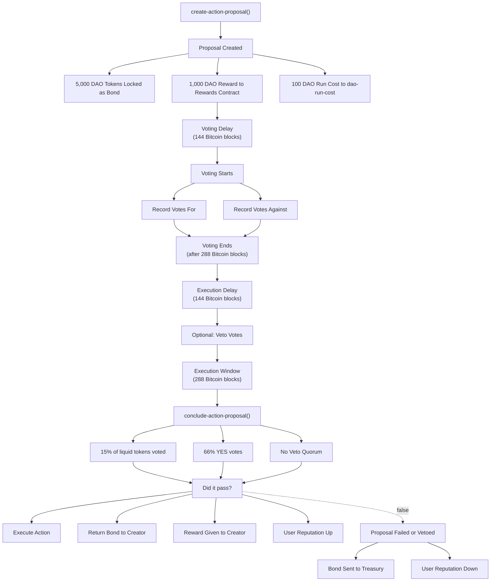

# Action Proposal Voting Extension

The Action Proposal Voting extension (`aibtc-action-proposal-voting`) allows DAO members to propose and vote on predefined actions. It features a multi-stage process including a voting period, a veto period, and mechanisms for proposal bonds, DAO run costs, and proposer rewards. This contract initially focuses on enabling proposals to send on-chain messages using the `.aibtc-onchain-messaging` contract as the primary action. This allows for routine, transparent communication and decision-making without the higher thresholds of core DAO proposals.

## Key Features

- **Predefined Actions**: Executes action contracts registered with the DAO. The primary initial action is sending messages via `.aibtc-onchain-messaging`.
- **Configurable Voting Parameters**: Utilizes specific voting delay (`VOTING_DELAY`), period (`VOTING_PERIOD`), quorum (`VOTING_QUORUM`), and threshold (`VOTING_THRESHOLD`).
- **Proposal Bond**: Requires a `VOTING_BOND` from the proposer, returned on successful execution or forfeited on failure/veto.
- **Proposal Reward**: Successful and executed proposals earn a `VOTING_REWARD` for the creator, funded by the treasury.
- **DAO Run Cost**: Proposers contribute an `AIBTC_DAO_RUN_COST_AMOUNT` fee towards DAO operational costs, paid to `.aibtc-dao-run-cost`.
- **Veto Mechanism**: Allows token holders to veto a proposal during a specific window after voting ends but before execution can begin.
- **Reputation Adjustments**: Proposal creators gain or lose reputation via `.aibtc-dao-users` based on the outcome.
- **Liquid Supply Snapshot**: Uses token balances at the proposal creation block for fair voting power calculation.

## Quick Reference

| Property              | Value                                                                     |
| --------------------- | ------------------------------------------------------------------------- |
| Contract Name         | `aibtc-action-proposal-voting`                                            |
| Implements            | `.aibtc-dao-traits.extension`, `.aibtc-dao-traits.action-proposal-voting` |
| Voting Delay          | `VOTING_DELAY` (e.g., 144 blocks, ~1 day)                                 |
| Voting Period         | `VOTING_PERIOD` (e.g., 288 blocks, ~2 days)                               |
| Execution Delay       | `VOTING_DELAY` (e.g., 144 blocks, ~1 day, also acts as veto period)       |
| Execution Window      | `VOTING_PERIOD` (e.g., 288 blocks, ~2 days)                               |
| Voting Quorum         | `VOTING_QUORUM` (e.g., 15% of liquid supply)                              |
| Voting Threshold      | `VOTING_THRESHOLD` (e.g., 66% of votes)                                   |
| Proposal Bond         | `VOTING_BOND` (e.g., 5,000 DAO tokens with 8 decimals)                    |
| Proposal Reward       | `VOTING_REWARD` (e.g., 1,000 DAO tokens with 8 decimals)                  |
| DAO Run Cost          | `AIBTC_DAO_RUN_COST_AMOUNT` (e.g., 100 DAO tokens with 8 decimals)        |
| DAO Token Contract    | `.aibtc-faktory`                                                          |
| Treasury Contract     | `.aibtc-treasury` (for bond forfeiture, rewards source)                   |
| DAO Run Cost Contract | `.aibtc-dao-run-cost`                                                     |
| DAO Rewards Account   | `.aibtc-rewards-account`                                                  |

## How It Works



The action proposal lifecycle involves several steps:

1.  **Proposal Creation (`create-action-proposal`)**: A DAO member proposes an action (e.g., sending a message via `.aibtc-onchain-messaging`). They must provide the action contract, parameters, an optional memo, and the `VOTING_BOND` (transferred to this extension). The proposer's balance must also be sufficient to cover the `AIBTC_DAO_RUN_COST_AMOUNT`. Upon proposal creation, this extension (`aibtc-action-proposal-voting`) instructs the `.aibtc-treasury` to transfer the `AIBTC_DAO_RUN_COST_AMOUNT` to `.aibtc-dao-run-cost`. Simultaneously, `VOTING_REWARD` is transferred from `.aibtc-treasury` to `.aibtc-rewards-account`.
2.  **Voting (`vote-on-action-proposal`)**: After a `VOTING_DELAY`, DAO members can cast votes using their token balance snapshotted at the proposal's creation block. Voting lasts for `VOTING_PERIOD`.
3.  **Veto (`veto-action-proposal`)**: After the `VOTING_PERIOD` ends, there's an execution delay (equal to `VOTING_DELAY`) during which token holders can cast veto votes.
4.  **Conclusion (`conclude-action-proposal`)**: After the veto period (execution delay) ends, anyone can call this function. The contract checks:
    - If the proposal met the `VOTING_QUORUM` and `VOTING_THRESHOLD`.
    - If a veto attempt met quorum and veto votes exceeded 'yes' votes.
    - If the proposal is not expired (within `execEnd` block).
5.  **Outcome**:
    - **Passed & Executed**: If the proposal passes, is not vetoed, and the action executes successfully:
    - The `VOTING_BOND` is returned to the proposer.
    - The `VOTING_REWARD` is transferred from `.aibtc-rewards-account` to the proposer.
    - The proposer's reputation is increased via `.aibtc-dao-users`.
    - **Failed, Vetoed, or Execution Failed**: If the proposal fails to pass, is successfully vetoed, or the action execution fails:
    - The `VOTING_BOND` is transferred to `.aibtc-treasury`.
    - If action execution failed (but vote passed), the `VOTING_REWARD` is transferred from `.aibtc-rewards-account` to `.aibtc-treasury`.
    - The proposer's reputation is decreased via `.aibtc-dao-users`.
      The initial and primary action available for proposals is to call the `send` function of the `.aibtc-onchain-messaging` contract.

## Public Functions

### `create-action-proposal`

**Purpose**: Creates a new action proposal. The caller pays a bond and a DAO run cost. A reward is set aside from the treasury.

**Parameters**:

- `action`: `<action-trait>` - The action contract to be executed if the proposal passes (e.g., `.aibtc-onchain-messaging`).
- `parameters`: `(buff 2048)` - Parameters to pass to the action contract (e.g., ABI-encoded message for `.aibtc-onchain-messaging.send`).
- `memo`: `(optional (string-ascii 1024))` - Optional description of the proposal.

**Returns**: `(response bool err-code)` - Returns `(ok true)` if the proposal creation process (including bond and fee transfers) completes successfully, otherwise an error. Note: This indicates success of the creation transaction, not the proposal ID. The proposal ID is internally generated and can be found in the emitted event or by querying `get-total-proposals`.

**Example**:

```ts
// how to construct buffer from string
const functionArgs = [
  Cl.principal(args.actionContractToExecute),
  Cl.bufferFromHex(Cl.serialize(Cl.stringAscii(args.messageToSend))),
  args.memo ? Cl.some(Cl.stringAscii(args.memo)) : Cl.none(),
];
```

_Note: The caller must have enough DAO tokens for `VOTING_BOND` + `AIBTC_DAO_RUN_COST_AMOUNT`._

### `vote-on-action-proposal`

**Purpose**: Casts a vote on an active proposal. Voting power is based on the voter's token balance at the proposal's creation block.

**Parameters**:

- `proposalId`: `uint` - The ID of the proposal to vote on.
- `vote`: `bool` - `true` for a 'yes' vote, `false` for a 'no' vote.

**Returns**: `(response bool err-code)` - `(ok true)` on success, otherwise an error.

### `veto-action-proposal`

**Purpose**: Casts a veto vote on a proposal that has finished its voting period but is not yet in its execution window.

**Parameters**:

- `proposalId`: `uint` - The ID of the proposal to veto.

**Returns**: `(response bool err-code)` - `(ok true)` on success, otherwise an error.

### `conclude-action-proposal`

**Purpose**: Concludes a proposal after its voting and veto periods have ended. If passed, not vetoed, and not expired, it attempts to execute the action. Handles bond and reward distribution.

**Parameters**:

- `proposalId`: `uint` - The ID of the proposal to conclude.
- `action`: `<action-trait>` - The action contract (must match the one in the proposal, e.g., `.aibtc-onchain-messaging`).

**Returns**: `(response bool err-code)` - `(ok true)` if the action was successfully executed, `(ok false)` if the proposal passed but action failed or proposal did not pass/was vetoed/expired. Returns an error for other issues.

### `callback`

**Purpose**: Standard extension callback function, typically used by the DAO to interact with the extension.

**Parameters**:

- `sender`: `principal` - The principal that triggered the callback.
- `memo`: `(buff 34)` - Optional memo data.

**Returns**: `(response bool err-code)` - Always returns `(ok true)`.

**Example**:

```clarity
(contract-call? .aibtc-action-proposal-voting callback tx-sender 0x00)
```

## Read-Only Functions

### `get-voting-power`

**Purpose**: Gets the voting power (DAO token balance) of a voter for a specific proposal, determined at the proposal's creation block.

**Parameters**:

- `proposalId`: `uint` - The ID of the proposal.
- `voter`: `principal` - The address of the voter.

**Returns**: `(response uint err-code)` - The voting power, or an error if data cannot be fetched.

### `get-proposal`

**Purpose**: Retrieves all data associated with a specific proposal.

**Parameters**:

- `proposalId`: `uint` - The ID of the proposal.

**Returns**: `(optional {action: principal, bond: uint, caller: principal, parameters: (buff 2048), memo: (optional (string-ascii 1024)), creator: principal, creatorUserId: uint, liquidTokens: uint, createdBtc: uint, createdStx: uint, voteStart: uint, voteEnd: uint, execStart: uint, execEnd: uint, votesFor: uint, votesAgainst: uint, vetoVotes: uint, concluded: bool, metQuorum: bool, metThreshold: bool, passed: bool, executed: bool, expired: bool, vetoMetQuorum: bool, vetoExceedsYes: bool, vetoed: bool})` - A tuple containing all proposal details, block information, and current records, or `none` if not found.

### `get-vote-record`

**Purpose**: Gets the vote record for a specific voter on a proposal.

**Parameters**:

- `proposalId`: `uint` - The ID of the proposal.
- `voter`: `principal` - The voter's address.

**Returns**: `(optional {vote: bool, amount: uint})` - The vote details (`vote`: true for yes, false for no; `amount`: voting power used) or `none` if no vote found.

### `get-veto-vote-record`

**Purpose**: Gets the veto vote record (amount voted) for a specific voter on a proposal.

**Parameters**:

- `proposalId`: `uint` - The ID of the proposal.
- `voter`: `principal` - The voter's address.

**Returns**: `(optional uint)` - The amount of tokens used for the veto vote, or `none` if no veto vote found.

### `get-vote-records`

**Purpose**: Retrieves both the regular vote and veto vote records for a voter on a proposal.

**Parameters**:

- `proposalId`: `uint` - The ID of the proposal.
- `voter`: `principal` - The voter's address.

**Returns**: `{voteRecord: (optional {vote: bool, amount: uint}), vetoVoteRecord: (optional uint)}`

### `get-total-proposals`

**Purpose**: Gets aggregate counts and block information about proposals.

**Parameters**: None

**Returns**: `{proposalCount: uint, concludedProposalCount: uint, executedProposalCount: uint, lastProposalStacksBlock: uint, lastProposalBitcoinBlock: uint}`

### `get-voting-configuration`

**Purpose**: Retrieves the current voting configuration parameters of the contract.

**Parameters**: None

**Returns**: `{self: principal, deployedBitcoinBlock: uint, deployedStacksBlock: uint, delay: uint, period: uint, quorum: uint, threshold: uint, treasury: principal, proposalBond: uint, proposalReward: uint}`
_Note: This also includes references to `AIBTC_DAO_RUN_COST_CONTRACT` and `DAO_REWARDS_ACCOUNT` implicitly through the contract's constants, though not directly returned here._

### `get-liquid-supply`

**Purpose**: Calculates the liquid supply of the DAO token (`.aibtc-faktory`) at a specific Stacks block height, excluding the balance of the `VOTING_TREASURY`.

**Parameters**:

- `blockHeight`: `uint` - The Stacks block height at which to calculate the liquid supply.

**Returns**: `(response uint err-code)` - The liquid supply amount or an error.

## Print Events

| Event                      | Description                                     | Key Data Points in Payload                                                                                                                                                                                                                                |
| -------------------------- | ----------------------------------------------- | --------------------------------------------------------------------------------------------------------------------------------------------------------------------------------------------------------------------------------------------------------- |
| `create-action-proposal`   | Emitted when a new action proposal is created.  | `proposalId`, `action`, `parameters`, `bond`, `creator`, `liquidTokens`, `createdBtc`, `createdStx`, `voteStart`, `voteEnd`, `execStart`, `execEnd`, `votingPeriod`, `votingQuorum`, `votingThreshold`, `votingDelay`, `votingReward`.                    |
| `vote-on-action-proposal`  | Emitted when a vote is cast on a proposal.      | `proposalId`, `voter`, `voterUserId`, `amount` (voting power), `vote` (true/false).                                                                                                                                                                       |
| `veto-action-proposal`     | Emitted when a veto vote is cast on a proposal. | `proposalId`, `vetoer`, `vetoerUserId`, `amount` (veto power).                                                                                                                                                                                            |
| `conclude-action-proposal` | Emitted when a proposal is concluded.           | `proposalId`, `action`, `parameters`, `bond`, `creator`, `liquidTokens`, `votesFor`, `votesAgainst`, `vetoVotes`, `metQuorum`, `metThreshold`, `vetoMetQuorum`, `vetoExceedsYes`, `vetoed`, `passed`, `expired`, `executed`, `executionError` (optional). |

## Error Handling

| Error Code | Constant                        | Description                                       | Resolution Suggestion                                    |
| ---------- | ------------------------------- | ------------------------------------------------- | -------------------------------------------------------- |
| u1300      | ERR_NOT_DAO_OR_EXTENSION        | Caller is not the DAO or an authorized extension. | Ensure call originates from DAO or approved extension.   |
| u1301      | ERR_FETCHING_TOKEN_DATA         | Error fetching token balance or supply.           | Check DAO token contract (`.aibtc-faktory`) status.      |
| u1302      | ERR_INSUFFICIENT_BALANCE        | Caller has insufficient token balance for action. | Ensure sufficient DAO tokens for bond, cost, or voting.  |
| u1303      | ERR_PROPOSAL_NOT_FOUND          | The specified proposal ID does not exist.         | Verify the proposal ID.                                  |
| u1304      | ERR_PROPOSAL_VOTING_ACTIVE      | Attempt to conclude a proposal while voting open. | Wait for the voting period (`voteEnd`) to pass.          |
| u1305      | ERR_PROPOSAL_EXECUTION_DELAY    | Attempt to conclude before execution delay ends.  | Wait for the execution start (`execStart`) block.        |
| u1306      | ERR_PROPOSAL_RATE_LIMIT         | Proposal created too soon after the last one.     | Wait for the next Bitcoin block.                         |
| u1307      | ERR_SAVING_PROPOSAL             | Internal error saving proposal data.              | Review proposal parameters; contact support if persists. |
| u1308      | ERR_PROPOSAL_ALREADY_CONCLUDED  | The proposal has already been concluded.          | No action needed, proposal is finalized.                 |
| u1309      | ERR_RETRIEVING_START_BLOCK_HASH | Error getting block hash for `at-block` calls.    | Stacks node issue or invalid block height.               |
| u1310      | ERR_VOTE_TOO_SOON               | Vote cast before voting period (`voteStart`).     | Wait for the voting period to begin.                     |
| u1311      | ERR_VOTE_TOO_LATE               | Vote cast after voting period (`voteEnd`).        | Voting is closed for this proposal.                      |
| u1312      | ERR_ALREADY_VOTED               | Voter has already cast this type of vote.         | A voter cannot vote or veto twice on the same proposal.  |
| u1313      | ERR_INVALID_ACTION              | Action contract is not valid or not active.       | Ensure action contract is registered and enabled in DAO. |

## Proposal Financials: Bond, Cost, and Reward

Creating an action proposal involves several financial components:

1.  **Proposal Bond (`VOTING_BOND`)**:

    - **Amount**: e.g., 5,000 DAO tokens (`.aibtc-faktory` tokens with 8 decimals).
    - **Purpose**: To prevent spam and incentivize well-considered proposals.
    - **Handling**: Paid by the proposer to the `aibtc-action-proposal-voting` contract upon proposal creation.
      - If the proposal passes, is not vetoed, and the action executes successfully, the bond is returned to the proposer.
      - If the proposal fails to meet voting criteria, is successfully vetoed, or the action execution fails, the bond is transferred to the DAO's treasury (`.aibtc-treasury`).

2.  **DAO Run Cost (`AIBTC_DAO_RUN_COST_AMOUNT`)**:

    - **Amount**: e.g., 100 DAO tokens.
    - **Purpose**: To contribute to the operational costs of the DAO infrastructure.
    - **Handling**: Upon proposal creation, the `aibtc-action-proposal-voting` extension instructs the `.aibtc-treasury` to transfer this amount to the `.aibtc-dao-run-cost` contract. The proposer must have a sufficient balance to cover this cost (in addition to the bond), but the transfer is facilitated by the extension via the treasury. This fee is non-refundable.

3.  **Proposal Reward (`VOTING_REWARD`)**:
    - **Amount**: e.g., 1,000 DAO tokens.
    - **Purpose**: To incentivize the creation of valuable and successful proposals.
    - **Handling**:
      - Upon proposal creation, this amount is transferred from the DAO treasury (`.aibtc-treasury`) to a dedicated rewards account (`.aibtc-rewards-account`).
      - If the proposal passes, is not vetoed, and the action executes successfully, the reward is transferred from `.aibtc-rewards-account` to the proposer.
      - If the proposal fails the vote, is vetoed, or if the action execution fails (even if the vote passed), the reward is transferred from `.aibtc-rewards-account` back to the DAO treasury (`.aibtc-treasury`).

These financial mechanisms aim to balance accessibility for proposers with the need to protect DAO resources and encourage high-quality governance participation.

## Security Considerations

- **Action Validation**: Only action contracts registered and enabled by the DAO (`.aibtc-base-dao`) can be proposed, limiting potential attack vectors. The initial focus on `.aibtc-onchain-messaging` further constrains actions.
- **Proposal Financials**: The bond, run cost, and reward system are designed to deter spam and incentivize good behavior.
- **Voting Power Snapshot**: Voting power is determined by token balances at the proposal's creation block (`createdStx`), mitigating attempts to manipulate voting power with flash loans or temporary token acquisitions. This is achieved using `at-block` calls.
- **Time-Locked Stages**: Distinct delay, voting, veto, and execution periods provide time for review and reaction, preventing rushed decisions.
- **Quorum and Threshold**: Minimum participation (`VOTING_QUORUM`) and approval (`VOTING_THRESHOLD`) requirements ensure proposals have sufficient community backing.
- **Veto Mechanism**: Provides an additional layer of security, allowing token holders to stop a potentially harmful or contentious proposal even if it initially passes the vote.

## Related Contracts

- **`.aibtc-base-dao`**: The core DAO contract that manages extensions and overall governance.
- **`.aibtc-faktory`**: The SIP-010 DAO token contract used for voting, bonds, costs, and rewards.
- **`.aibtc-treasury`**: The DAO's main treasury, which funds rewards and receives forfeited bonds.
- **`.aibtc-dao-users`**: Manages user registration and reputation scores, which are affected by proposal outcomes.
- **`.aibtc-rewards-account`**: A contract holding proposal rewards temporarily before distribution.
- **`.aibtc-dao-run-cost`**: A contract that collects the run cost fee from proposers.
- **Action Contracts (implementing `.aibtc-dao-traits.action`)**:
  - **`.aibtc-onchain-messaging`**: The primary example and initial target for action proposals, allowing the DAO to send messages.
- **Traits**:
  - `.aibtc-dao-traits.extension`
  - `.aibtc-dao-traits.action-proposal-voting`
  - `.aibtc-dao-traits.action` (for target action contracts)
