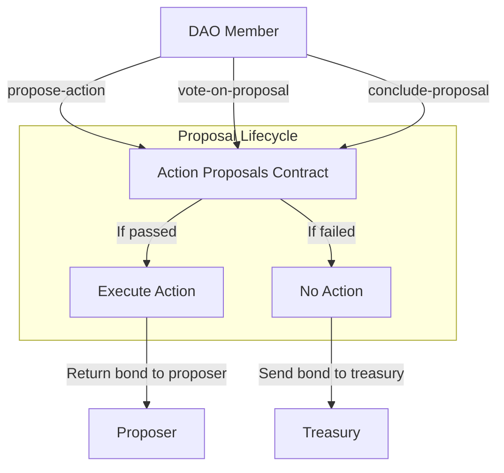

# Action Proposals Extension

The Action Proposals extension (`aibtc-action-proposals-v2`) enables DAO members to vote on predefined actions with lower thresholds than core proposals. This allows for more routine operations to be executed without the high barriers required for fundamental changes to the DAO.

## Key Features

- **Predefined Actions**: Only executes pre-approved action contracts registered with the DAO
- **Lower Thresholds**: Requires 66% approval with 15% quorum (vs 90%/25% for core proposals)
- **Proposal Bond**: Requires a bond that is returned to the proposer if the proposal passes
- **Shorter Timeframes**: Shorter voting delay and period compared to core proposals

## Quick Reference

| Property       | Value                                |
| -------------- | ------------------------------------ |
| Contract Name  | `aibtc-action-proposals-v2`         |
| Version        | 2.0.0                               |
| Implements     | extension, action-proposals traits   |
| Voting Delay   | 144 blocks (~1 day)                 |
| Voting Period  | 288 blocks (~2 days)                |
| Voting Quorum  | 15% of liquid supply                |
| Voting Threshold | 66% of votes                      |
| Proposal Bond  | 2,500 DAO tokens                    |

## How It Works



The action proposal process begins when a DAO member submits a proposal specifying an action contract and parameters. After the voting delay period, other members can vote for or against the proposal. Once the voting period ends, any member can conclude the proposal. If it passes (meets quorum and threshold), the action is executed and the bond is returned to the proposer. If it fails, the bond is sent to the treasury.

## Public Functions

### `set-proposal-bond`

**Purpose**: Sets the required bond amount for creating proposals

**Parameters**:
- `amount`: uint - The new bond amount in DAO tokens (8 decimals)

**Returns**: (response bool err-code) - Success or failure

**Example**:
```clarity
(contract-call? .aibtc-action-proposals-v2 set-proposal-bond u100000000000)
```

*Note: This function can only be called by the DAO or an extension.*

### `propose-action`

**Purpose**: Creates a new action proposal

**Parameters**:
- `action`: action-trait - The action contract to be executed if proposal passes
- `parameters`: (buff 2048) - Parameters to pass to the action contract
- `memo`: (optional (string-ascii 1024)) - Optional description of the proposal

**Returns**: (response uint err-code) - The proposal ID if successful

**Example**:
```clarity
(contract-call? .aibtc-action-proposals-v2 propose-action .my-action-contract 0x0123456789 "This is a proposal to do X")
```

### `vote-on-proposal`

**Purpose**: Casts a vote on an existing proposal

**Parameters**:
- `proposalId`: uint - The ID of the proposal to vote on
- `vote`: bool - True for yes, false for no

**Returns**: (response bool err-code) - Success or failure

**Example**:
```clarity
(contract-call? .aibtc-action-proposals-v2 vote-on-proposal u1 true)
```

### `conclude-proposal`

**Purpose**: Concludes a proposal after the voting period

**Parameters**:
- `proposalId`: uint - The ID of the proposal to conclude
- `action`: action-trait - The action contract (must match the one in the proposal)

**Returns**: (response bool err-code) - Success or failure, with true indicating the action was executed

**Example**:
```clarity
(contract-call? .aibtc-action-proposals-v2 conclude-proposal u1 .my-action-contract)
```

### `callback`

**Purpose**: Standard extension callback function

**Parameters**:
- `sender`: principal - The sender of the callback
- `memo`: (buff 34) - Memo data

**Returns**: (response bool err-code) - Always returns ok true

## Read-Only Functions

### `get-voting-power`

**Purpose**: Gets the voting power of an address for a specific proposal

**Parameters**:
- `who`: principal - The address to check
- `proposalId`: uint - The proposal ID

**Returns**: (optional uint) - The voting power (token balance) at proposal creation

### `get-proposal`

**Purpose**: Gets the details of a proposal

**Parameters**:
- `proposalId`: uint - The ID of the proposal

**Returns**: (optional {proposal-data}) - The proposal details or none if not found

### `get-proposal-bond`

**Purpose**: Gets the current proposal bond amount

**Parameters**: None

**Returns**: uint - The current bond amount

### `get-vote-record`

**Purpose**: Gets the vote record for a specific voter on a proposal

**Parameters**:
- `proposalId`: uint - The ID of the proposal
- `voter`: principal - The voter address

**Returns**: uint - The amount of tokens used for voting (0 if no vote)

### `get-total-proposals`

**Purpose**: Gets the total number of proposals

**Parameters**: None

**Returns**: {total: uint, concluded: uint, executed: uint} - Counts of proposals

### `get-last-proposal-created`

**Purpose**: Gets the block height of the last created proposal

**Parameters**: None

**Returns**: uint - The block height

### `get-voting-configuration`

**Purpose**: Gets the voting configuration details

**Parameters**: None

**Returns**: {configuration-data} - All voting parameters and contract references

### `get-liquid-supply`

**Purpose**: Calculates the liquid supply of the DAO token at a specific block

**Parameters**:
- `blockHeight`: uint - The block height to check

**Returns**: (response uint err-code) - The liquid supply amount

## Print Events

| Event | Description | Data |
|-------|-------------|------|
| `set-proposal-bond` | Emitted when proposal bond is changed | Amount, caller, sender |
| `propose-action` | Emitted when a new action proposal is created | Proposal ID, action contract, parameters, creator, bond, start/end blocks, liquid tokens |
| `vote-on-proposal` | Emitted when a vote is cast on a proposal | Proposal ID, voter, vote amount |
| `conclude-proposal` | Emitted when a proposal is concluded | Proposal ID, vote results, execution status |

## Integration Examples

### Creating a Proposal to Update Treasury Parameters

```clarity
;; Define the parameters for the treasury update
(define-constant PARAMETERS 
  (concat 
    (to-consensus-buff? u10000000000) ;; New withdrawal limit
    (to-consensus-buff? u5) ;; New required approvals
  ))

;; Create the proposal
(contract-call? .aibtc-action-proposals-v2 propose-action .treasury-update-action PARAMETERS (some "Update treasury withdrawal limits"))
```

### Voting on an Active Proposal

```clarity
;; Vote in favor of proposal #5
(contract-call? .aibtc-action-proposals-v2 vote-on-proposal u5 true)

;; Vote against proposal #6
(contract-call? .aibtc-action-proposals-v2 vote-on-proposal u6 false)
```

## Error Handling

| Error Code | Constant | Description | Resolution |
|------------|----------|-------------|------------|
| u1000 | ERR_NOT_DAO_OR_EXTENSION | Caller is not the DAO or an extension | Ensure you're calling from the DAO or an approved extension |
| u1001 | ERR_FETCHING_TOKEN_DATA | Error fetching token data | Check token contract is accessible |
| u1002 | ERR_INSUFFICIENT_BALANCE | Caller has insufficient token balance | Ensure you have enough tokens for the bond or voting |
| u1003 | ERR_PROPOSAL_NOT_FOUND | Proposal not found | Verify the proposal ID exists |
| u1004 | ERR_PROPOSAL_VOTING_ACTIVE | Proposal voting is still active | Wait until the voting period ends |
| u1005 | ERR_PROPOSAL_EXECUTION_DELAY | Proposal is in execution delay period | Wait until the execution delay ends |
| u1006 | ERR_ALREADY_PROPOSAL_AT_BLOCK | Already a proposal at this block | Wait for the next block to create a proposal |
| u1007 | ERR_SAVING_PROPOSAL | Error saving proposal | Check for data format issues |
| u1008 | ERR_PROPOSAL_ALREADY_CONCLUDED | Proposal already concluded | Cannot conclude a proposal twice |
| u1009 | ERR_RETRIEVING_START_BLOCK_HASH | Error retrieving start block hash | Block data may be unavailable |
| u1010 | ERR_VOTE_TOO_SOON | Vote attempted before voting period started | Wait until the voting delay period ends |
| u1011 | ERR_VOTE_TOO_LATE | Vote attempted after voting period ended | Cannot vote after the voting period |
| u1012 | ERR_ALREADY_VOTED | User already voted on this proposal | Cannot vote twice on the same proposal |
| u1013 | ERR_INVALID_ACTION | Invalid action contract | Action must be registered with the DAO |
| u1014 | ERR_DAO_NOT_ACTIVATED | DAO not activated | Wait for DAO activation |
| u1015 | ERR_INVALID_BOND_AMOUNT | Invalid bond amount | Bond amount must be greater than zero |

## Proposal Bond

The Action Proposals extension requires a bond of **2,500 DAO tokens** to create a proposal. This bond serves several important purposes:

1. **Prevent Spam**: The bond creates a financial barrier to submitting frivolous proposals
2. **Ensure Quality**: Proposers are incentivized to create well-thought-out proposals
3. **Align Incentives**: The bond is returned if the proposal passes, aligning proposer incentives with the DAO

The bond amount can be adjusted through governance if needed. If a proposal passes, the bond is returned to the proposer. If a proposal fails, the bond is sent to the treasury.

## Security Considerations

- **Action Validation**: Only pre-approved action contracts can be executed, preventing arbitrary code execution
- **Proposal Bond**: Requires a significant bond (2,500 tokens) to prevent spam proposals
- **Voting Power Snapshot**: Voting power is determined at proposal creation time to prevent manipulation
- **Timelock Periods**: Voting delay and execution delay prevent rushed decisions
- **Quorum Requirements**: Ensures sufficient participation for valid governance

## Related Contracts

- **aibtc-base-dao**: The base DAO contract that this extension integrates with
- **aibtc-token**: The DAO token used for voting
- **aibtc-treasury**: Receives proposal bonds for failed proposals
- **Action Contracts**: Any contract implementing the action trait that can be executed by this extension

## Versioning and Updates

- **Current Version**: 2.0.0
- **Last Updated**: April 2025
- **Changes from v1**:
  - Added proposal bond mechanism
  - Improved voting power calculation
  - Enhanced security validations
