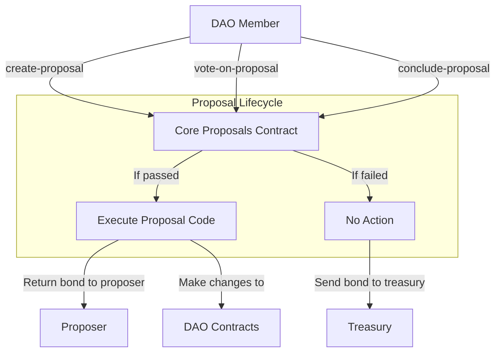

# Core Proposals Extension

The Core Proposals extension (`aibtc-core-proposals-v2`) enables DAO members to vote on proposals that can execute arbitrary Clarity code in the context of the DAO. This provides the highest level of governance control with correspondingly high voting thresholds to ensure security and consensus.

## Key Features

- **Arbitrary Code Execution**: Can execute any Clarity code in the context of the DAO
- **Highest Security Thresholds**: Requires 90% approval with 25% quorum
- **Proposal Bond**: Requires a bond that is returned to the proposer if the proposal passes
- **Extended Timeframes**: Longer voting delay and period for thorough consideration

## Quick Reference

| Property       | Value                                |
| -------------- | ------------------------------------ |
| Contract Name  | `aibtc-core-proposals-v2`           |
| Version        | 2.0.0                               |
| Implements     | extension, core-proposals traits     |
| Voting Delay   | 432 blocks (~3 days)                |
| Voting Period  | 432 blocks (~3 days)                |
| Voting Quorum  | 25% of liquid supply                |
| Voting Threshold | 90% of votes                      |
| Proposal Bond  | 250,000 DAO tokens                  |

## How It Works



The core proposal process begins when a DAO member submits a proposal contract implementing the proposal trait. After the voting delay period, other members can vote for or against the proposal. Once the voting period ends, any member can conclude the proposal. If it passes (meets quorum and threshold), the proposal code is executed in the context of the DAO and the bond is returned to the proposer. If it fails, the bond is sent to the treasury.

## Public Functions

### `set-proposal-bond`

**Purpose**: Sets the required bond amount for creating proposals

**Parameters**:
- `amount`: uint - The new bond amount in DAO tokens (8 decimals)

**Returns**: (response bool err-code) - Success or failure

**Example**:
```clarity
(contract-call? .aibtc-core-proposals-v2 set-proposal-bond u100000000000)
```

*Note: This function can only be called by the DAO or an extension.*

### `create-proposal`

**Purpose**: Creates a new core proposal

**Parameters**:
- `proposal`: proposal-trait - The proposal contract to be executed if passed
- `memo`: (optional (string-ascii 1024)) - Optional description of the proposal

**Returns**: (response bool err-code) - Success or failure

**Example**:
```clarity
(contract-call? .aibtc-core-proposals-v2 create-proposal .my-proposal-contract (some "This is a proposal to change X"))
```

### `vote-on-proposal`

**Purpose**: Casts a vote on an existing proposal

**Parameters**:
- `proposal`: proposal-trait - The proposal contract to vote on
- `vote`: bool - True for yes, false for no

**Returns**: (response bool err-code) - Success or failure

**Example**:
```clarity
(contract-call? .aibtc-core-proposals-v2 vote-on-proposal .my-proposal-contract true)
```

### `conclude-proposal`

**Purpose**: Concludes a proposal after the voting period

**Parameters**:
- `proposal`: proposal-trait - The proposal contract to conclude

**Returns**: (response bool err-code) - Success or failure, with true indicating the proposal was executed

**Example**:
```clarity
(contract-call? .aibtc-core-proposals-v2 conclude-proposal .my-proposal-contract)
```

### `callback`

**Purpose**: Standard extension callback function

**Parameters**:
- `sender`: principal - The sender of the callback
- `memo`: (buff 34) - Memo data

**Returns**: (response bool err-code) - Always returns ok true

## Read-Only Functions

### `get-voting-power`

**Purpose**: Gets the voting power of an address for a specific proposal

**Parameters**:
- `who`: principal - The address to check
- `proposal`: proposal-trait - The proposal contract

**Returns**: (optional uint) - The voting power (token balance) at proposal creation

### `get-proposal`

**Purpose**: Gets the details of a proposal

**Parameters**:
- `proposal`: principal - The proposal contract address

**Returns**: (optional {proposal-data}) - The proposal details or none if not found

### `get-proposal-bond`

**Purpose**: Gets the current proposal bond amount

**Parameters**: None

**Returns**: uint - The current bond amount

### `get-vote-record`

**Purpose**: Gets the vote record for a specific voter on a proposal

**Parameters**:
- `proposal`: principal - The proposal contract address
- `voter`: principal - The voter address

**Returns**: uint - The amount of tokens used for voting (0 if no vote)

### `get-total-proposals`

**Purpose**: Gets the total number of proposals

**Parameters**: None

**Returns**: {total: uint, concluded: uint, executed: uint} - Counts of proposals

### `get-last-proposal-created`

**Purpose**: Gets the block height of the last created proposal

**Parameters**: None

**Returns**: uint - The block height

### `get-voting-configuration`

**Purpose**: Gets the voting configuration details

**Parameters**: None

**Returns**: {configuration-data} - All voting parameters and contract references

### `get-liquid-supply`

**Purpose**: Calculates the liquid supply of the DAO token at a specific block

**Parameters**:
- `blockHeight`: uint - The block height to check

**Returns**: (response uint err-code) - The liquid supply amount

## Print Events

| Event | Description | Data |
|-------|-------------|------|
| `set-proposal-bond` | Emitted when proposal bond is changed | Amount, caller, sender |
| `create-proposal` | Emitted when a new proposal is created | Proposal contract, creator, bond, start/end blocks, liquid tokens |
| `vote-on-proposal` | Emitted when a vote is cast on a proposal | Proposal contract, voter, vote amount |
| `conclude-proposal` | Emitted when a proposal is concluded | Proposal contract, vote results, execution status |

## Integration Examples

### Creating a Proposal to Add a New Extension

```clarity
;; Deploy your proposal contract first
;; Then create the proposal
(contract-call? .aibtc-core-proposals-v2 create-proposal .add-extension-proposal (some "Add new analytics extension"))
```

### Creating a Proposal to Update Core DAO Parameters

```clarity
;; Deploy your proposal contract first
;; Then create the proposal
(contract-call? .aibtc-core-proposals-v2 create-proposal .update-dao-params-proposal (some "Update minimum proposal threshold"))
```

## Error Handling

| Error Code | Constant | Description | Resolution |
|------------|----------|-------------|------------|
| u3000 | ERR_NOT_DAO_OR_EXTENSION | Caller is not the DAO or an extension | Ensure you're calling from the DAO or an approved extension |
| u3001 | ERR_FETCHING_TOKEN_DATA | Error fetching token data | Check token contract is accessible |
| u3002 | ERR_INSUFFICIENT_BALANCE | Caller has insufficient token balance | Ensure you have enough tokens for the bond or voting |
| u3003 | ERR_PROPOSAL_NOT_FOUND | Proposal not found | Verify the proposal contract exists |
| u3004 | ERR_PROPOSAL_VOTING_ACTIVE | Proposal voting is still active | Wait until the voting period ends |
| u3005 | ERR_PROPOSAL_EXECUTION_DELAY | Proposal is in execution delay period | Wait until the execution delay ends |
| u3006 | ERR_PROPOSAL_ALREADY_EXECUTED | Proposal already executed | Cannot execute a proposal twice |
| u3007 | ERR_SAVING_PROPOSAL | Error saving proposal | Check for data format issues |
| u3008 | ERR_PROPOSAL_ALREADY_CONCLUDED | Proposal already concluded | Cannot conclude a proposal twice |
| u3009 | ERR_RETRIEVING_START_BLOCK_HASH | Error retrieving start block hash | Block data may be unavailable |
| u3010 | ERR_VOTE_TOO_SOON | Vote attempted before voting period started | Wait until the voting delay period ends |
| u3011 | ERR_VOTE_TOO_LATE | Vote attempted after voting period ended | Cannot vote after the voting period |
| u3012 | ERR_ALREADY_VOTED | User already voted on this proposal | Cannot vote twice on the same proposal |
| u3013 | ERR_FIRST_VOTING_PERIOD | First voting period has not passed | Wait for the first voting period after deployment |
| u3014 | ERR_DAO_NOT_ACTIVATED | DAO not activated | Wait for DAO activation |
| u3015 | ERR_INVALID_BOND_AMOUNT | Invalid bond amount | Bond amount must be greater than zero |

## Proposal Bond

The Core Proposals extension requires a substantial bond of **250,000 DAO tokens** to create a proposal. This high bond amount reflects the critical nature of core proposals, which can execute arbitrary code in the context of the DAO. The bond serves several crucial purposes:

1. **High Security Barrier**: The significant bond amount ensures only serious proposals with broad support are submitted
2. **Prevent Governance Attacks**: The high cost deters potential attackers from attempting to manipulate governance
3. **Ensure Thorough Vetting**: Proposers are strongly incentivized to ensure their proposals are well-designed and likely to pass
4. **Community Alignment**: The bond is returned if the proposal passes, aligning proposer incentives with the DAO

The bond amount can be adjusted through governance if needed. If a proposal passes, the bond is returned to the proposer. If a proposal fails, the bond is sent to the treasury.

## Security Considerations

- **High Thresholds**: 90% approval with 25% quorum ensures broad consensus for critical changes
- **Substantial Proposal Bond**: Requires a large bond (250,000 tokens) to prevent spam and governance attacks
- **Voting Power Snapshot**: Voting power is determined at proposal creation time to prevent manipulation
- **Extended Timelock**: Longer voting delay and period allow thorough review of proposed code
- **First Voting Period Check**: Prevents proposals immediately after deployment
- **Liquid Supply Calculation**: Excludes tokens held by protocol contracts for accurate voting power

## Related Contracts

- **aibtc-base-dao**: The base DAO contract that this extension integrates with
- **aibtc-token**: The DAO token used for voting
- **aibtc-treasury**: Receives proposal bonds for failed proposals
- **Proposal Contracts**: Any contract implementing the proposal trait that can be executed by this extension

## Liquid Supply Calculation

The liquid supply calculation excludes tokens held by:
- The pre-DEX contract
- The token DEX contract
- The token pool contract
- The treasury contract

This ensures that only tokens in circulation are counted for voting power, preventing protocol-owned tokens from influencing governance decisions.

## Versioning and Updates

- **Current Version**: 2.0.0
- **Last Updated**: April 2025
- **Changes from v1**:
  - Added proposal bond mechanism
  - Improved liquid supply calculation
  - Enhanced security validations
  - Added first voting period check
