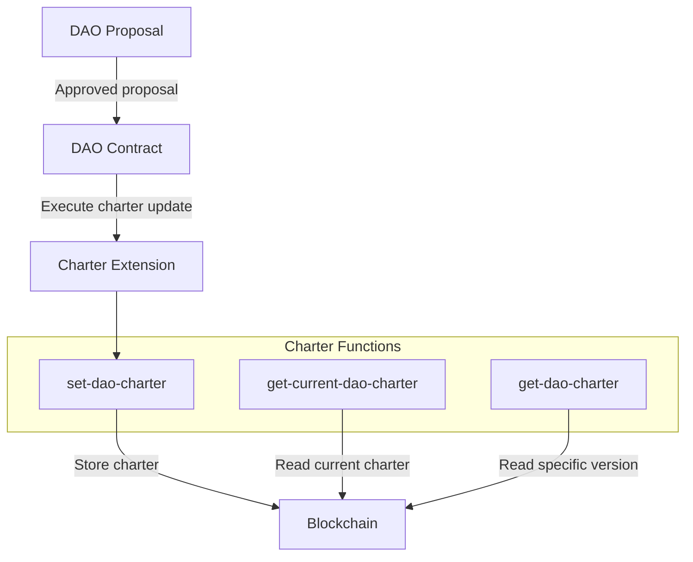

# DAO Charter Extension

The DAO Charter extension (`aibtc-dao-charter`) allows the DAO to define and maintain its mission and values on-chain. This provides a permanent record of the organization's purpose and principles that can guide decision-making and proposals. The charter serves as the foundational document that establishes the DAO's identity, mission, and governance philosophy.

## Key Features

- **On-chain Charter Storage**: Permanently records the DAO's mission and values on the blockchain
- **Version History**: Maintains a complete history of all charter revisions
- **Inscription Support**: Optional support for Bitcoin inscriptions to enhance permanence
- **DAO-controlled Updates**: Only the DAO or authorized extensions can modify the charter

## Quick Reference

| Property       | Value                           |
| -------------- | ------------------------------- |
| Contract Name  | `aibtc-dao-charter`             |
| Version        | 1.0.0                           |
| Implements     | extension, charter              |
| Key Parameters | Charter text (max 4096 chars)   |

## How It Works



The DAO Charter extension works by storing the organization's mission and values directly on the blockchain. When the DAO approves a charter update, it calls the extension to store the new text. Each update creates a new version while preserving the complete history of previous versions. The charter can be retrieved by anyone, providing transparency about the DAO's purpose and principles.

## Public Functions

### `callback`

**Purpose**: Standard extension callback function required by the extension trait

**Parameters**:
- `sender`: principal - The principal that triggered the callback
- `memo`: (buff 34) - Optional memo data

**Returns**: (response bool) - Returns success (true) if the callback is processed

**Example**:
```clarity
(contract-call? .aibtc-dao-charter callback tx-sender 0x00)
```

### `set-dao-charter`

**Purpose**: Sets or updates the DAO charter text

**Parameters**:
- `charter`: (string-ascii 4096) - The charter text (up to 4096 ASCII characters)
- `inscriptionId`: (optional (buff 33)) - Optional Bitcoin inscription ID for permanence

**Returns**: (response bool) - Returns success (true) if the charter is updated

**Example**:
```clarity
(contract-call? .aibtc-dao-charter set-dao-charter "The mission of our DAO is to..." none)
```

**Notes**: This function can only be called by the DAO or an authorized extension. The charter text must be between 1 and 4096 characters.

## Read-Only Functions

### `get-current-dao-charter-version`

**Purpose**: Gets the current version number of the DAO charter

**Parameters**: None

**Returns**: (optional uint) - The current charter version or none if no charter exists

**Example**:
```clarity
(contract-call? .aibtc-dao-charter get-current-dao-charter-version)
```

### `get-current-dao-charter`

**Purpose**: Gets the current text of the DAO charter

**Parameters**: None

**Returns**: (optional (string-ascii 4096)) - The current charter text or none if no charter exists

**Example**:
```clarity
(contract-call? .aibtc-dao-charter get-current-dao-charter)
```

### `get-dao-charter`

**Purpose**: Gets a specific version of the DAO charter

**Parameters**:
- `version`: uint - The version number to retrieve

**Returns**: (optional {burnHeight: uint, createdAt: uint, caller: principal, sender: principal, charter: (string-ascii 4096), inscriptionId: (optional (buff 33))}) - The charter data for the specified version

**Example**:
```clarity
(contract-call? .aibtc-dao-charter get-dao-charter u1)
```

## Print Events

| Event             | Description                    | Data                                                         |
| ----------------- | ------------------------------ | ------------------------------------------------------------ |
| `set-dao-charter` | Emitted when charter is updated | Charter text, version, creator, timestamp, optional inscription ID |

## Integration Examples

### Setting the Initial DAO Charter

```clarity
;; This would typically be done through a DAO proposal
(contract-call? .aibtc-base-dao propose-extension-action
  .aibtc-dao-charter
  (contract-call? .aibtc-dao-charter set-dao-charter 
    "The mission of our DAO is to advance Bitcoin development through collective governance and funding allocation. We value transparency, technical excellence, and community-driven innovation." 
    none
  )
)
```

### Reading the Current Charter in a UI Application

```clarity
;; Get the current charter to display in a UI
(contract-call? .aibtc-dao-charter get-current-dao-charter)
```

## Error Handling

| Error Code | Constant                  | Description                       | Resolution                                           |
| ---------- | ------------------------- | --------------------------------- | ---------------------------------------------------- |
| u8000      | ERR_NOT_DAO_OR_EXTENSION  | Caller is not the DAO or extension | Ensure the call is made through the DAO or an authorized extension |
| u8001      | ERR_SAVING_CHARTER        | Error saving charter data         | Verify the charter data format is correct            |
| u8002      | ERR_CHARTER_TOO_SHORT     | Charter text is too short         | Ensure the charter text is at least 1 character      |
| u8003      | ERR_CHARTER_TOO_LONG      | Charter text exceeds maximum      | Reduce charter text to 4096 characters or less       |

## Security Considerations

- **Access Control**: Only the DAO or authorized extensions can update the charter
- **Data Validation**: Charter text is validated for length constraints
- **Version History**: All previous versions are preserved, preventing history modification
- **Transparency**: All charter updates are visible on-chain with attribution

## Related Contracts

- **aibtc-base-dao**: The main DAO contract that authorizes charter updates
- **aibtc-dao-traits-v3**: Defines the extension and charter traits
- **aibtc-onchain-messaging**: Can be used alongside the charter for DAO communications

## Charter Versioning

The contract maintains a history of all charter versions, including:
- Charter text (up to 4096 ASCII characters)
- Creation timestamp (block height)
- Creator information
- Optional inscription ID for blockchain permanence

Each update creates a new version while preserving the complete history of previous versions.
