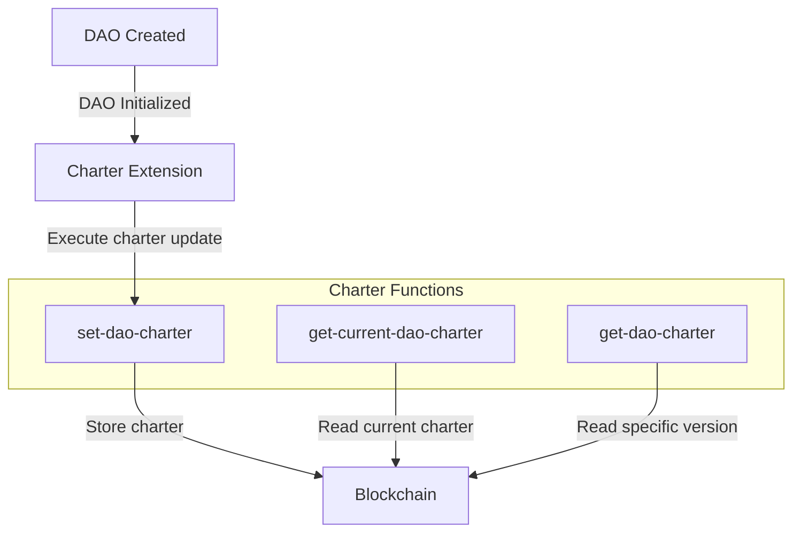

# DAO Charter Extension

The DAO Charter extension (`aibtc-dao-charter`) allows the DAO to define and maintain its mission and values on-chain. This provides a permanent record of the organization's purpose and principles that can guide decision-making and proposals. The charter serves as the foundational document that establishes the DAO's identity, mission, and governance philosophy.

## Key Features

- **On-chain Charter Storage**: Permanently records the DAO's mission and values on the blockchain.
- **Version History**: Maintains a complete history of all charter revisions.
- **DAO-controlled Updates**: Only the DAO or authorized extensions can modify the charter.


The first cohort of AIBTC DAOs will not have the ability to change the DAO charter.

Future iterations of AIBTC DAOs can implement an extension that allows for this.


## Quick Reference

| Property       | Value                                                          |
| -------------- | -------------------------------------------------------------- |
| Contract Name  | `aibtc-dao-charter`                                            |
| Implements     | `.aibtc-dao-traits.extension`, `.aibtc-dao-traits.dao-charter` |
| Key Parameters | Charter text (max 4096 chars)                                  |

## How It Works

The DAO Charter extension works by storing the organization's mission and values directly on the blockchain. When the DAO approves a charter update, it calls the extension to store the new text. Each update creates a new version while preserving the complete history of previous versions. The charter can be retrieved by anyone, providing transparency about the DAO's purpose and principles.

## Public Functions

### `callback`

**Purpose**: Standard extension callback function required by the extension trait

**Parameters**:

- `sender`: principal - The principal that triggered the callback
- `memo`: (buff 34) - Optional memo data

**Returns**: (response bool) - Returns success (true) if the callback is processed

### `set-dao-charter`

**Purpose**: Sets or updates the DAO charter text

**Parameters**:

- `charter`: `(string-ascii 4096)` - The charter text (up to 4096 ASCII characters).

**Returns**: `(response bool err-code)` - Returns `(ok true)` if the charter is updated, otherwise an error.

**Notes**: This function can only be called by the DAO or an authorized extension. The charter text must be between 1 and 4096 characters.

## Read-Only Functions

### `get-current-dao-charter-version`

**Purpose**: Gets the current version number of the DAO charter

**Parameters**: None

**Returns**: (optional uint) - The current charter version or none if no charter exists

### `get-current-dao-charter`

**Purpose**: Gets the current text of the DAO charter

**Parameters**: None

**Returns**: (optional (string-ascii 4096)) - The current charter text or none if no charter exists

### `get-dao-charter`

**Purpose**: Gets a specific version of the DAO charter

**Parameters**:

- `version`: `uint` - The version number to retrieve.

**Returns**: `(optional {burnHeight: uint, createdAt: uint, caller: principal, sender: principal, charter: (string-ascii 4096)})` - The charter data for the specified version, or `none` if not found.f

## Print Events

| Event             | Description                     | Data                                                                                                            |
| ----------------- | ------------------------------- | --------------------------------------------------------------------------------------------------------------- |
| `set-dao-charter` | Emitted when charter is updated | `burnHeight`, `createdAt`, `contractCaller`, `txSender`, `dao (SELF)`, `charter`, `previousCharter`, `version`. |

## Error Handling

| Error Code | Constant                 | Description                               | Resolution                                                          |
| ---------- | ------------------------ | ----------------------------------------- | ------------------------------------------------------------------- |
| u1400      | ERR_NOT_DAO_OR_EXTENSION | Caller is not the DAO or an extension.    | Ensure the call is made through the DAO or an authorized extension. |
| u1401      | ERR_SAVING_CHARTER       | Error saving new charter version data.    | Verify the charter data format and contract state; retry.           |
| u1402      | ERR_CHARTER_TOO_SHORT    | Charter text is too short (must be >= 1). | Ensure the charter text is at least 1 character long.               |
| u1403      | ERR_CHARTER_TOO_LONG     | Charter text exceeds maximum (4096).      | Reduce charter text to 4096 ASCII characters or less.               |

## Security Considerations

- **Access Control**: Only the DAO or authorized extensions can update the charter
- **Data Validation**: Charter text is validated for length constraints
- **Version History**: All previous versions are preserved, preventing history modification
- **Transparency**: All charter updates are visible on-chain with attribution

## Related Contracts

- **`.aibtc-base-dao`**: The main DAO contract that authorizes charter updates.
- **`.aibtc-dao-traits.extension`**: Trait implemented by this extension.
- **`.aibtc-dao-traits.dao-charter`**: Trait implemented by this extension.
- **`.aibtc-onchain-messaging`**: Can be used alongside the charter for DAO communications.

## Charter Versioning

The contract maintains a history of all charter versions. Each version record includes:

- `charter`: The charter text (up to 4096 ASCII characters).
- `burnHeight`: The Bitcoin block height at the time of creation.
- `createdAt`: The Stacks block height at the time of creation.
- `caller`: The `contract-caller` (e.g., the DAO contract or an authorized extension).
- `sender`: The `tx-sender` who initiated the transaction.

Each update creates a new version while preserving the complete history of previous versions.
