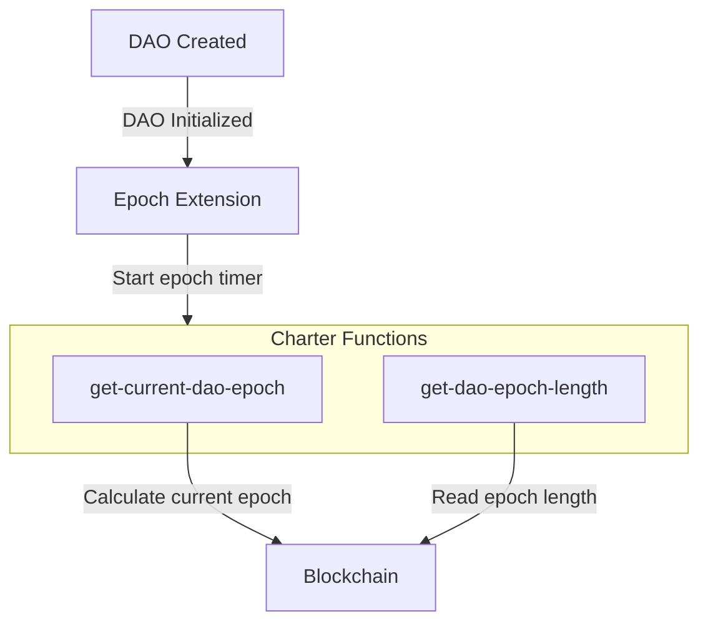

# DAO Epoch Extension

The DAO Epoch extension (`aibtc-dao-epoch`) provides a mechanism to track time in discrete periods called "epochs." These epochs are defined by a fixed number of Bitcoin blocks, allowing DAO operations and governance to be synchronized with the progression of the Bitcoin blockchain.

## Key Features

- **Bitcoin Block-Based Epochs**: Epochs are measured in Bitcoin blocks, providing a consistent and decentralized time reference.
- **Configurable Epoch Length**: The duration of an epoch (in Bitcoin blocks) is a defined constant.
- **Read-Only Access**: Provides functions to query the current epoch and the defined epoch length.

## Quick Reference

| Property       | Value                                                             |
| -------------- | ----------------------------------------------------------------- |
| Contract Name  | `aibtc-dao-epoch`                                                 |
| Implements     | `.aibtc-dao-traits.extension`, `.aibtc-dao-traits.dao-epoch`      |
| Key Parameters | `EPOCH_LENGTH` (default: `u4320` Bitcoin blocks, approx. 30 days) |

## How It Works

The extension calculates the current DAO epoch based on the number of Bitcoin blocks that have elapsed since the contract's deployment. It uses the `burn-block-height` (current Bitcoin block height), `DEPLOYED_BURN_BLOCK` (Bitcoin block height at contract deployment), and `EPOCH_LENGTH` (constant defining blocks per epoch). The formula is essentially `(burn-block-height - DEPLOYED_BURN_BLOCK) / EPOCH_LENGTH`.

## Public Functions

### `callback`

**Purpose**: Standard extension callback function required by the extension trait.

**Parameters**:

- `sender`: `principal` - The principal that triggered the callback.
- `memo`: `(buff 34)` - Optional memo data.

**Returns**: `(response bool)` - Returns `(ok true)` if the callback is processed.

## Read-Only Functions

### `get-current-dao-epoch`

**Purpose**: Gets the current DAO epoch number.

**Parameters**: None.

**Returns**: `(ok uint)` - The current epoch number.

### `get-dao-epoch-length`

**Purpose**: Gets the defined length of a DAO epoch in Bitcoin blocks.

**Parameters**: None.

**Returns**: `(ok uint)` - The epoch length in Bitcoin blocks (e.g., `u4320`).

## Print Events

This contract does not emit any print events.

## Error Handling

This contract does not define custom error codes. Read-only functions return `(ok ...)` responses.

## Security Considerations

- **Read-Only Nature**: The primary functions are read-only and do not alter state, minimizing direct attack vectors.
- **Reliance on Stacks Chain Data**: The accuracy of epoch calculation depends on the `burn-block-height` provided by the Stacks blockchain.
- **Immutability of Epoch Length**: `EPOCH_LENGTH` is a constant; changing it would require deploying a new version of the contract.

## Related Contracts

- **`.aibtc-dao-traits.extension`**: Trait implemented by this extension.
- **`.aibtc-dao-traits.dao-epoch`**: Trait implemented by this extension.
- Any DAO contract or extension that needs to perform actions based on defined time periods (epochs).
