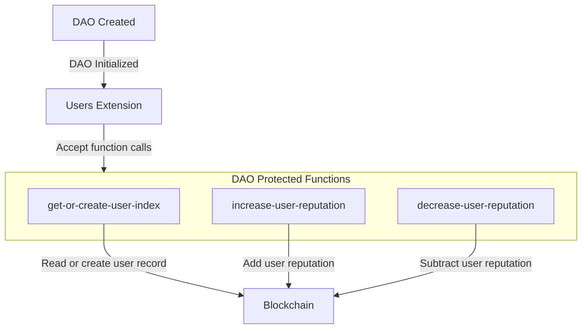

# DAO Users Extension

The DAO Users extension (`aibtc-dao-users`) is responsible for tracking unique users within the DAO and managing their reputation scores. It allows the DAO or authorized extensions to register new users and adjust reputation based on participation or other defined criteria.

## Key Features

- **User Registration**: Creates unique entries for DAO participants.
- **Reputation Tracking**: Maintains a numerical reputation score for each user.
- **Controlled Updates**: Reputation can only be modified by the DAO or authorized extensions.
- **Data Accessibility**: Provides read-only functions to query user data and reputation.

## Quick Reference

| Property       | Value                                                           |
| -------------- | --------------------------------------------------------------- |
| Contract Name  | `aibtc-dao-users`                                               |
| Implements     | `.aibtc-dao-traits.extension`, `.aibtc-dao-traits.dao-users`    |
| Key Parameters | None directly; relies on DAO/extension calls for modifications. |

## How It Works

The DAO or an authorized extension interacts with this contract to manage users. When `get-or-create-user-index` is called for a principal, the extension checks if the user already exists. If not, it creates a new entry, assigning a unique index and initializing their data (including a reputation of 0). The `increase-user-reputation` and `decrease-user-reputation` functions allow authorized callers to modify a user's reputation score. All user data is stored in internal maps.

## Public Functions

### `callback`

**Purpose**: Standard extension callback function required by the extension trait.

**Parameters**:

- `sender`: `principal` - The principal that triggered the callback.
- `memo`: `(buff 34)` - Optional memo data.

**Returns**: `(response bool)` - Returns `(ok true)` if the callback is processed.

### `get-or-create-user-index`

**Purpose**: Retrieves the index for an existing user or creates a new user entry if one doesn't exist.

**Parameters**:

- `address`: `principal` - The principal of the user.

**Returns**: `(response uint err-code)` - Returns `(ok user-index)` on success, or an error if the caller is not authorized.

### `increase-user-reputation`

**Purpose**: Increases the reputation score of a specified user.

**Parameters**:

- `address`: `principal` - The principal of the user.
- `amount`: `uint` - The amount by which to increase the reputation (converted to `int`).

**Returns**: `(response bool err-code)` - Returns `(ok true)` on success, or an error.

### `decrease-user-reputation`

**Purpose**: Decreases the reputation score of a specified user.

**Parameters**:

- `address`: `principal` - The principal of the user.
- `amount`: `uint` - The amount by which to decrease the reputation (converted to `int`).

**Returns**: `(response bool err-code)` - Returns `(ok true)` on success, or an error.

## Read-Only Functions

### `get-user-count`

**Purpose**: Gets the total number of registered users.

**Parameters**: None.

**Returns**: `uint` - The total count of users.

### `get-user-index`

**Purpose**: Gets the unique index for a given user principal.

**Parameters**:

- `address`: `principal` - The user's principal.

**Returns**: `(optional uint)` - The user's index if found, otherwise `none`.

### `get-user-data-by-index`

**Purpose**: Gets the full user data record for a given user index.

**Parameters**:

- `userIndex`: `uint` - The user's unique index.

**Returns**: `(optional {address: principal, createdAt: uint, reputation: int})` - The user data tuple if found, otherwise `none`.

### `get-user-data-by-address`

**Purpose**: Gets the full user data record for a given user principal. This is a convenience function that first looks up the index.

**Parameters**:

- `address`: `principal` - The user's principal.

**Returns**: `(optional {address: principal, createdAt: uint, reputation: int})` - The user data tuple if found, otherwise `none`.

## Print Events

| Event                                      | Description                                    | Data                                                                                    |
| ------------------------------------------ | ---------------------------------------------- | --------------------------------------------------------------------------------------- |
| `aibtc-dao-users/get-or-create-user-index` | Emitted when a new user index is created.      | `userIndex`, `address`, `createdAt` (burn block), `contractCaller`, `txSender`          |
| `aibtc-dao-users/increase-user-reputation` | Emitted when a user's reputation is increased. | `userIndex`, `address`, `createdAt` (burn block of event), `contractCaller`, `txSender` |
| `aibtc-dao-users/decrease-user-reputation` | Emitted when a user's reputation is decreased. | `userIndex`, `address`, `createdAt` (burn block of event), `contractCaller`, `txSender` |

## Error Handling

| Error Code | Constant                 | Description                                         | Resolution                                                                                        |
| ---------- | ------------------------ | --------------------------------------------------- | ------------------------------------------------------------------------------------------------- |
| u1500      | ERR_NOT_DAO_OR_EXTENSION | Caller is not the DAO or an authorized extension.   | Ensure calls modifying user data are made by `.aibtc-base-dao` or a registered extension.         |
| u1501      | ERR_USER_NOT_FOUND       | User principal or index not found for an operation. | Ensure the user exists before attempting to modify reputation, or use `get-or-create-user-index`. |

## Security Considerations

- **Access Control**: Modifying functions (`get-or-create-user-index`, `increase-user-reputation`, `decrease-user-reputation`) are protected and can only be called by the DAO (`.aibtc-base-dao`) or an extension authorized by the DAO.
- **Reputation Score Integrity**: The logic for increasing/decreasing reputation should be carefully designed within the calling contracts (e.g., proposal mechanisms) to prevent unfair manipulation.
- **Data Privacy**: User principals and their creation block heights are public. Reputation scores are also public.

## Related Contracts

- **`.aibtc-base-dao`**: The main DAO contract that authorizes calls to this extension.
- **`.aibtc-dao-traits.extension`**: Trait implemented by this extension.
- **`.aibtc-dao-traits.dao-users`**: Trait implemented by this extension.
- Proposal contracts or other extensions that interact with user reputation.
