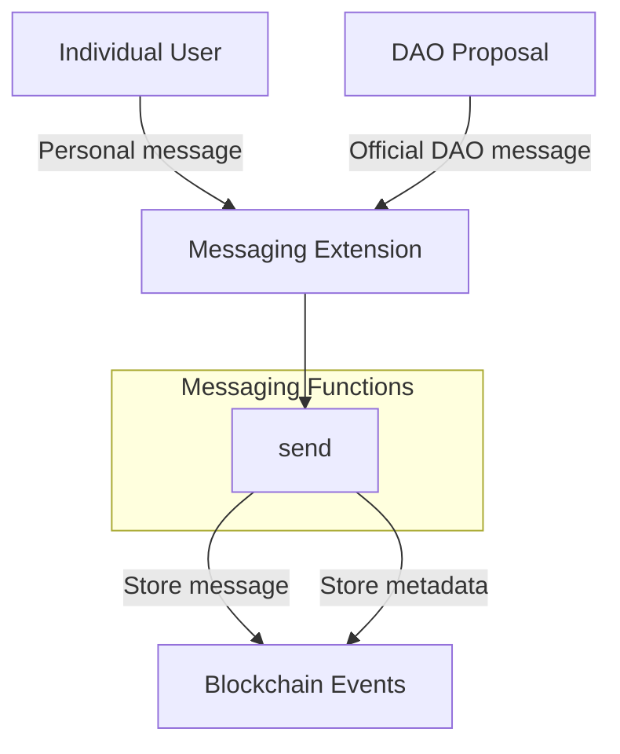

# Onchain Messaging Extension

The Onchain Messaging extension (`aibtc-onchain-messaging`) allows for sending verified messages that are stored as blockchain events. This provides a way for the DAO to communicate officially and for users to send messages that can be verified as coming from specific addresses. Messages are permanently recorded on the blockchain, creating an immutable communication record.

## Key Features

- **Verified Messaging**: Messages are cryptographically tied to their sender
- **DAO Official Communications**: Special flag for messages sent by the DAO
- **Large Message Support**: Supports messages up to 1MB in size
- **Blockchain Permanence**: All messages are stored as blockchain events
- **Metadata Capture**: Records sender, block height, and other contextual data

## Quick Reference

| Property       | Value                           |
| -------------- | ------------------------------- |
| Contract Name  | `aibtc-onchain-messaging`       |
| Version        | 1.0.0                           |
| Implements     | extension, messaging            |
| Key Parameters | Message text (max 1,048,576 chars), isFromDao flag |

## How It Works



The Onchain Messaging extension works by recording messages as blockchain events. When a user or the DAO sends a message, the contract verifies the sender's identity and records both the message content and metadata about the sender. Messages from the DAO are specially flagged, allowing recipients to distinguish official communications from individual messages. All messages are permanently stored on the blockchain, creating an immutable record.

## Public Functions

### `callback`

**Purpose**: Standard extension callback function required by the extension trait

**Parameters**:
- `sender`: principal - The principal that triggered the callback
- `memo`: (buff 34) - Optional memo data

**Returns**: (response bool) - Returns success (true) if the callback is processed

**Example**:
```clarity
(contract-call? .aibtc-onchain-messaging callback tx-sender 0x00)
```

### `send`

**Purpose**: Sends a message that is recorded on the blockchain

**Parameters**:
- `msg`: (string-ascii 1048576) - The message text (up to 1,048,576 ASCII characters)
- `isFromDao`: bool - Flag indicating if the message is an official DAO communication

**Returns**: (response bool) - Returns success (true) if the message is sent

**Example**:
```clarity
(contract-call? .aibtc-onchain-messaging send "Hello, Stacks blockchain!" false)
```

**Notes**: If `isFromDao` is true, the function verifies that the caller is the DAO or an authorized extension. Messages must be at least 1 character long.

## Print Events

| Event             | Description                    | Data                                                         |
| ----------------- | ------------------------------ | ------------------------------------------------------------ |
| Message content   | The actual message content     | Raw message string                                           |
| `send`            | Metadata about the message     | Caller, block height, isFromDao flag, sender                 |

## Integration Examples

### Sending a Personal Message

```clarity
;; Individual user sending a personal message
(contract-call? .aibtc-onchain-messaging send "Hello, Stacks blockchain!" false)
```

### Sending an Official DAO Message

```clarity
;; This would typically be done through a DAO proposal
(contract-call? .aibtc-base-dao propose-extension-action
  .aibtc-onchain-messaging
  (contract-call? .aibtc-onchain-messaging send 
    "Official announcement: The DAO has approved funding for the new development initiative." 
    true
  )
)
```

### Creating a Communication Channel

```clarity
;; Setting up a regular update channel
(contract-call? .aibtc-onchain-messaging send 
  "Weekly Development Update #1: Progress on milestone 1 is at 75%. Team is on track to deliver by end of month." 
  true
)
```

## Error Handling

| Error Code | Constant         | Description                       | Resolution                                           |
| ---------- | ---------------- | --------------------------------- | ---------------------------------------------------- |
| u4000      | INPUT_ERROR      | Invalid input (empty message)     | Ensure the message contains at least one character   |
| u4001      | ERR_UNAUTHORIZED | Caller is not the DAO or extension | For DAO messages, ensure the call is made through the DAO or an authorized extension |

## Security Considerations

- **Message Attribution**: All messages are cryptographically tied to their sender
- **DAO Authorization**: Only the DAO or authorized extensions can send messages flagged as official
- **Input Validation**: Messages are validated to ensure they're not empty
- **Size Limits**: The 1MB size limit prevents abuse while allowing substantial content
- **Immutability**: Once sent, messages cannot be edited or deleted

## Related Contracts

- **aibtc-base-dao**: The main DAO contract that authorizes official messages
- **aibtc-dao-traits-v3**: Defines the extension and messaging traits
- **aibtc-dao-charter**: Works alongside messaging to define the DAO's mission and values

## Message Size Limits

The extension supports messages up to 1MB in size (1,048,576 ASCII characters), making it suitable for a wide range of communication needs, from simple announcements to more detailed documentation or proposals. This size limit allows for:

- Comprehensive announcements
- Detailed technical specifications
- Multi-part proposals
- Regular community updates
- Documentation of decisions and rationales
