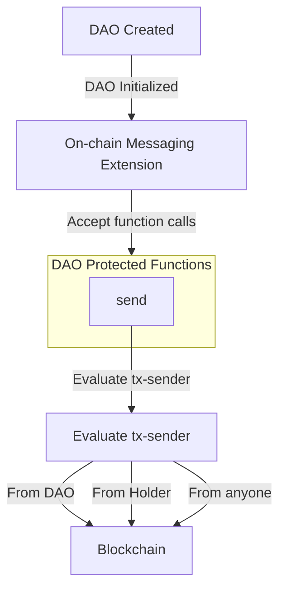

# Onchain Messaging Extension

The Onchain Messaging extension (`aibtc-onchain-messaging`) allows for sending verified messages that are stored as blockchain events (via `print`). This provides a way for the DAO to communicate officially and for any Stacks user (including token holders) to send messages that can be verified as coming from specific addresses. Messages are permanently recorded on the blockchain, creating an immutable communication record.

## Key Features

- **Verified Messaging**: Messages are cryptographically tied to their `tx-sender`.
- **DAO/Holder Identification**: The contract event indicates if the message sender is the DAO (or an extension) and if the sender holds the DAO token (`.aibtc-faktory`).
- **Message Size**: Supports messages up to 10,000 ASCII characters.
- **Blockchain Permanence**: All messages are emitted as `print` events, becoming part of the transaction receipt.
- **Metadata Capture**: Records `contract-caller`, `tx-sender`, block height, message length, and DAO/holder status.

## Quick Reference

| Property       | Value                                                        |
| -------------- | ------------------------------------------------------------ |
| Contract Name  | `aibtc-onchain-messaging`                                    |
| Implements     | `.aibtc-dao-traits.extension`, `.aibtc-dao-traits.messaging` |
| Key Parameters | Message text (max 10,000 ASCII chars)                        |

## How It Works

The Onchain Messaging extension works by emitting `print` events containing the message and associated metadata. Any Stacks user can call the `send` function. The contract determines if the `contract-caller` is the DAO or an authorized extension, and also checks if the `tx-sender` holds the DAO's token (`.aibtc-faktory`). This information, along with the message, sender details, and block height, is included in the `print` event.

## Public Functions

### `callback`

**Purpose**: Standard extension callback function required by the extension trait

**Parameters**:

- `sender`: principal - The principal that triggered the callback
- `memo`: (buff 34) - Optional memo data

**Returns**: (response bool) - Returns success (true) if the callback is processed

### `send`

**Purpose**: Sends a message that is emitted as a `print` event on the blockchain.

**Parameters**:

- `msg`: `(string-ascii 10000)` - The message text (up to 10,000 ASCII characters).

**Returns**: `(response bool err-code)` - Returns `(ok true)` if the message is sent, otherwise an error.

**Notes**: The contract internally determines if the message originates from the DAO/extension or a DAO token holder. Messages must be at least 1 character long.

## Print Events

| Event  | Description                                       | Key Data Points in Payload                                                                                                                |
| ------ | ------------------------------------------------- | ----------------------------------------------------------------------------------------------------------------------------------------- |
| `send` | Emitted when a message is sent via this contract. | `contractCaller`, `txSender`, `height`, `isFromDao` (bool), `isFromHolder` (bool), `messageLength` (uint), `message` (string-ascii 10000) |

## Error Handling

| Error Code | Constant                 | Description                                          | Resolution                                                                       |
| ---------- | ------------------------ | ---------------------------------------------------- | -------------------------------------------------------------------------------- |
| u1600      | ERR_NOT_DAO_OR_EXTENSION | (Contextual) Caller is not DAO for DAO-like actions. | Not directly applicable for `send` by any user, but used internally by contract. |
| u1601      | ERR_INVALID_INPUT        | Message is empty.                                    | Ensure the message string contains at least one character.                       |
| u1602      | ERR_FETCHING_TOKEN_DATA  | Error fetching DAO token balance for sender.         | Check `.aibtc-faktory` token contract status; sender may not hold tokens.        |

## Security Considerations

- **Message Attribution**: All messages are tied to their `tx-sender` and `contract-caller`.
- **DAO/Holder Identification**: The `print` event clearly flags if a message originates from the DAO/extension or a DAO token holder, aiding in verifying message authenticity.
- **Input Validation**: Messages are validated to ensure they are not empty.
- **Size Limits**: The 10,000 character limit prevents excessive blockchain data usage while allowing for meaningful messages.
- **Immutability**: Once emitted, `print` events (and thus messages) cannot be edited or deleted.

## Related Contracts

- **`.aibtc-base-dao`**: The main DAO contract. Messages sent via proposals executed by the DAO will be flagged as `isFromDao: true`.
- **`.aibtc-faktory`**: The DAO token contract, used to determine if `tx-sender` is a token holder (`isFromHolder`).
- **`.aibtc-dao-traits.extension`**: Trait implemented by this extension.
- **`.aibtc-dao-traits.messaging`**: Trait implemented by this extension.
- **`.aibtc-action-proposal-voting`**: An example of an extension that can use this messaging contract as an action.

## Message Size Limits

The extension supports messages up to 10,000 ASCII characters. This size is suitable for:

- Announcements and notifications.
- Short status updates.
- Links to off-chain resources or more detailed documents.
- Recording summaries of decisions or actions.
