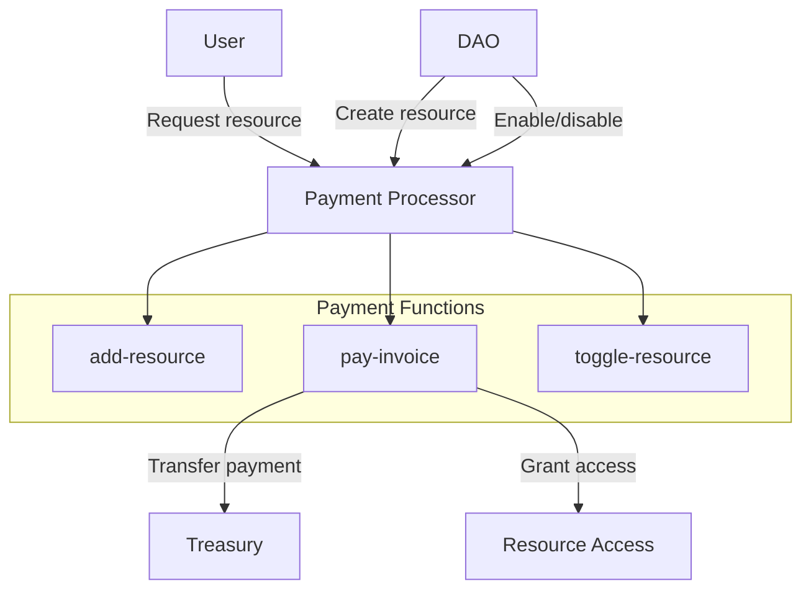

# Payment Processor Extension

The Payment Processor extension provides a payment processing system for DAO services. It allows the DAO to define resources with prices, track user payments, and manage access to services. The extension is available in three variants to support different payment tokens: DAO token, BTC, and STX.

## Key Features

- **Resource Management**: Create and manage resources with descriptions and pricing
- **Payment Processing**: Process payments in DAO tokens, sBTC, or STX
- **User Tracking**: Track user payments and resource usage
- **Invoice System**: Generate and record invoices for all transactions
- **Usage Statistics**: Maintain detailed usage and revenue statistics
- **Flexible Pricing**: Set custom prices for each resource

## Quick Reference

| Property       | Value                           |
| -------------- | ------------------------------- |
| Contract Names | `aibtc-payment-processor-dao`<br>`aibtc-payment-processor-sbtc`<br>`aibtc-payment-processor-stx` |
| Version        | 1.0.0                           |
| Implements     | extension, invoices, resources  |
| Payment Tokens | DAO token, sBTC, STX            |
| Default Treasury | `.aibtc-treasury`             |

## How It Works



The Payment Processor extension works by allowing the DAO to create resources with associated prices. Users can pay for these resources using the specified token (DAO token, sBTC, or STX), which generates an invoice and transfers the payment to the DAO treasury. The system tracks all payments and resource usage, providing detailed statistics for both users and resources.

## Token Variants

The extension is available in three variants, each using a different payment token:

| Variant | Contract Name | Payment Token | Transfer Mechanism |
|---------|---------------|---------------|-------------------|
| DAO Token | `aibtc-payment-processor-dao` | `.aibtc-token` | `contract-call? .aibtc-token transfer` |
| BTC | `aibtc-payment-processor-sbtc` | `'STV9K21TBFAK4KNRJXF5DFP8N7W46G4V9RJ5XDY2.sbtc-token` | `contract-call? 'STV9K21TBFAK4KNRJXF5DFP8N7W46G4V9RJ5XDY2.sbtc-token transfer` |
| STX | `aibtc-payment-processor-stx` | Native STX | `stx-transfer?` or `stx-transfer-memo?` |

All variants share the same functionality and interface, with the only difference being the token used for payment.

## Public Functions

### `callback`

**Purpose**: Standard extension callback function required by the extension trait

**Parameters**:
- `sender`: principal - The principal that triggered the callback
- `memo`: (buff 34) - Optional memo data

**Returns**: (response bool) - Returns success (true) if the callback is processed

**Example**:
```clarity
(contract-call? .aibtc-payment-processor-dao callback tx-sender 0x00)
```

### `set-payment-address`

**Purpose**: Sets the payment recipient address (treasury)

**Parameters**:
- `newAddress`: principal - The new payment address

**Returns**: (response bool) - Returns success (true) if the address is updated

**Example**:
```clarity
(contract-call? .aibtc-payment-processor-dao set-payment-address 'SP2CBFWG9AT0HSJVPK5YGRW34EWFAWZPVJ4S6AD1K)
```

**Notes**: This function can only be called by the DAO or an authorized extension.

### `add-resource`

**Purpose**: Adds a new resource with pricing information

**Parameters**:
- `name`: (string-utf8 50) - Unique name for the resource
- `description`: (string-utf8 255) - Description of the resource
- `price`: uint - Price in the contract's token
- `url`: (optional (string-utf8 255)) - Optional URL for the resource

**Returns**: (response uint) - Returns the resource index if successful

**Example**:
```clarity
(contract-call? .aibtc-payment-processor-dao add-resource "premium-api" "Access to premium API endpoints" u1000000 (some "https://api.example.com"))
```

**Notes**: This function can only be called by the DAO or an authorized extension. The resource name must be unique.

### `toggle-resource`

**Purpose**: Enables or disables a resource by its index

**Parameters**:
- `resourceIndex`: uint - The index of the resource to toggle

**Returns**: (response bool) - Returns the new enabled status

**Example**:
```clarity
(contract-call? .aibtc-payment-processor-dao toggle-resource u1)
```

**Notes**: This function can only be called by the DAO or an authorized extension.

### `toggle-resource-by-name`

**Purpose**: Enables or disables a resource by its name

**Parameters**:
- `name`: (string-utf8 50) - The name of the resource to toggle

**Returns**: (response bool) - Returns the new enabled status

**Example**:
```clarity
(contract-call? .aibtc-payment-processor-dao toggle-resource-by-name "premium-api")
```

### `pay-invoice`

**Purpose**: Pays for a resource by its index

**Parameters**:
- `resourceIndex`: uint - The index of the resource to pay for
- `memo`: (optional (buff 34)) - Optional memo for the payment

**Returns**: (response uint) - Returns the invoice index if successful

**Example**:
```clarity
;; For DAO token or sBTC
(contract-call? .aibtc-payment-processor-dao pay-invoice u1 none)

;; For STX
(contract-call? .aibtc-payment-processor-stx pay-invoice u1 none)
```

**Notes**: The resource must be enabled. The payment is transferred to the payment address.

### `pay-invoice-by-resource-name`

**Purpose**: Pays for a resource by its name

**Parameters**:
- `name`: (string-utf8 50) - The name of the resource to pay for
- `memo`: (optional (buff 34)) - Optional memo for the payment

**Returns**: (response uint) - Returns the invoice index if successful

**Example**:
```clarity
(contract-call? .aibtc-payment-processor-dao pay-invoice-by-resource-name "premium-api" none)
```

## Read-Only Functions

### `get-total-users`

**Purpose**: Gets the total number of users

**Parameters**: None

**Returns**: uint - The total number of users

**Example**:
```clarity
(contract-call? .aibtc-payment-processor-dao get-total-users)
```

### `get-user-index`

**Purpose**: Gets the user index for an address

**Parameters**:
- `user`: principal - The user's address

**Returns**: (optional uint) - The user index or none if not found

**Example**:
```clarity
(contract-call? .aibtc-payment-processor-dao get-user-index tx-sender)
```

### `get-user-data`

**Purpose**: Gets user data by index

**Parameters**:
- `index`: uint - The user index

**Returns**: (optional {address: principal, totalSpent: uint, totalUsed: uint}) - The user data or none if not found

**Example**:
```clarity
(contract-call? .aibtc-payment-processor-dao get-user-data u1)
```

### `get-user-data-by-address`

**Purpose**: Gets user data by address

**Parameters**:
- `user`: principal - The user's address

**Returns**: (optional {address: principal, totalSpent: uint, totalUsed: uint}) - The user data or none if not found

**Example**:
```clarity
(contract-call? .aibtc-payment-processor-dao get-user-data-by-address tx-sender)
```

### `get-total-resources`

**Purpose**: Gets the total number of resources

**Parameters**: None

**Returns**: uint - The total number of resources

**Example**:
```clarity
(contract-call? .aibtc-payment-processor-dao get-total-resources)
```

### `get-resource-index`

**Purpose**: Gets the resource index by name

**Parameters**:
- `name`: (string-utf8 50) - The resource name

**Returns**: (optional uint) - The resource index or none if not found

**Example**:
```clarity
(contract-call? .aibtc-payment-processor-dao get-resource-index "premium-api")
```

### `get-resource`

**Purpose**: Gets resource data by index

**Parameters**:
- `index`: uint - The resource index

**Returns**: (optional {createdAt: uint, enabled: bool, name: (string-utf8 50), description: (string-utf8 255), price: uint, totalSpent: uint, totalUsed: uint, url: (optional (string-utf8 255))}) - The resource data or none if not found

**Example**:
```clarity
(contract-call? .aibtc-payment-processor-dao get-resource u1)
```

### `get-resource-by-name`

**Purpose**: Gets resource data by name

**Parameters**:
- `name`: (string-utf8 50) - The resource name

**Returns**: (optional {createdAt: uint, enabled: bool, name: (string-utf8 50), description: (string-utf8 255), price: uint, totalSpent: uint, totalUsed: uint, url: (optional (string-utf8 255))}) - The resource data or none if not found

**Example**:
```clarity
(contract-call? .aibtc-payment-processor-dao get-resource-by-name "premium-api")
```

### `get-total-invoices`

**Purpose**: Gets the total number of invoices

**Parameters**: None

**Returns**: uint - The total number of invoices

**Example**:
```clarity
(contract-call? .aibtc-payment-processor-dao get-total-invoices)
```

### `get-invoice`

**Purpose**: Gets invoice data by index

**Parameters**:
- `index`: uint - The invoice index

**Returns**: (optional {amount: uint, createdAt: uint, userIndex: uint, resourceName: (string-utf8 50), resourceIndex: uint}) - The invoice data or none if not found

**Example**:
```clarity
(contract-call? .aibtc-payment-processor-dao get-invoice u1)
```

### `get-recent-payment`

**Purpose**: Gets the most recent payment index for a user and resource

**Parameters**:
- `resourceIndex`: uint - The resource index
- `userIndex`: uint - The user index

**Returns**: (optional uint) - The invoice index or none if not found

**Example**:
```clarity
(contract-call? .aibtc-payment-processor-dao get-recent-payment u1 u2)
```

### `get-recent-payment-data`

**Purpose**: Gets the most recent payment data for a user and resource

**Parameters**:
- `resourceIndex`: uint - The resource index
- `userIndex`: uint - The user index

**Returns**: (optional {amount: uint, createdAt: uint, userIndex: uint, resourceName: (string-utf8 50), resourceIndex: uint}) - The invoice data or none if not found

**Example**:
```clarity
(contract-call? .aibtc-payment-processor-dao get-recent-payment-data u1 u2)
```

### `get-recent-payment-data-by-address`

**Purpose**: Gets the most recent payment data for a user and resource by name and address

**Parameters**:
- `name`: (string-utf8 50) - The resource name
- `user`: principal - The user's address

**Returns**: (optional {amount: uint, createdAt: uint, userIndex: uint, resourceName: (string-utf8 50), resourceIndex: uint}) - The invoice data or none if not found

**Example**:
```clarity
(contract-call? .aibtc-payment-processor-dao get-recent-payment-data-by-address "premium-api" tx-sender)
```

### `get-payment-address`

**Purpose**: Gets the current payment address

**Parameters**: None

**Returns**: (optional principal) - The payment address

**Example**:
```clarity
(contract-call? .aibtc-payment-processor-dao get-payment-address)
```

### `get-total-revenue`

**Purpose**: Gets the total revenue collected

**Parameters**: None

**Returns**: uint - The total revenue

**Example**:
```clarity
(contract-call? .aibtc-payment-processor-dao get-total-revenue)
```

### `get-contract-data`

**Purpose**: Gets aggregate contract data

**Parameters**: None

**Returns**: {contractAddress: principal, paymentAddress: (optional principal), paymentToken: (string-ascii 42), totalInvoices: uint, totalResources: uint, totalRevenue: uint, totalUsers: uint} - The contract data

**Example**:
```clarity
(contract-call? .aibtc-payment-processor-dao get-contract-data)
```

## Print Events

| Event               | Description                      | Data                                                         |
| ------------------- | -------------------------------- | ------------------------------------------------------------ |
| `set-payment-address` | Emitted when payment address is updated | Old address, new address, caller |
| `add-resource`      | Emitted when a new resource is added | Resource data, resource index, caller |
| `toggle-resource`   | Emitted when a resource is enabled/disabled | Resource index, resource data, caller |
| `pay-invoice`       | Emitted when an invoice is paid | Invoice data, resource data, user data, payment details |

## Integration Examples

### Creating a New Resource

```clarity
;; This would typically be done through a DAO proposal
(contract-call? .aibtc-base-dao propose-extension-action
  .aibtc-payment-processor-dao
  (contract-call? .aibtc-payment-processor-dao add-resource 
    "api-access" 
    "Access to the premium API endpoints" 
    u10000000 
    (some "https://api.example.com/docs")
  )
)
```

### Paying for a Resource with DAO Token

```clarity
;; User paying for a resource with DAO token
(contract-call? .aibtc-payment-processor-dao pay-invoice-by-resource-name 
  "api-access" 
  (some 0x68656c6c6f776f726c64) ;; Optional memo "helloworld"
)
```

### Paying for a Resource with sBTC

```clarity
;; User paying for a resource with sBTC
(contract-call? .aibtc-payment-processor-sbtc pay-invoice-by-resource-name 
  "api-access" 
  (some 0x68656c6c6f776f726c64) ;; Optional memo "helloworld"
)
```

### Paying for a Resource with STX

```clarity
;; User paying for a resource with STX
(contract-call? .aibtc-payment-processor-stx pay-invoice-by-resource-name 
  "api-access" 
  (some 0x68656c6c6f776f726c64) ;; Optional memo "helloworld"
)
```

### Checking User's Payment History

```clarity
;; Get user's payment history for a specific resource
(let 
  (
    (userIndex (unwrap-panic (contract-call? .aibtc-payment-processor-dao get-user-index tx-sender)))
    (resourceIndex (unwrap-panic (contract-call? .aibtc-payment-processor-dao get-resource-index "api-access")))
  )
  (contract-call? .aibtc-payment-processor-dao get-recent-payment-data resourceIndex userIndex)
)
```

## Error Handling

| Error Code | Constant                    | Description                       | Resolution                                           |
| ---------- | --------------------------- | --------------------------------- | ---------------------------------------------------- |
| u5000      | ERR_NOT_DAO_OR_EXTENSION    | Caller is not the DAO or extension | Ensure the call is made through the DAO or an authorized extension |
| u5001      | ERR_INVALID_PARAMS          | Invalid parameters provided       | Check that all parameters meet the requirements (non-empty strings, positive prices) |
| u5002      | ERR_NAME_ALREADY_USED       | Resource name already exists      | Choose a different, unique name for the resource     |
| u5003      | ERR_SAVING_RESOURCE_DATA    | Error saving resource data        | Verify the resource data format is correct           |
| u5004      | ERR_DELETING_RESOURCE_DATA  | Error deleting resource data      | Verify the resource exists before attempting to delete |
| u5005      | ERR_RESOURCE_NOT_FOUND      | Resource not found                | Verify the resource index or name is correct         |
| u5006      | ERR_RESOURCE_DISABLED       | Resource is disabled              | Enable the resource before allowing payments         |
| u5007      | ERR_USER_ALREADY_EXISTS     | User already exists               | User is already registered in the system             |
| u5008      | ERR_SAVING_USER_DATA        | Error saving user data            | Verify the user data format is correct               |
| u5009      | ERR_USER_NOT_FOUND          | User not found                    | Verify the user index or address is correct          |
| u5010      | ERR_INVOICE_ALREADY_PAID    | Invoice already paid              | The invoice has already been paid                    |
| u5011      | ERR_SAVING_INVOICE_DATA     | Error saving invoice data         | Verify the invoice data format is correct            |
| u5012      | ERR_INVOICE_NOT_FOUND       | Invoice not found                 | Verify the invoice index is correct                  |
| u5013      | ERR_RECENT_PAYMENT_NOT_FOUND | Recent payment not found         | No recent payment exists for the specified user and resource |

## Security Considerations

- **Access Control**: Only the DAO or authorized extensions can add resources or change the payment address
- **Resource Validation**: Resources are validated for required fields and uniqueness
- **Payment Tracking**: All payments are tracked with detailed metadata
- **Token Security**: Different token implementations have different security considerations:
  - DAO token: Requires approval for transfers
  - BTC: Requires proper Bitcoin transaction verification
  - STX: Uses native Stacks token transfer mechanisms
- **Data Integrity**: All data is stored in maps with proper validation

## Related Contracts

- **aibtc-base-dao**: The main DAO contract that authorizes payment processor actions
- **aibtc-dao-traits-v3**: Defines the extension, invoices, and resources traits
- **aibtc-treasury**: Default recipient for payments
- **aibtc-token**: DAO token used for payments in the DAO token variant
- **sbtc-token**: sBTC token used for payments in the BTC variant

## Resource Management

Resources are defined with:
- Name (unique identifier)
- Description
- Price (in the respective token)
- Optional URL
- Enabled/disabled status

When users pay for a resource:
1. An invoice is created
2. Payment is transferred to the payment address
3. Usage statistics are updated for both user and resource
4. The payment is recorded for future reference
