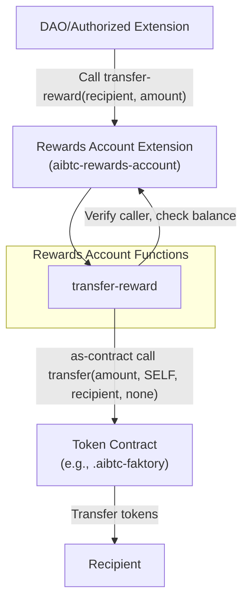

# DAO Rewards Account Extension

The DAO Rewards Account extension (`aibtc-rewards-account`) provides a secure contract to hold and disburse funds, typically fungible tokens, designated as rewards for DAO proposals or other DAO-related activities. It ensures that reward distribution is controlled by the DAO or authorized extensions.

## Key Features

- **Secure Token Holding**: Holds SIP-010 fungible tokens in a contract-controlled account.
- **Controlled Disbursement**: Only the DAO or authorized extensions can initiate reward transfers.
- **Integration with Token Contracts**: Interacts with a specified SIP-010 token contract (e.g., `.aibtc-faktory`) for transfers.

## Quick Reference

| Property       | Value                                                              |
| -------------- | ------------------------------------------------------------------ |
| Contract Name  | `aibtc-rewards-account`                                            |
| Version        | 2.0.0                                                              |
| Implements     | `.aibtc-dao-traits.extension`, `.aibtc-dao-traits.rewards-account` |
| Key Parameters | Relies on DAO/extension calls to specify token and amount.         |

## How It Works



The DAO or an authorized extension initiates a reward payment by calling the `transfer-reward` function on this extension. The extension verifies the caller's authorization and its own balance of the specified token (e.g., aIBTC via `.aibtc-faktory`). If valid, it executes a token transfer from its own account to the designated recipient.

## Public Functions

### `callback`

**Purpose**: Standard extension callback function required by the extension trait.

**Parameters**:
- `sender`: `principal` - The principal that triggered the callback.
- `memo`: `(buff 34)` - Optional memo data.

**Returns**: `(response bool)` - Returns `(ok true)` if the callback is processed.

**Example**:
```clarity
(contract-call? .aibtc-rewards-account callback tx-sender 0x00)
```

### `transfer-reward`

**Purpose**: Transfers a specified amount of tokens from this contract to a recipient.

**Parameters**:
- `recipient`: `principal` - The principal to receive the reward.
- `amount`: `uint` - The amount of tokens to transfer.

**Returns**: `(response bool err-code)` - Returns `(ok true)` if the transfer is successful, otherwise an error.

**Example**:
```clarity
;; Assuming this call is made by the DAO or an authorized extension
(contract-call? .aibtc-rewards-account transfer-reward 'SPRECIPIENTADDRESS u1000000)
```

**Notes**: This function can only be called by the DAO (`.aibtc-base-dao`) or an authorized extension. The contract must have a sufficient balance of the token being transferred (managed by `.aibtc-faktory` in this context).

## Read-Only Functions

This contract does not have specific read-only functions beyond those potentially inherited or implied by its traits. Balances are typically checked via the token contract (e.g., `(contract-call? .aibtc-faktory get-balance .aibtc-rewards-account)`).

## Print Events

| Event                                   | Description                                  | Data                                                                 |
| --------------------------------------- | -------------------------------------------- | -------------------------------------------------------------------- |
| `aibtc-rewards-account/transfer-reward` | Emitted when a reward transfer is successful | `recipient`, `amount`, `contractCaller`, `txSender`                  |

## Integration Examples

### Transferring a Reward via a DAO Proposal

```clarity
;; This would typically be part of a DAO proposal execution
;; The proposal would call .aibtc-base-dao to execute this:
(contract-call? .aibtc-rewards-account transfer-reward
  'SPRECIPIENTFORPROPOSALXYZ  ;; Recipient's principal
  u500000000 ;; Amount of reward (e.g., 500 aIBTC tokens)
)
```

## Error Handling

| Error Code | Constant                  | Description                                       | Resolution                                                                    |
| ---------- | ------------------------- | ------------------------------------------------- | ----------------------------------------------------------------------------- |
| u1700      | ERR_NOT_DAO_OR_EXTENSION  | Caller is not the DAO or an authorized extension. | Ensure the call is made by `.aibtc-base-dao` or a registered extension.       |
| u1701      | ERR_INSUFFICIENT_BALANCE  | The contract has insufficient tokens for transfer. | Ensure the rewards account has been funded with enough tokens before transfer. |

## Security Considerations

- **Access Control**: The `transfer-reward` function is protected and can only be called by the DAO (`.aibtc-base-dao`) or an extension authorized by the DAO.
- **Token Contract Reliance**: The security of token transfers depends on the correctness and security of the underlying SIP-010 token contract (e.g., `.aibtc-faktory`).
- **No Direct Funding Path**: This contract does not have public functions to receive funds directly; funding must occur via direct transfers to its principal or through other DAO mechanisms.

## Related Contracts

- **`.aibtc-base-dao`**: The main DAO contract that authorizes calls to this extension.
- **`.aibtc-faktory`**: The SIP-010 token contract from which rewards are typically disbursed by this extension.
- **`.aibtc-dao-traits.extension`**: Trait implemented by this extension.
- **`.aibtc-dao-traits.rewards-account`**: Trait implemented by this extension.
