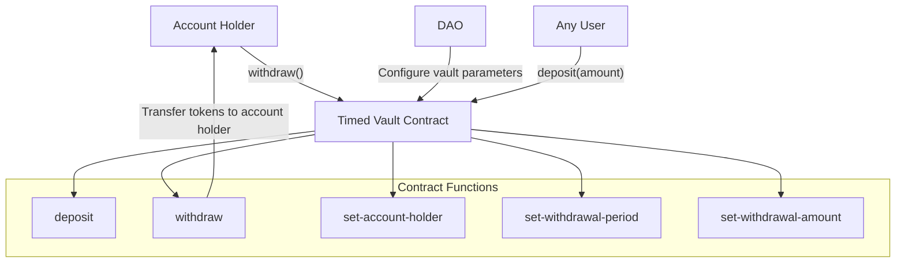

# Timed Vault Extension

The Timed Vault extension provides a mechanism for periodic token withdrawals by a designated account holder. This extension is useful for managing operational expenses or recurring payments with controlled withdrawal limits. The extension is available in three variants to support different tokens: DAO token, BTC, and STX.

## Key Features

- **Time-based withdrawals**: Enforces minimum time between withdrawals
- **Fixed withdrawal amounts**: Preset amounts for each withdrawal
- **Designated account holder**: Only authorized principal can withdraw
- **Multiple token support**: Separate vaults for STX, DAO tokens, and BTC

## Quick Reference

| Property       | Value                           |
| -------------- | ------------------------------- |
| Contract Names | `aibtc-timed-vault-dao`<br>`aibtc-timed-vault-sbtc`<br>`aibtc-timed-vault-stx` |
| Version        | 1.0.0                           |
| Implements     | extension, timed-vault          |
| Default Period | 144 blocks (~1 day)             |

## How It Works



The Timed Vault extension allows a designated account holder to withdraw a fixed amount of tokens at regular intervals. The DAO can configure the withdrawal amount, period, and account holder. Anyone can deposit tokens to the vault, but only the designated account holder can withdraw, and only after the specified time period has elapsed since the last withdrawal.

## Token Variants

The extension is available in three variants, each using a different token:

| Variant | Contract Name | Token | Default Amount | Transfer Mechanism |
|---------|---------------|-------|----------------|-------------------|
| DAO Token | `aibtc-timed-vault-dao` | `.aibtc-token` | 1,000 DAO tokens (u100000000000) | `contract-call? .aibtc-token transfer` |
| BTC | `aibtc-timed-vault-sbtc` | `'STV9K21TBFAK4KNRJXF5DFP8N7W46G4V9RJ5XDY2.sbtc-token` | 0.0001 BTC (u10000) | `contract-call? 'STV9K21TBFAK4KNRJXF5DFP8N7W46G4V9RJ5XDY2.sbtc-token transfer` |
| STX | `aibtc-timed-vault-stx` | Native STX | 10 STX (u10000000) | `stx-transfer?` |

All variants share the same functionality and interface, with the only difference being the token used for withdrawals.

## Public Functions

### `callback`

**Purpose**: Standard extension callback function

**Parameters**:
- `sender`: principal - The sender of the callback
- `memo`: (buff 34) - Optional memo data

**Returns**: (response bool) - Always returns (ok true)

**Example**:
```clarity
(contract-call? .aibtc-timed-vault-stx callback tx-sender none)
```

### `set-account-holder`

**Purpose**: Sets the account holder who can withdraw tokens

**Parameters**:
- `new`: principal - The new account holder

**Returns**: (response bool) - Success or failure

**Example**:
```clarity
(contract-call? .aibtc-timed-vault-stx set-account-holder 'SP2ZNGJ85ENDY6QRHQ5P2D4FXKGZWCKTB2T0Z55KS)
```

**Notes**: This function can only be called by the DAO or an authorized extension.

### `set-withdrawal-period`

**Purpose**: Sets the minimum time between withdrawals (in Bitcoin blocks)

**Parameters**:
- `period`: uint - The new withdrawal period

**Returns**: (response bool) - Success or failure

**Example**:
```clarity
(contract-call? .aibtc-timed-vault-stx set-withdrawal-period u144)
```

**Notes**: This function can only be called by the DAO or an authorized extension.

### `set-withdrawal-amount`

**Purpose**: Sets the amount that can be withdrawn in each withdrawal

**Parameters**:
- `amount`: uint - The new withdrawal amount

**Returns**: (response bool) - Success or failure

**Example**:
```clarity
;; For STX variant
(contract-call? .aibtc-timed-vault-stx set-withdrawal-amount u10000000)

;; For DAO token variant
(contract-call? .aibtc-timed-vault-dao set-withdrawal-amount u100000000000)

;; For BTC variant
(contract-call? .aibtc-timed-vault-sbtc set-withdrawal-amount u10000)
```

**Notes**: This function can only be called by the DAO or an authorized extension.

### `override-last-withdrawal-block`

**Purpose**: Overrides the last withdrawal block (for administrative purposes)

**Parameters**:
- `block`: uint - The new last withdrawal block

**Returns**: (response bool) - Success or failure

**Example**:
```clarity
(contract-call? .aibtc-timed-vault-stx override-last-withdrawal-block u100000)
```

**Notes**: This function can only be called by the DAO or an authorized extension.

### `deposit`

**Purpose**: Deposits tokens to the vault

**Parameters**:
- `amount`: uint - The amount to deposit

**Returns**: (response bool) - Success or failure

**Example**:
```clarity
;; For STX variant
(contract-call? .aibtc-timed-vault-stx deposit u10000000)

;; For DAO token variant
(contract-call? .aibtc-timed-vault-dao deposit u100000000000)

;; For BTC variant
(contract-call? .aibtc-timed-vault-sbtc deposit u10000)
```

### `withdraw`

**Purpose**: Withdraws tokens from the vault (only callable by account holder)

**Parameters**: None

**Returns**: (response bool) - Success or failure

**Example**:
```clarity
(contract-call? .aibtc-timed-vault-stx withdraw)
```

**Notes**: Only the account holder can call this function, and only after the withdrawal period has elapsed since the last withdrawal.

## Read-Only Functions

### `get-account-balance`

**Purpose**: Gets the current token balance of the vault

**Parameters**: None

**Returns**: (response uint) - The current balance

**Example**:
```clarity
(contract-call? .aibtc-timed-vault-stx get-account-balance)
```

### `get-account-terms`

**Purpose**: Gets all account configuration details

**Parameters**: None

**Returns**: A tuple with all account configuration details including:
- `accountHolder`: principal - The current account holder
- `contractName`: principal - The contract's principal
- `deployedBurnBlock`: uint - The Bitcoin block height when deployed
- `deployedStacksBlock`: uint - The Stacks block height when deployed
- `lastWithdrawalBlock`: uint - The block of the last withdrawal
- `vaultToken`: principal or string-ascii - The token used by this vault
- `withdrawalAmount`: uint - The amount that can be withdrawn
- `withdrawalPeriod`: uint - The minimum period between withdrawals

**Example**:
```clarity
(contract-call? .aibtc-timed-vault-stx get-account-terms)
```

## Integration Examples

### Setting Up a Timed Vault for Operations

```clarity
;; This would typically be done through a DAO proposal
(contract-call? .aibtc-base-dao propose-extension-action
  .aibtc-timed-vault-stx
  (contract-call? .aibtc-timed-vault-stx set-account-holder 'SP2ZNGJ85ENDY6QRHQ5P2D4FXKGZWCKTB2T0Z55KS)
)

;; Set withdrawal period to 1 week (approximately 1008 Bitcoin blocks)
(contract-call? .aibtc-base-dao propose-extension-action
  .aibtc-timed-vault-stx
  (contract-call? .aibtc-timed-vault-stx set-withdrawal-period u1008)
)

;; Set withdrawal amount to 100 STX
(contract-call? .aibtc-base-dao propose-extension-action
  .aibtc-timed-vault-stx
  (contract-call? .aibtc-timed-vault-stx set-withdrawal-amount u100000000)
)
```

### Depositing Tokens to the Vault

```clarity
;; Depositing STX to the STX vault
(contract-call? .aibtc-timed-vault-stx deposit u50000000)

;; Depositing DAO tokens to the DAO token vault
(contract-call? .aibtc-timed-vault-dao deposit u500000000000)

;; Depositing BTC to the BTC vault
(contract-call? .aibtc-timed-vault-sbtc deposit u50000)
```

### Withdrawing Tokens as the Account Holder

```clarity
;; Account holder withdrawing from the STX vault
(contract-call? .aibtc-timed-vault-stx withdraw)
```

## Print Events

| Event          | Description                | Data                         |
| -------------- | -------------------------- | ---------------------------- |
| `deposit`      | Emitted when tokens are deposited | amount, caller, recipient |
| `withdraw`     | Emitted when tokens are withdrawn | amount, caller, recipient |

## Error Handling

| Error Code | Constant                 | Description                       | Resolution                |
| ---------- | ------------------------ | --------------------------------- | ------------------------- |
| u2000      | ERR_NOT_DAO_OR_EXTENSION | Caller is not the DAO or an extension | Call from the DAO or an authorized extension |
| u2001      | ERR_INVALID             | Invalid parameter value           | Provide a valid parameter value |
| u2002      | ERR_NOT_ACCOUNT_HOLDER  | Caller is not the account holder  | Only the account holder can withdraw |
| u2003      | ERR_TOO_SOON            | Withdrawal attempted too soon     | Wait until the withdrawal period has passed |
| u2004      | ERR_INVALID_AMOUNT      | Invalid amount specified          | Provide a valid amount > 0 |
| u2005      | ERR_FETCHING_BALANCE    | Error fetching token balance      | Check token contract availability |

## Security Considerations

- **Withdrawal restrictions**: Only the account holder can withdraw funds
- **Time-based limits**: Withdrawals are limited by frequency (minimum time between withdrawals)
- **Amount limits**: Each withdrawal is limited to a fixed amount
- **Administrative control**: Only the DAO can change account parameters
- **Open deposits**: Anyone can deposit tokens to the vault
- **Token-specific considerations**:
  - DAO token: Requires proper token approval and transfer mechanisms
  - BTC: Relies on the security of the sBTC bridge
  - STX: Uses native Stacks token transfer mechanisms

## Related Contracts

- **aibtc-base-dao**: The main DAO contract that controls the vault extensions
- **aibtc-dao-traits-v3**: Defines the extension and timed-vault traits
- **aibtc-token**: The DAO token used by the DAO token variant
- **sbtc-token**: The sBTC token used by the BTC variant
