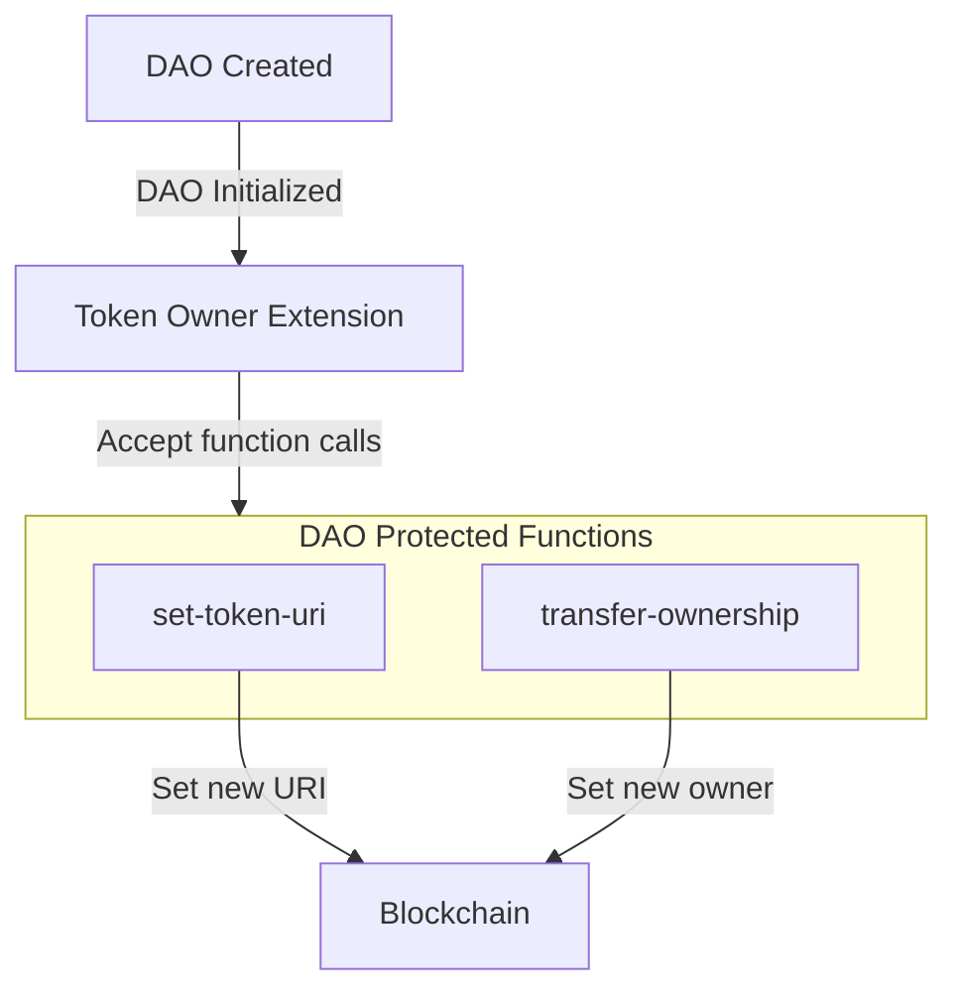

# Token Owner Extension

The Token Owner extension (`aibtc-token-owner`) provides management functions for the DAO token, allowing the DAO to control token metadata and ownership through governance. This extension serves as the authorized interface between the DAO and its token contract, ensuring that token configuration changes can only be executed through proper governance channels.

## Key Features

- **Token URI Management**: Updates the token's metadata URI through governance
- **Ownership Control**: Allows the DAO to transfer token contract ownership
- **Permission Gating**: Ensures only the DAO or authorized extensions can modify token settings
- **Contract Interoperability**: Interfaces between the DAO and token contract using proper permissions


The first cohort of AIBTC DAOs will not have the ability to change the DAO token owner.

Future iterations of AIBTC DAOs can implement an extension that allows for this.


## Quick Reference

| Property       | Value                                                          |
| -------------- | -------------------------------------------------------------- |
| Contract Name  | `aibtc-token-owner`                                            |
| Implements     | `.aibtc-dao-traits.extension`, `.aibtc-dao-traits.token-owner` |
| Key Parameters | None (stateless extension)                                     |

## How It Works

The Token Owner extension acts as an authorized intermediary between the DAO and its token contract. When the DAO approves a proposal to update token settings, it calls the appropriate function on this extension. The extension verifies the caller is authorized (either the DAO itself or another approved extension), then uses `as-contract` to call the token contract with the proper permissions.

## Public Functions

### `callback`

**Purpose**: Standard extension callback function required by the extension trait

**Parameters**:

- `sender`: principal - The principal that triggered the callback
- `memo`: (buff 34) - Optional memo data

**Returns**: (response bool) - Returns true on success

### `set-token-uri`

**Purpose**: Updates the token's URI metadata, which controls how the token appears in wallets and explorers

**Parameters**:

- `value`: (string-utf8 256) - The new URI string for the token metadata

**Returns**: (response bool) - Returns true on success or an error

This function can only be called by the DAO or an authorized extension. It updates the token's metadata URI, which typically points to a JSON file containing token information like name, symbol, description, and image.

### `transfer-ownership`

**Purpose**: Transfers token contract ownership to a new principal

**Parameters**:

- `new-owner`: principal - The principal that will become the new token contract owner

**Returns**: (response bool) - Returns true on success or an error

This function allows the DAO to transfer ownership of the token contract to a new principal, which could be useful during contract upgrades or governance changes.

## Private Functions

### `is-dao-or-extension`

**Purpose**: Internal authorization check to ensure only the DAO or authorized extensions can call sensitive functions.

**Parameters**: None

**Returns**: `(response bool err-code)` - Returns `(ok true)` if authorized, or `ERR_NOT_DAO_OR_EXTENSION (err u1800)` if unauthorized.

## Error Handling

| Error Code | Constant                 | Description                                 | Resolution                                                                          |
| ---------- | ------------------------ | ------------------------------------------- | ----------------------------------------------------------------------------------- |
| u1800      | ERR_NOT_DAO_OR_EXTENSION | Caller is not the DAO or a valid extension. | Ensure the function is called through proper DAO governance (e.g., via a proposal). |

## Security Considerations

- **Authorization Control**: All management functions are protected by the `is-dao-or-extension` check, ensuring only authorized entities can modify token settings
- **Contract-Call Pattern**: Uses the `as-contract` pattern to make calls to the token contract with the extension's authority
- **Governance Protection**: Changes to token settings require going through the DAO's proposal and voting process
- **No Direct State**: The extension maintains no state of its own, reducing attack surface
- **Limited Functionality**: The extension provides only the minimum necessary functions for token management

## Related Contracts

- **`.aibtc-faktory`**: The DAO token contract (SIP-010 FT) managed by this extension.
- **`.aibtc-base-dao`**: The core DAO contract that authorizes this extension's actions.
- **`.aibtc-dao-traits.extension`**: Trait implemented by this extension.
- **`.aibtc-dao-traits.token-owner`**: Trait implemented by this extension.
