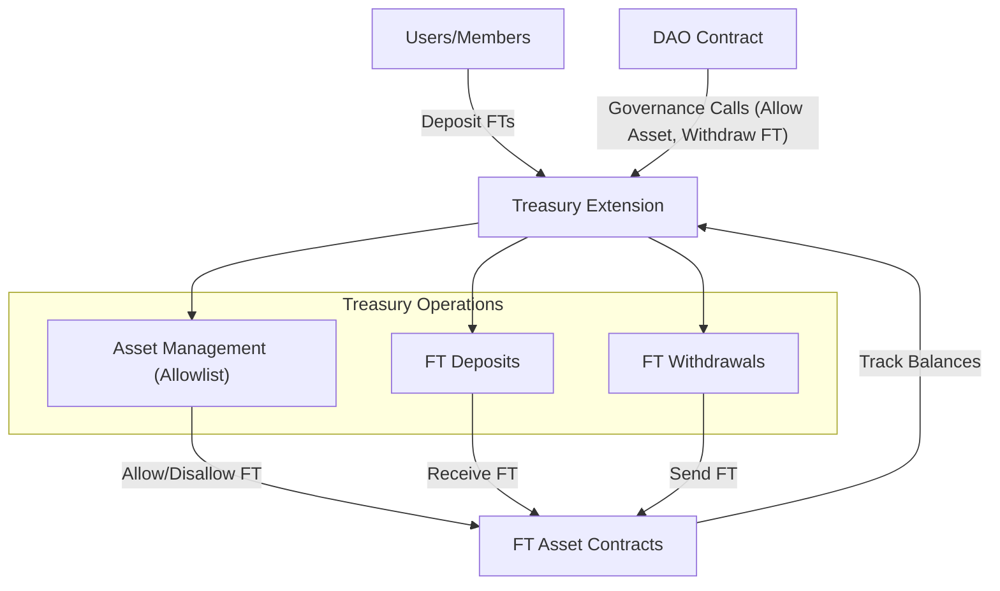

# Treasury Extension

The Treasury extension (`aibtc-treasury`) manages SIP-010 fungible tokens (FTs) owned by the DAO. It provides controlled access to these assets through DAO governance, ensuring that all financial operations are executed securely and transparently. This extension serves as a key financial component of the DAO, enabling it to receive, hold, and distribute various FTs.

## Key Features

- **Fungible Token Support**: Manages SIP-010 fungible tokens (FTs).
- **Asset Allowlist**: Controls which FTs can be deposited and withdrawn.
- **Secure Withdrawals**: Ensures only the DAO or authorized extensions can withdraw FTs.
- **Transparent Operations**: Emits detailed events for all FT transactions.

## Quick Reference

| Property       | Value                                |
| -------------- | ------------------------------------ |
| Contract Name  | `aibtc-treasury`                    |
| Version        | 3.0.0                               |
| Implements     | `.aibtc-dao-traits.extension`, `.aibtc-dao-traits.treasury` |
| Key Parameters | Allowlist of approved FT contracts |

## How It Works



The Treasury extension acts as a specialized financial hub for the DAO's fungible tokens. Users can deposit allowed FTs directly into the treasury. However, withdrawals and asset allowlist management can only be performed through DAO governance. The extension maintains an allowlist of approved FTs to ensure only recognized tokens can be deposited or withdrawn.

## Public Functions

### `callback`

**Purpose**: Standard extension callback function required by the extension trait

**Parameters**:

- `sender`: principal - The principal that triggered the callback
- `memo`: (buff 34) - Optional memo data

**Returns**: (response bool) - Returns true on success

**Example**:

```clarity
(contract-call? .aibtc-treasury callback tx-sender 0x)
```

### `allow-asset`

**Purpose**: Adds or updates an asset in the allowed list

**Parameters**:

- `token`: principal - The principal of the asset contract
- `enabled`: bool - Whether the asset is allowed (true) or disallowed (false)

**Returns**: (response bool) - Returns true on success or an error

**Example**:

```clarity
(contract-call? .aibtc-treasury allow-asset .usda-token true)
```

This function can only be called by the DAO or an authorized extension. It controls which assets can be deposited into and withdrawn from the treasury.

### `allow-assets`

**Purpose**: Adds or updates multiple assets in the allowed list at once

**Parameters**:

- `allowList`: (list 100 {token: principal, enabled: bool}) - List of assets to allow/disallow

**Returns**: (response bool) - Returns true on success or an error

**Example**:

```clarity
(contract-call? .aibtc-treasury allow-assets 
  (list 
    {token: .usda-token, enabled: true}
    {token: .xbtc-token, enabled: true}
    {token: .old-token, enabled: false}
  )
)
```

This function provides a convenient way to manage multiple assets in a single transaction.

### `deposit-stx`

**Purpose**: Deposits STX into the treasury

**Parameters**:

- `amount`: uint - The amount of STX to deposit

**Returns**: (response bool) - Returns true on success or an error

**Example**:

```clarity
(contract-call? .aibtc-treasury deposit-stx u1000000)
```

Anyone can deposit STX into the treasury. The function transfers STX from the caller to the treasury contract.

### `deposit-ft`

**Purpose**: Deposits fungible tokens into the treasury

**Parameters**:

- `ft`: ft-trait - The fungible token contract
- `amount`: uint - The amount of tokens to deposit

**Returns**: (response bool) - Returns true on success or an error

**Example**:

```clarity
(contract-call? .aibtc-treasury deposit-ft .usda-token u1000000)
```

This function allows depositing SIP-010 fungible tokens into the treasury. The token must be in the allowed list.

### `deposit-nft`

**Purpose**: Deposits a non-fungible token into the treasury

**Parameters**:

- `nft`: nft-trait - The non-fungible token contract
- `id`: uint - The ID of the NFT to deposit

**Returns**: (response bool) - Returns true on success or an error

**Example**:

```clarity
(contract-call? .aibtc-treasury deposit-nft .bitcoin-monkeys u42)
```

This function allows depositing SIP-009 non-fungible tokens into the treasury. The NFT contract must be in the allowed list.

### `withdraw-stx`

**Purpose**: Withdraws STX from the treasury

**Parameters**:

- `amount`: uint - The amount of STX to withdraw
- `recipient`: principal - The recipient of the STX

**Returns**: (response bool) - Returns true on success or an error

**Example**:

```clarity
(contract-call? .aibtc-treasury withdraw-stx u1000000 'SP2ZNGJ85ENDY6QRHQ5P2D4FXKGZWCKTB2T0Z55KS)
```

This function can only be called by the DAO or an authorized extension. It transfers STX from the treasury to the specified recipient.

### `withdraw-ft`

**Purpose**: Withdraws fungible tokens from the treasury

**Parameters**:

- `ft`: ft-trait - The fungible token contract
- `amount`: uint - The amount of tokens to withdraw
- `recipient`: principal - The recipient of the tokens

**Returns**: (response bool) - Returns true on success or an error

**Example**:

```clarity
(contract-call? .aibtc-treasury withdraw-ft .usda-token u1000000 'SP2ZNGJ85ENDY6QRHQ5P2D4FXKGZWCKTB2T0Z55KS)
```

This function can only be called by the DAO or an authorized extension. It transfers fungible tokens from the treasury to the specified recipient.

### `withdraw-nft`

**Purpose**: Withdraws a non-fungible token from the treasury

**Parameters**:

- `nft`: nft-trait - The non-fungible token contract
- `id`: uint - The ID of the NFT to withdraw
- `recipient`: principal - The recipient of the NFT

**Returns**: (response bool) - Returns true on success or an error

**Example**:

```clarity
(contract-call? .aibtc-treasury withdraw-nft .bitcoin-monkeys u42 'SP2ZNGJ85ENDY6QRHQ5P2D4FXKGZWCKTB2T0Z55KS)
```

This function can only be called by the DAO or an authorized extension. It transfers an NFT from the treasury to the specified recipient.

### `delegate-stx`

**Purpose**: Delegates STX for stacking

**Parameters**:

- `maxAmount`: uint - The maximum amount of STX to delegate
- `to`: principal - The principal to delegate to

**Returns**: (response bool) - Returns true on success or an error

**Example**:

```clarity
(contract-call? .aibtc-treasury delegate-stx u10000000 'SP2ZNGJ85ENDY6QRHQ5P2D4FXKGZWCKTB2T0Z55KS)
```

This function can only be called by the DAO or an authorized extension. It delegates STX from the treasury for stacking, allowing the DAO to participate in Stacks consensus.

### `revoke-delegate-stx`

**Purpose**: Revokes STX delegation

**Parameters**: None

**Returns**: (response bool) - Returns true on success or an error

**Example**:

```clarity
(contract-call? .aibtc-treasury revoke-delegate-stx)
```

This function can only be called by the DAO or an authorized extension. It revokes the STX delegation, which will unlock the STX after the current cycle ends.

## Read-Only Functions

### `is-allowed-asset`

**Purpose**: Checks if an asset is allowed

**Parameters**:

- `assetContract`: principal - The principal of the asset contract

**Returns**: bool - Returns true if the asset is allowed, false otherwise

**Example**:

```clarity
(contract-call? .aibtc-treasury is-allowed-asset .usda-token)
```

### `get-allowed-asset`

**Purpose**: Gets the allowed status of an asset

**Parameters**:

- `assetContract`: principal - The principal of the asset contract

**Returns**: (optional bool) - Returns the allowed status if the asset is in the list, none otherwise

**Example**:

```clarity
(contract-call? .aibtc-treasury get-allowed-asset .usda-token)
```

## Private Functions

### `is-dao-or-extension`

**Purpose**: Internal authorization check to ensure only the DAO or authorized extensions can call sensitive functions

**Parameters**: None

**Returns**: (response bool) - Returns ok true if authorized, or err u6000 if unauthorized

### `allow-assets-iter`

**Purpose**: Helper function for processing each item in the allow-assets list

**Parameters**:

- `item`: {token: principal, enabled: bool} - The asset item to process

**Returns**: None

## Print Events

| Event                 | Description                           | Data                                                     |
| --------------------- | ------------------------------------- | -------------------------------------------------------- |
| `allow-asset`         | Asset allowed/disallowed              | Token principal, enabled status                          |
| `deposit-stx`         | STX deposited                         | Amount, sender, recipient                                |
| `deposit-ft`          | Fungible token deposited              | Amount, asset contract, sender, recipient                |
| `deposit-nft`         | Non-fungible token deposited          | Asset contract, token ID, sender, recipient              |
| `withdraw-stx`        | STX withdrawn                         | Amount, recipient, sender                                |
| `withdraw-ft`         | Fungible token withdrawn              | Asset contract, recipient, sender                        |
| `withdraw-nft`        | Non-fungible token withdrawn          | Asset contract, token ID, recipient, sender              |
| `delegate-stx`        | STX delegated for stacking           | Amount, delegate address, sender                         |
| `revoke-delegate-stx` | STX delegation revoked               | Sender                                                   |

## Error Handling

| Error Code | Constant           | Description                                | Resolution                                           |
| ---------- | ------------------ | ------------------------------------------ | ---------------------------------------------------- |
| u6000      | ERR_UNAUTHORIZED   | Caller is not the DAO or a valid extension | Ensure the function is called through proper DAO governance |
| u6001      | ERR_UNKNOWN_ASSSET | Asset is not in the allowed list           | Add the asset to the allowed list before attempting to deposit or withdraw |

## Security Considerations

- **Authorization Control**: All withdrawal and management functions are protected by the `is-dao-or-extension` check, ensuring only authorized entities can access treasury funds
- **Asset Allowlist**: The treasury maintains an explicit allowlist of approved assets, preventing unauthorized tokens from being deposited or withdrawn
- **Contract-Call Pattern**: Uses the `as-contract` pattern for withdrawals to ensure proper permissions
- **Governance Protection**: Changes to treasury settings and withdrawals require going through the DAO's proposal and voting process
- **Explicit Asset Verification**: All deposit and withdrawal functions verify that the asset is in the allowed list
- **STX Stacking Security**: Stacking operations are protected by governance controls to prevent unauthorized delegation

## Integration Examples

### Allowing a New Asset

```clarity
;; Example proposal to allow a new token
(contract-call? .aibtc-base-dao submit-proposal
  .aibtc-treasury
  'allow-asset
  (list .new-token true)
  none
  u0
)
```

### Withdrawing Funds for a Project

```clarity
;; Example proposal to withdraw STX for a project
(contract-call? .aibtc-base-dao submit-proposal
  .aibtc-treasury
  'withdraw-stx
  (list u5000000 'SP2ZNGJ85ENDY6QRHQ5P2D4FXKGZWCKTB2T0Z55KS)
  none
  u0
)
```

### Delegating STX for Stacking

```clarity
;; Example proposal to delegate STX for stacking
(contract-call? .aibtc-base-dao submit-proposal
  .aibtc-treasury
  'delegate-stx
  (list u10000000 'SP2ZNGJ85ENDY6QRHQ5P2D4FXKGZWCKTB2T0Z55KS)
  none
  u0
)
```

## Related Contracts

- **[aibtc-base-dao](../dao-base-layer.md)**: The core DAO contract that authorizes this extension
- **[aibtc-dao-traits-v3](../dao-traits.md)**: Defines the traits implemented by this extension
- **[aibtc-payment-processor](./payment-processor.md)**: Works with the treasury for automated payments
- **[aibtc-token-owner](./token-owner.md)**: Manages the DAO token that may be held in the treasury

## Review Checklist

- [x] Follows the appropriate template structure
- [x] Includes all required sections
- [x] Has exactly one H1 title
- [x] YAML frontmatter is at the top with description
- [x] Introduction follows immediately after title
- [x] Heading levels are used correctly (H1 → H2 → H3)
- [x] Code examples are complete and functional with language identifiers
- [x] Tables have clear headers and consistent formatting
- [x] Contract diagram has explanation
- [x] Links to related documentation are correct
- [x] No spelling or grammatical errors
- [x] Technical accuracy has been verified
- [x] Examples use realistic values
- [x] Security considerations are addressed comprehensively
- [x] Error codes and handling are documented
- [x] Content is accessible to the target audience

## Versioning and Updates

- **Last Updated**: June 2025
- **Contract Version**: 3.0.0
- **Documentation Version**: 1.2.0
- **Changes from Previous Version**: Updated to match new documentation template format
