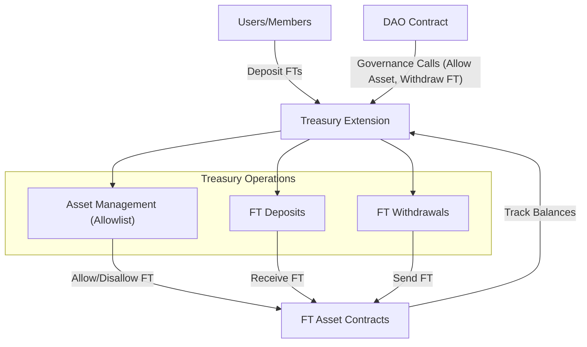

# Treasury Extension

The Treasury extension (`aibtc-treasury`) manages SIP-010 fungible tokens (FTs) owned by the DAO. It provides controlled access to these assets through DAO governance, ensuring that all financial operations are executed securely and transparently. This extension serves as a key financial component of the DAO, enabling it to receive, hold, and distribute various FTs.

## Key Features

- **Fungible Token Support**: Manages SIP-010 fungible tokens (FTs).
- **Asset Allowlist**: Controls which FTs can be deposited and withdrawn.
- **Secure Withdrawals**: Ensures only the DAO or authorized extensions can withdraw FTs.
- **Transparent Operations**: Emits detailed events for all FT transactions.


The first cohort of AIBTC DAOs will have the ability to set the allowed token once at initialization. This will be scoped to SBTC and the DAO token.

Future iterations of AIBTC DAOs can implement additional asset functionality.


## Quick Reference

| Property       | Value                                                       |
| -------------- | ----------------------------------------------------------- |
| Contract Name  | `aibtc-treasury`                                            |
| Implements     | `.aibtc-dao-traits.extension`, `.aibtc-dao-traits.treasury` |
| Key Parameters | Allowlist of approved FT contracts                          |

## How It Works

The Treasury extension acts as a specialized financial hub for the DAO's fungible tokens. Users can deposit allowed FTs directly into the treasury. However, withdrawals and asset allowlist management can only be performed through DAO governance. The extension maintains an allowlist of approved FTs to ensure only recognized tokens can be deposited or withdrawn.

## Public Functions

### `callback`

**Purpose**: Standard extension callback function required by the extension trait

**Parameters**:

- `sender`: principal - The principal that triggered the callback
- `memo`: (buff 34) - Optional memo data

**Returns**: (response bool) - Returns true on success

### `allow-asset`

**Purpose**: Adds or updates an asset in the allowed list

**Parameters**:

- `token`: principal - The principal of the asset contract
- `enabled`: bool - Whether the asset is allowed (true) or disallowed (false)

**Returns**: (response bool) - Returns true on success or an error

This function can only be called by the DAO or an authorized extension. It controls which FTs can be deposited into and withdrawn from the treasury.

### `deposit-ft`

**Purpose**: Deposits fungible tokens (FTs) into the treasury

**Parameters**:

- `ft`: `<sip010-trait>` - The fungible token contract.
- `amount`: `uint` - The amount of tokens to deposit.

**Returns**: `(response (tuple) err-code)` - Returns `(ok (tuple))` on success or an error.

This function allows depositing SIP-010 fungible tokens into the treasury. The token must be in the allowed list.

### `withdraw-ft`

**Purpose**: Withdraws fungible tokens (FTs) from the treasury

**Parameters**:

- `ft`: ft-trait - The fungible token contract
- `amount`: uint - The amount of tokens to withdraw
- `recipient`: principal - The recipient of the tokens

**Returns**: (response bool) - Returns true on success or an error

This function can only be called by the DAO or an authorized extension. It transfers fungible tokens from the treasury to the specified recipient.

## Read-Only Functions

### `is-allowed-asset`

**Purpose**: Checks if an asset is allowed

**Parameters**:

- `assetContract`: principal - The principal of the asset contract

**Returns**: bool - Returns true if the asset is allowed, false otherwise

### `get-allowed-asset`

**Purpose**: Gets the allowed status of an asset

**Parameters**:

- `assetContract`: principal - The principal of the asset contract

**Returns**: (optional bool) - Returns the allowed status if the asset is in the list, none otherwise

### `get-contract-info`

**Purpose**: Retrieves basic information about the contract instance

**Parameters**: None

**Returns**: `{self: principal, deployedBurnBlock: uint, deployedStacksBlock: uint}` - A tuple containing the contract's own principal, the burn block height at deployment, and the Stacks block height at deployment.

## Private Functions

### `is-dao-or-extension`

**Purpose**: Internal authorization check to ensure only the DAO or authorized extensions can call sensitive functions

**Parameters**: None

**Returns**: `(response bool err-code)` - Returns `(ok true)` if authorized, or `ERR_NOT_DAO_OR_EXTENSION (err u1900)` if unauthorized.

## Print Events

| Event                        | Description                 | Data                                                                        |
| ---------------------------- | --------------------------- | --------------------------------------------------------------------------- |
| `aibtc-treasury/allow-asset` | FT Asset allowed/disallowed | `token` (principal), `enabled` (bool), `contractCaller`, `txSender`         |
| `aibtc-treasury/deposit-ft`  | Fungible token deposited    | `amount`, `recipient` (SELF), `assetContract`, `contractCaller`, `txSender` |
| `aibtc-treasury/withdraw-ft` | Fungible token withdrawn    | `amount`, `recipient`, `assetContract`, `contractCaller`, `txSender`        |

## Error Handling

| Error Code | Constant                 | Description                                | Resolution                                                                     |
| ---------- | ------------------------ | ------------------------------------------ | ------------------------------------------------------------------------------ |
| u1900      | ERR_NOT_DAO_OR_EXTENSION | Caller is not the DAO or a valid extension | Ensure the function is called through proper DAO governance.                   |
| u1901      | ERR_ASSET_NOT_ALLOWED    | Asset is not in the allowed list           | Add the FT asset to the allowed list before attempting to deposit or withdraw. |

## Security Considerations

- **Authorization Control**: All withdrawal and `allow-asset` functions are protected by the `is-dao-or-extension` check, ensuring only authorized entities can manage treasury funds and settings.
- **Asset Allowlist**: The treasury maintains an explicit allowlist of approved FTs, preventing unauthorized tokens from being deposited or withdrawn.
- **Contract-Call Pattern**: Uses `as-contract` for withdrawals to ensure proper permissions.
- **Governance Protection**: Changes to treasury settings and withdrawals require going through the DAO's proposal and voting process.
- **Explicit Asset Verification**: All deposit and withdrawal functions verify that the FT asset is in the allowed list.

## Related Contracts

- **`.aibtc-base-dao`**: The core DAO contract that authorizes this extension.
- **`.aibtc-dao-traits.extension`**: Trait implemented by this extension.
- **`.aibtc-dao-traits.treasury`**: Trait implemented by this extension.
- **SIP-010 Compliant FT Contracts**: Various fungible token contracts that the treasury can manage (e.g., `.aibtc-faktory`, `.usda-token`).
