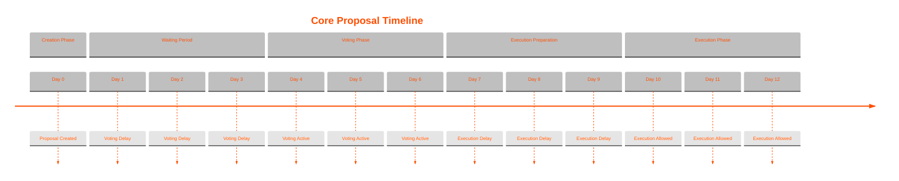

# Core Proposals

Core proposals can execute arbitrary Clarity code within the DAO context, requiring higher consensus due to their significant impact. Each proposal is implemented as a distinct contract that executes functionality through the DAO's extensions.

### Voting Parameters

* 90% approval threshold
* 25% quorum requirement


Proposals expire and will not execute if not submitted in time. This prevents holding an early proposal and executing it later.

The proposal must be executed within 1 voting period following the end block + the voting delay.


### Available Core Proposals

#### Bank Account Management

* **Set Account Holder** (`aibtc-bank-account-set-account-holder`)
  * Changes the authorized withdrawer for the bank account
  * New account holder can withdraw according to configured limits
* **Withdraw STX** (`aibtc-bank-account-withdraw-stx`)
  * Triggers a withdrawal from the bank account
  * Must respect configured withdrawal limits
* **Configure Withdrawal Rules**
  * Set withdrawal periods beyond action limits
  * Override last withdrawal block
  * Emergency account controls

#### DAO Configuration

* **Bootstrap Initialization** (`aibtc-base-bootstrap-initialization-v2`)
  * Sets up initial DAO state
  * Enables core extensions
  * Configures initial action proposals
  * Sets base DAO treasury permissions
  * Records DAO manifest on-chain

#### Extension Management

* **Add New Extension** (`aibtc-base-add-new-extension`)
  * Adds and enables a new extension to the DAO
  * Extension must implement required traits
* **Replace Extension** (`aibtc-base-replace-extension`)
  * Disables an existing extension
  * Enables a new version of the extension
* **Configure Extensions**
  * Enable/disable any extension
  * Update extension parameters
  * Set extension permissions

#### Messaging

* **Send Message** (`aibtc-onchain-messaging-send`)
  * Sends a verified message from the DAO
  * Message stored permanently on-chain

#### Payment Configuration

* **Set Payment Address** (`aibtc-payments-invoices-set-payment-address`)
  * Updates payment receiving address for invoices
  * Controls where funds are sent when resources are purchased
* **Resource Management**
  * Add/remove/modify payment resources
  * Set resource pricing
  * Configure resource availability

#### Token Management

* **Transfer Token Ownership** (`aibtc-token-owner-transfer-ownership`)
  * Transfers control of token configuration
  * Changes authorized manager of token metadata
* **Update Token Metadata**
  * Set token URI
  * Update token information

#### Treasury Operations

* **Withdraw FT** (`aibtc-treasury-withdraw-ft`)
  * Withdraws fungible tokens from treasury
  * Requires token to be on allowlist
* **Withdraw STX** (`aibtc-treasury-withdraw-stx`)
  * Withdraws STX from treasury
  * Can specify any recipient address
* **Withdraw NFT** (`aibtc-treasury-withdraw-nft`)
  * Withdraws non-fungible tokens from treasury
  * Requires NFT to be on allowlist
* **Asset Management**
  * Add/remove assets from allowlist
  * Configure treasury settings
  * Manage asset permissions
* **Stacking Operations**
  * Delegate STX for stacking
  * Revoke stacking delegation
  * Configure stacking parameters

### Creating Custom Core Proposals

Any contract that:

1. Implements the proposal trait (`aibtcdev-dao-traits-v1.proposal`)
2. Makes valid calls to enabled extensions
3. Can be executed through the base DAO

Can be proposed as a core proposal. This allows for unlimited extensibility while maintaining security through high voting thresholds.

### Using Core Proposals

Each proposal requires:

1. Deployment of proposal contract
2. Creation through core proposals extension
3. Meeting voting thresholds
4. Execution after voting period

The key addition here is explicitly listing all the capabilities from the available extensions, plus adding the "Creating Custom Core Proposals" section to emphasize that core proposals aren't limited to just the example contracts we see - they can do anything that's possible through the extensions while respecting the DAO's security model.
