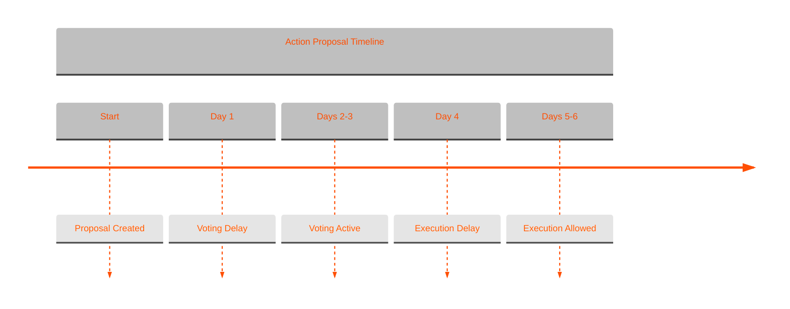

# Action Proposals

Action proposals are predefined operations that can be executed with lower voting requirements.

Each action is implemented as a smart contract that executes specific functionality through the DAO's extensions.

Actions must be registered as an extension with the base dao contract before they can be used in action proposal voting.

### Voting Parameters

* 66% approval threshold
* 15% quorum requirement


Proposals expire and will not execute if not submitted in time. This prevents holding an early proposal and executing it later. The proposal must be executed within 1 voting period following the end block + the voting delay.


### Available Actions

#### Payment/Invoice Management

* **Add Resource** (`aibtc-action-add-resource`)
  * Creates new payable resource in the payments system
  * Sets resource name, description, price, and URL
  * Available for immediate invoice payment after creation
* **Toggle Resource** (`aibtc-action-toggle-resource-by-name`)
  * Enables or disables a payment resource
  * Controls availability for invoice payments

#### Treasury Management

* **Allow Asset** (`aibtc-action-allow-asset`)
  * Adds FT or NFT to treasury allowlist
  * Enables deposits and withdrawals of the asset
  * Required before asset can be used

#### Messaging

* **Send Message** (`aibtc-action-send-message`)
  * Posts verified DAO message on-chain
  * Message includes DAO verification flag
  * Limited to 1MB size

#### Bank Account Configuration

* **Set Account Holder** (`aibtc-action-set-account-holder`)
  * Designates authorized withdrawal address
  * Account holder can withdraw according to limits
* **Set Withdrawal Amount** (`aibtc-action-set-withdrawal-amount`)
  * Updates permitted withdrawal size
  * Must be between 0-100 STX
  * Applied per withdrawal period
* **Set Withdrawal Period** (`aibtc-action-set-withdrawal-period`)
  * Sets time between allowed withdrawals
  * Must be between 6-1,008 blocks (1 hour to 1 week)

### Using Action Proposals

Action proposals provide a simplified way to execute common DAO operations while maintaining security through voting. Unlike core proposals, actions are limited to predefined operations with clear constraints.

Each action requires:

1. Proposal creation through action proposals extension
2. Meeting voting thresholds
3. Execution after voting period
