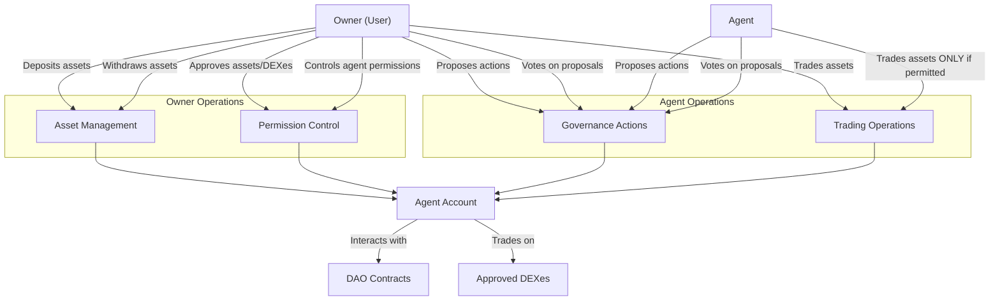

# Agent Account Documentation Example

This is an example of how to apply the smart contract documentation template to the Agent Account contract.

```yaml
---
description: User-Agent Account for managing assets and DAO interactions
---
```

# Agent Account

The Agent Account provides a secure interface between users and their agents, enabling controlled asset management and DAO participation. It creates a permission structure where users maintain full control of their assets while allowing agents to perform specific actions on their behalf.

## Key Features

- **Self-Custody**: Users maintain exclusive withdrawal rights
- **Agent Delegation**: Controlled permissions for agents to interact with DAOs
- **Asset Management**: Deposit, withdraw, and trade approved assets
- **DAO Governance**: Create, vote on, and conclude proposals
- **Trading Controls**: Optional agent trading with user-defined limits

## Quick Reference

| Property          | Value                                                                          |
| ----------------- | ------------------------------------------------------------------------------ |
| Contract Name     | `aibtc-user-agent-account`                                                     |
| Version           | 1.0.0                                                                          |
| Implements        | `aibtc-account`, `aibtc-proposals-v3`, `faktory-dex-approval`, `faktory-buy-sell` |
| Naming Convention | `aibtc-user-agent-account-[OWNER_FIRST5]-[OWNER_LAST5]-[AGENT_FIRST5]-[AGENT_LAST5]` |

## How It Works



The Agent Account acts as a secure intermediary, with different permission levels for owners and agents. The owner (user who created the account) maintains full control over assets and configuration, while agents can perform governance actions and (only when explicitly permitted by the owner) trading operations. The owner has exclusive withdrawal rights.

## Public Functions

### `deposit-stx`

**Purpose**: Deposits STX into the agent account

**Parameters**:

- `amount`: uint - Amount of STX to deposit

**Returns**: (response bool uint) - Success or error code

**Example**:

```clarity
(contract-call? .aibtc-user-agent-account-ST1PQ-PGZGM-ST2CY-RK9AG deposit-stx u1000000)
```

### `withdraw-stx`

**Purpose**: Withdraws STX from the agent account (user only)

**Parameters**:

- `amount`: uint - Amount of STX to withdraw

**Returns**: (response bool uint) - Success or error code

**Example**:

```clarity
(contract-call? .aibtc-user-agent-account-ST1PQ-PGZGM-ST2CY-RK9AG withdraw-stx u500000)
```

### `vote-on-action-proposal`

**Purpose**: Votes on an action proposal (user or agent)

**Parameters**:

- `action-proposals`: action-proposals-trait - The action proposals contract
- `proposalId`: uint - The proposal ID
- `vote`: bool - True for yes, false for no

**Returns**: (response bool uint) - Success or error code

**Example**:

```clarity
(contract-call? .aibtc-user-agent-account-ST1PQ-PGZGM-ST2CY-RK9AG vote-on-action-proposal .aibtc-action-proposals-v3 u5 true)
```

## Read-Only Functions

### `get-balance-stx`

**Purpose**: Gets the current STX balance of the agent account

**Parameters**: None

**Returns**: uint - Current STX balance

**Example**:

```clarity
(contract-call? .aibtc-user-agent-account-ST1PQ-PGZGM-ST2CY-RK9AG get-balance-stx)
```

#### `get-configuration`

**Purpose**: Gets the agent account configuration

**Parameters**: None

**Returns**: Tuple with user, agent, and other configuration details

**Example**:

```clarity
(contract-call? .aibtc-user-agent-account-ST1PQ-PGZGM-ST2CY-RK9AG get-configuration)
```

## Print Events

| Event                     | Description                               | Data                                                 |
| ------------------------- | ----------------------------------------- | ---------------------------------------------------- |
| `deposit-stx`             | Emitted when STX is deposited             | Amount, sender, caller, recipient                    |
| `withdraw-stx`            | Emitted when STX is withdrawn             | Amount, sender, caller, recipient                    |
| `vote-on-action-proposal` | Emitted when voting on an action proposal | Proposal contract, proposal ID, vote, sender, caller |

## Integration Examples

### Depositing STX and Voting on a Proposal

```clarity
;; Deposit STX to the agent account
(contract-call? .aibtc-user-agent-account-ST1PQ-PGZGM-ST2CY-RK9AG deposit-stx u1000000)

;; Vote on an action proposal
(contract-call? .aibtc-user-agent-account-ST1PQ-PGZGM-ST2CY-RK9AG vote-on-action-proposal .aibtc-action-proposals-v3 u5 true)
```

### Agent Trading with Permission

```clarity
;; Owner enables agent trading (must be called by the owner)
(contract-call? .aibtc-user-agent-account-ST1PQ-PGZGM-ST2CY-RK9AG set-agent-can-buy-sell true)

;; Agent buys tokens (will only succeed if agent trading is enabled)
(contract-call? .aibtc-user-agent-account-ST1PQ-PGZGM-ST2CY-RK9AG acct-buy-asset .aibtc-token-dex .aibtc-token u100000000)
```

## Error Handling

| Error Code | Constant                 | Description                              | Resolution                                                       |
| ---------- | ------------------------ | ---------------------------------------- | ---------------------------------------------------------------- |
| u9000      | ERR_UNAUTHORIZED         | Caller is not authorized                 | Ensure you're calling from the correct principal (user or agent) |
| u9001      | ERR_UNKNOWN_ASSET        | Asset is not in the approved list        | Call approve-asset first to add the asset to the approved list   |
| u9002      | ERR_OPERATION_FAILED     | Operation failed                         | Check parameters and try again                                   |
| u9003      | ERR_BUY_SELL_NOT_ALLOWED | Buy/sell operation not allowed for agent | User must call set-agent-can-buy-sell to enable trading          |

## Security Considerations

- **Principal Separation**: User and agent addresses are separate and have different permissions
- **Asset Approval**: Assets must be explicitly approved before they can be used
- **Withdrawal Restrictions**: Only the user can withdraw assets
- **Trading Controls**: Agent trading can be enabled/disabled by the user
- **Immutable Configuration**: User and agent addresses cannot be changed after deployment

## Related Contracts

- **DAO Action Proposals**: The agent account can interact with action proposals for voting
- **DAO Core Proposals**: The agent account can interact with core proposals for voting
- **Faktory DEX**: The agent account can trade on approved DEXes
