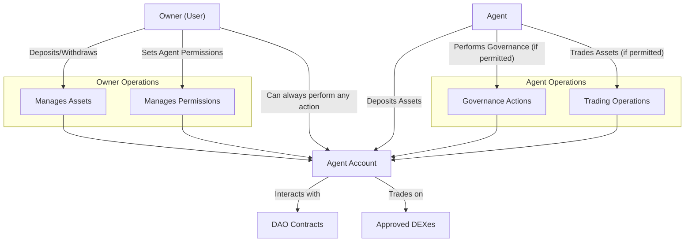

# Agent Account Documentation Example

This is an example of how to apply the smart contract documentation template to the `aibtc-agent-account` contract.

```yaml
---
description: A special account contract between a user and an agent for managing assets and DAO interactions.
---
```

# Agent Account

The Agent Account provides a secure interface between an owner (user) and an agent, enabling controlled asset management and DAO participation. It creates a permission structure where the owner maintains full control of their assets while allowing an agent to perform specific, permitted actions on their behalf.

## Key Features

- **Self-Custody**: The owner has exclusive withdrawal rights.
- **Agent Delegation**: The owner can grant the agent specific permissions for DAO interactions, contract approvals, and trading.
- **Unified Contract Approval**: A single allowlist for all external contracts (tokens, DEXs, etc.).
- **Transparent Operations**: All significant actions are logged via print events.

## Quick Reference

| Property      | Value                                                                                                                                                                          |
| ------------- | ------------------------------------------------------------------------------------------------------------------------------------------------------------------------------ |
| Contract Name | `aibtc-agent-account`                                                                                                                                                          |
| Implements    | `.aibtc-agent-account-traits.aibtc-account`, `.aibtc-agent-account-traits.aibtc-proposals`, `.aibtc-agent-account-traits.aibtc-account-config`, `.aibtc-agent-account-traits.faktory-buy-sell` |

## How It Works


```mermaid
flowchart TD
    A["Owner (User)"]
    B["Agent"]
    C["Agent Account"]
    D["DAO Contracts"]
    E["Approved DEXes"]
    
    subgraph Owner Operations
        direction LR
        CA["Manages Assets"]
        CB["Manages Permissions"]
    end
    
    subgraph Agent Operations
        direction LR
        CC["Governance Actions"]
        CD["Trading Operations"]
    end
    
    A -->|"Deposits/Withdraws"| CA
    A -->|"Sets Agent Permissions"| CB
    A -->|"Can always perform any action"| C

    B -->|"Deposits Assets"| C
    B -->|"Performs Governance (if permitted)"| CC
    B -->|"Trades Assets (if permitted)"| CD
    
    CA --> C
    CB --> C
    CC --> C
    CD --> C
    
    C -->|"Interacts with"| D
    C -->|"Trades on"| E
```

The Agent Account acts as a secure intermediary. The owner maintains full control over assets and can grant the agent specific permissions. The agent can only perform actions like voting or trading if explicitly permitted by the owner. Only the owner can withdraw assets.

## Public Functions

### `deposit-stx`

**Purpose**: Deposits STX into the agent account.
**Parameters**: `amount`: `uint`
**Authorization**: Owner or Agent
**Example**: `(contract-call? .aibtc-agent-account deposit-stx u1000000)`

### `withdraw-stx`

**Purpose**: Withdraws STX from the agent account to the owner.
**Parameters**: `amount`: `uint`
**Authorization**: Owner Only
**Example**: `(contract-call? .aibtc-agent-account withdraw-stx u500000)`

### `approve-contract`

**Purpose**: Approves an external contract for interaction.
**Parameters**: `contract`: `principal`
**Authorization**: Owner, or Agent if permitted.
**Example**: `(contract-call? .aibtc-agent-account approve-contract .my-token)`

### `set-agent-can-buy-sell-assets`

**Purpose**: Allows the owner to enable or disable the agent's trading ability.
**Parameters**: `canBuySell`: `bool`
**Authorization**: Owner Only
**Example**: `(contract-call? .aibtc-agent-account set-agent-can-buy-sell-assets true)`

## Read-Only Functions

### `is-approved-contract`

**Purpose**: Checks if a contract is on the approved list.
**Parameters**: `contract`: `principal`
**Returns**: `bool`
**Example**: `(contract-call? .aibtc-agent-account is-approved-contract .my-dex)`

### `get-configuration`

**Purpose**: Gets the core agent account configuration.
**Parameters**: None
**Returns**: A tuple with `owner`, `agent`, and `account` principals.
**Example**: `(contract-call? .aibtc-agent-account get-configuration)`

## Print Events

| Event                             | Description                               |
| --------------------------------- | ----------------------------------------- |
| `deposit-stx`                     | Emitted when STX is deposited.            |
| `withdraw-stx`                    | Emitted when STX is withdrawn.            |
| `approve-contract`                | Emitted when a contract is approved.      |
| `set-agent-can-buy-sell-assets`   | Emitted when agent trading permission is changed. |

## Integration Examples

### Depositing STX and Approving a Contract

```clarity
;; Deposit STX to the agent account (as owner or agent)
(contract-call? .aibtc-agent-account deposit-stx u1000000)

;; Approve a DEX for trading (as owner)
(contract-call? .aibtc-agent-account approve-contract .aibtc-faktory-dex)
```

### Agent Trading with Permission

```clarity
;; Owner enables agent trading (must be called by the owner)
(contract-call? .aibtc-agent-account set-agent-can-buy-sell-assets true)

;; Agent buys tokens (will only succeed if agent trading is enabled)
(as-contract (contract-call? .aibtc-agent-account faktory-buy-asset .aibtc-faktory-dex .aibtc-token u100000000))
```

## Error Handling

| Error Code | Constant                    | Description                               |
| ---------- | --------------------------- | ----------------------------------------- |
| u1100      | ERR_CALLER_NOT_OWNER        | Caller is not the owner.                  |
| u1101      | ERR_CONTRACT_NOT_APPROVED   | The target contract is not approved.      |
| u1103      | ERR_OPERATION_NOT_ALLOWED   | The caller cannot perform this action.    |

## Security Considerations

- **Principal Separation**: Owner and agent have different, clearly defined permissions.
- **Contract Approval**: External contracts must be explicitly approved before use.
- **Withdrawal Restrictions**: Only the owner can withdraw assets.
- **Configurable Permissions**: The owner has granular control over the agent's abilities.
- **Immutable Configuration**: Owner and agent addresses cannot be changed after deployment.

## Related Contracts

- **DAO Proposal Contracts**: The agent account can interact with proposal contracts for voting.
- **Faktory DEX**: The agent account can trade on approved DEXes.
- **sBTC Token**: The sBTC contract is approved by default for deposits.
