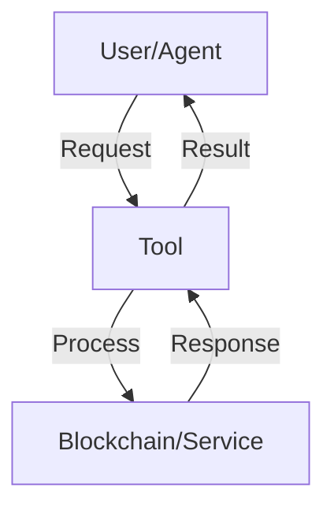

# Agent Tool Documentation Template

Use this template when documenting agent tools to ensure consistency across all tool documentation.

## High-Level Overview

---
description: [One-line description of the tool's purpose]
---

# [Tool Category Name]

[1-2 paragraph introduction explaining what this tool category does and why it matters]

## Key Features

- **[Feature 1]**: [Brief explanation]
- **[Feature 2]**: [Brief explanation]
- **[Feature 3]**: [Brief explanation]

## Tool Overview

| Tool Name | Description | Key Features |
|-----------|-------------|--------------|
| `[tool_name_1]` | [Brief description] | [Key feature highlights] |
| `[tool_name_2]` | [Brief description] | [Key feature highlights] |
| `[tool_name_3]` | [Brief description] | [Key feature highlights] |

## How It Works



[Brief explanation of the workflow]

## Tool Details

### [tool_name_1]

**Purpose**: [What this tool does]

**Input Parameters**:
- `[param1]`: [type] - [description]
- `[param2]`: [type] - [description]

**Output**:
```json
{
  "key1": "value1",
  "key2": "value2"
}
```

**Example Prompt**:
```
[Example of how to prompt the agent to use this tool]
```

[Additional notes about usage, security considerations, etc.]

## Workflow Examples

### [Example Use Case 1]

```
[Step 1 prompt]

[Step 2 prompt]

[Step 3 prompt]
```

[Brief explanation of the workflow]

### [Example Use Case 2]

```
[Step 1 prompt]

[Step 2 prompt]

[Step 3 prompt]
```

[Brief explanation of the workflow]

## Error Handling

| Error Code | Description | Resolution |
|------------|-------------|------------|
| [code] | [What causes this error] | [How to resolve or avoid] |

## Security Considerations

- **[Security Feature 1]**: [Explanation]
- **[Security Feature 2]**: [Explanation]
- **[Security Risk 1]**: [Explanation and mitigation]

## Related Tools

- **[Related Tool 1]**: [Brief description of relationship]
- **[Related Tool 2]**: [Brief description of relationship]
