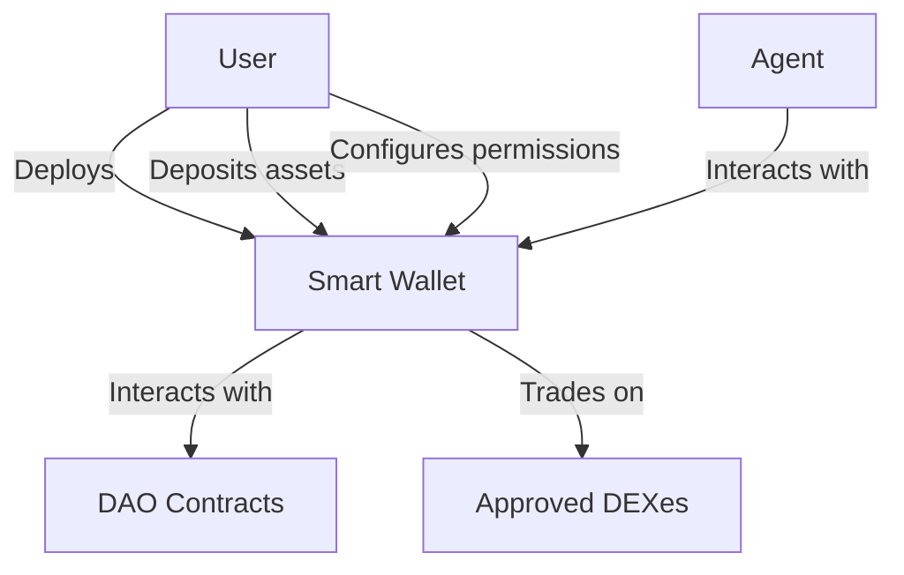

# Smart Wallet Tools Documentation Example

This is an example of how to apply the agent tool documentation template to the Smart Wallet Tools category.

---
description: Tools for interacting with Smart Wallets
---

# Smart Wallet Tools

Smart Wallet tools provide functionality for deploying, managing, and interacting with Smart Wallets, which are programmable wallets that can hold assets and interact with various contracts on the Stacks blockchain. These tools enable users and agents to perform operations like depositing/withdrawing assets, approving tokens and DEXes, and participating in DAO governance.

## Key Features

- **Wallet Deployment**: Create new smart wallets with owner and agent assignments
- **Asset Management**: Deposit, withdraw, and trade various assets
- **Permission Control**: Configure what actions agents can perform
- **DAO Governance**: Propose, vote on, and conclude DAO proposals
- **Configuration Management**: Approve/revoke assets and DEXes for use with the wallet

## Tool Overview

| Tool Name | Description | Key Features |
|-----------|-------------|--------------|
| `smartwallet_deploy_smart_wallet` | Deploy a new smart wallet | Owner assignment, DAO token linking |
| `smartwallet_deposit_stx` | Deposit STX to a smart wallet | Transaction creation, balance update |
| `smartwallet_withdraw_stx` | Withdraw STX from a smart wallet | Transaction creation, balance update |
| `smartwallet_approve_asset` | Approve an asset for use with the smart wallet | Asset authorization |
| `smartwallet_vote_on_action_proposal` | Vote on an action proposal | Governance participation |

## How It Works



Smart Wallet tools facilitate the creation and management of programmable wallets that serve as secure intermediaries between users, agents, and blockchain services. The user maintains control over assets and configuration, while the agent can perform specific actions based on granted permissions.

## Tool Details

### smartwallet_deploy_smart_wallet

**Purpose**: Deploys a new smart wallet for a user.

**Input Parameters**:
- `owner_address`: string - Stacks address of the wallet owner
- `agent_address`: string - Stacks address of the agent
- `dao_token_contract`: string - Contract principal of the DAO token
- `dao_token_dex_contract` (optional): string - Contract principal of the DAO token DEX

**Output**:
```json
{
  "success": true,
  "txid": "0x8912c9f4a79114eb4bdb153fc35fa3d3cddd3c681a855a8f2f27ab5799f552c0",
  "smart_wallet_contract": "ST1PQHQKV0RJXZFY1DGX8MNSNYVE3VGZJSRTPGZGM.aibtc-smart-wallet-ST1PQ-PGZGM-ST2CY-RK9AG",
  "owner": "ST1PQHQKV0RJXZFY1DGX8MNSNYVE3VGZJSRTPGZGM",
  "agent": "ST2CY5V39NHDPWSXMW9QDT3HC3GD6Q6XX4CFRK9AG"
}
```

**Example Prompt**:
```
Deploy a new smart wallet with the following details:
- owner_address: ST1PQHQKV0RJXZFY1DGX8MNSNYVE3VGZJSRTPGZGM
- agent_address: ST2CY5V39NHDPWSXMW9QDT3HC3GD6Q6XX4CFRK9AG
- dao_token_contract: ST1PQHQKV0RJXZFY1DGX8MNSNYVE3VGZJSRTPGZGM.aibtc-token
- dao_token_dex_contract: ST1PQHQKV0RJXZFY1DGX8MNSNYVE3VGZJSRTPGZGM.aibtc-token-dex
```

This tool creates a new smart wallet contract with the specified owner and agent addresses. The wallet is automatically configured to work with the specified DAO token and DEX.

## Workflow Examples

### Asset Management Workflow

```
1. Deploy a new smart wallet with the following details:
   - owner_address: ST1PQHQKV0RJXZFY1DGX8MNSNYVE3VGZJSRTPGZGM
   - agent_address: ST2CY5V39NHDPWSXMW9QDT3HC3GD6Q6XX4CFRK9AG
   - dao_token_contract: ST1PQHQKV0RJXZFY1DGX8MNSNYVE3VGZJSRTPGZGM.aibtc-token
   - dao_token_dex_contract: ST1PQHQKV0RJXZFY1DGX8MNSNYVE3VGZJSRTPGZGM.aibtc-token-dex

2. Deposit STX to my smart wallet with the following details:
   - smart_wallet_contract: ST1PQHQKV0RJXZFY1DGX8MNSNYVE3VGZJSRTPGZGM.aibtc-smart-wallet-ST1PQ-PGZGM-ST2CY-RK9AG
   - amount: 1000000

3. Approve a token for use with my smart wallet:
   - smart_wallet_contract: ST1PQHQKV0RJXZFY1DGX8MNSNYVE3VGZJSRTPGZGM.aibtc-smart-wallet-ST1PQ-PGZGM-ST2CY-RK9AG
   - asset_contract: ST1PQHQKV0RJXZFY1DGX8MNSNYVE3VGZJSRTPGZGM.aibtc-token
```

This workflow demonstrates how to set up a smart wallet, fund it with STX, and approve a token for use with the wallet.

### DAO Governance Workflow

```
1. Vote on an action proposal through my smart wallet:
   - smart_wallet_contract: ST1PQHQKV0RJXZFY1DGX8MNSNYVE3VGZJSRTPGZGM.aibtc-smart-wallet-ST1PQ-PGZGM-ST2CY-RK9AG
   - action_proposals_contract: ST1PQHQKV0RJXZFY1DGX8MNSNYVE3VGZJSRTPGZGM.aibtc-action-proposals-v2
   - proposal_id: 123
   - vote: true

2. Conclude an action proposal through my smart wallet:
   - smart_wallet_contract: ST1PQHQKV0RJXZFY1DGX8MNSNYVE3VGZJSRTPGZGM.aibtc-smart-wallet-ST1PQ-PGZGM-ST2CY-RK9AG
   - action_proposals_contract: ST1PQHQKV0RJXZFY1DGX8MNSNYVE3VGZJSRTPGZGM.aibtc-action-proposals-v2
   - proposal_id: 123
   - action_contract: ST1PQHQKV0RJXZFY1DGX8MNSNYVE3VGZJSRTPGZGM.aibtc-action-send-message
```

This workflow demonstrates how to participate in DAO governance by voting on and concluding action proposals.

## Error Handling

| Error Code | Description | Resolution |
|------------|-------------|------------|
| 9000 | Unauthorized access | Ensure you're calling from the correct principal (user or agent) |
| 9001 | Unknown asset | Call approve-asset first to add the asset to the approved list |
| 9002 | Operation failed | Check parameters and try again |
| 9003 | Buy/sell not allowed | User must call set-agent-can-buy-sell to enable trading |

## Security Considerations

- **Principal Separation**: User and agent addresses are separate and have different permissions
- **Asset Approval**: Assets must be explicitly approved before they can be used
- **Withdrawal Restrictions**: Only the user can withdraw assets
- **Trading Controls**: Agent trading can be enabled/disabled by the user
- **Immutable Configuration**: User and agent addresses cannot be changed after deployment

## Related Tools

- **Wallet Tools**: Used for managing the agent's own wallet that interacts with smart wallets
- **DAO Tools**: Used in conjunction with smart wallet tools for DAO governance
- **Faktory Tools**: Used for trading tokens through the smart wallet
