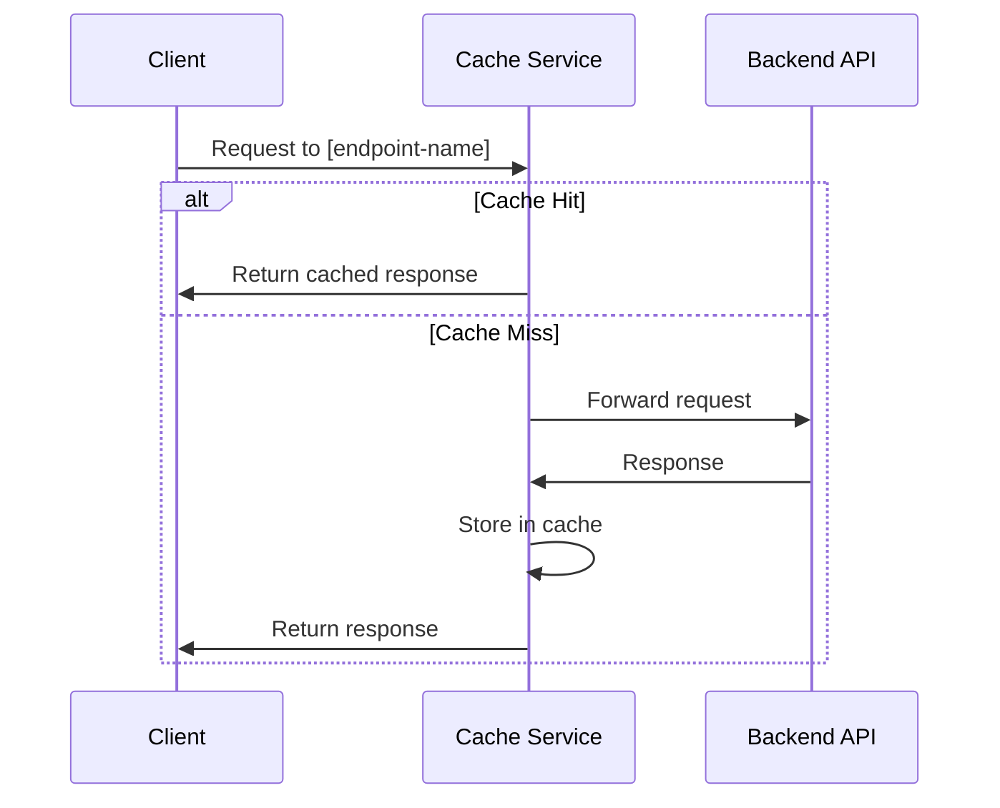

# Cache Endpoint Documentation Template

Use this template when documenting individual endpoints of a cache service.

# [Endpoint Name]

**Purpose**: [What this endpoint does]

**Path**: `/[path]/[endpoint-name]`

**Method**: [HTTP Method]

## Request Flow



## Request Format

### Path Parameters
- `[pathParam1]`: [Description]
- `[pathParam2]`: [Description]

### Query Parameters
- `[queryParam1]`: (optional) [Description]
- `[queryParam2]`: [Description]

### Request Body
```json
{
  "param1": "value1",
  "param2": "value2",
  "cacheControl": {
    "bustCache": false,
    "skipCache": false,
    "ttl": 3600
  }
}
```

### Request Body Parameters
- `param1`: [Type] - [Description]
- `param2`: [Type] - [Description]
- `cacheControl`: (optional) Object - Options to control caching behavior:
  - `bustCache`: (optional) Boolean - If true, bypass the cache and force a fresh request
  - `skipCache`: (optional) Boolean - If true, don't cache the result of this request
  - `ttl`: (optional) Number - Custom time-to-live in seconds for this specific request

## Response Format

### Success Response
```json
{
  "success": true,
  "data": {
    "key1": "value1",
    "key2": "value2"
  }
}
```

### Error Response
```json
{
  "success": false,
  "error": {
    "id": "unique-error-id",
    "code": "ERROR_CODE",
    "message": "Human-readable error message",
    "details": {
      // Optional additional error details
    }
  }
}
```

## Common Error Codes
- `[ERROR_CODE_1]` - [Description and when it occurs]
- `[ERROR_CODE_2]` - [Description and when it occurs]

## Example Requests

### cURL
```bash
curl -X [METHOD] \
  https://cache.aibtc.dev/[path]/[endpoint-name] \
  -H "Content-Type: application/json" \
  -d '{"param1": "value1", "param2": "value2"}'
```

### JavaScript
```javascript
async function callEndpoint(param1, param2) {
  const response = await fetch(
    'https://cache.aibtc.dev/[path]/[endpoint-name]',
    {
      method: '[METHOD]',
      headers: {
        'Content-Type': 'application/json',
      },
      body: JSON.stringify({
        param1,
        param2
      })
    }
  );
  
  const result = await response.json();
  
  if (result.success) {
    return result.data;
  } else {
    throw new Error(`API Error: ${result.error.code} - ${result.error.message}`);
  }
}
```

### Python
```python
import requests
import json

def call_endpoint(param1, param2):
    url = 'https://cache.aibtc.dev/[path]/[endpoint-name]'
    
    payload = {
        "param1": param1,
        "param2": param2
    }
    
    response = requests.post(
        url,
        headers={'Content-Type': 'application/json'},
        data=json.dumps(payload)
    )
    
    response.raise_for_status()
    result = response.json()
    
    if result.get('success'):
        return result['data']
    else:
        error = result.get('error', {})
        raise Exception(f"API Error: {error.get('code')} - {error.get('message')}")
```

## Integration Examples

### [Example Use Case 1]
```javascript
// Example of how to use this endpoint for a specific use case
async function exampleUseCase() {
  try {
    const data = await callEndpoint('value1', 'value2');
    console.log('Success:', data);
    // Process data...
  } catch (error) {
    console.error('Error:', error);
    // Handle error...
  }
}
```

### [Example Use Case 2 with Error Handling and Retries]
```javascript
async function callWithRetry(param1, param2, maxRetries = 3) {
  let retries = 0;
  let delay = 1000; // Start with 1 second
  
  while (true) {
    try {
      const response = await fetch(
        'https://cache.aibtc.dev/[path]/[endpoint-name]',
        {
          method: '[METHOD]',
          headers: {
            'Content-Type': 'application/json',
          },
          body: JSON.stringify({
            param1,
            param2,
            cacheControl: {
              bustCache: retries > 0 // Bust cache on retries
            }
          })
        }
      );
      
      const result = await response.json();
      
      if (result.success) {
        return result.data;
      } else if (
        ['UPSTREAM_API_ERROR', 'TIMEOUT', 'RATE_LIMIT_EXCEEDED'].includes(result.error.code) && 
        retries < maxRetries
      ) {
        retries++;
        console.log(`Retrying after error: ${result.error.code} (attempt ${retries}/${maxRetries})`);
        await new Promise(resolve => setTimeout(resolve, delay));
        delay *= 2; // Exponential backoff
        continue;
      } else {
        throw new Error(`API Error: ${result.error.code} - ${result.error.message}`);
      }
    } catch (error) {
      if (retries < maxRetries) {
        retries++;
        console.log(`Request failed, retrying (attempt ${retries}/${maxRetries})`);
        await new Promise(resolve => setTimeout(resolve, delay));
        delay *= 2; // Exponential backoff
        continue;
      }
      throw error;
    }
  }
}
```

## Caching Details

- **Default TTL**: [Time in seconds for this specific endpoint]
- **Cache Key Components**: [What makes up the cache key for this endpoint]
- **Recommended Cache Settings**: [Best practices for this endpoint]

## Performance Notes

- **Typical Response Time**: [Expected response time range]
- **Rate Limit Impact**: [How this endpoint affects rate limits]
- **Heavy Operation Warning**: [Any warnings about resource-intensive operations]
