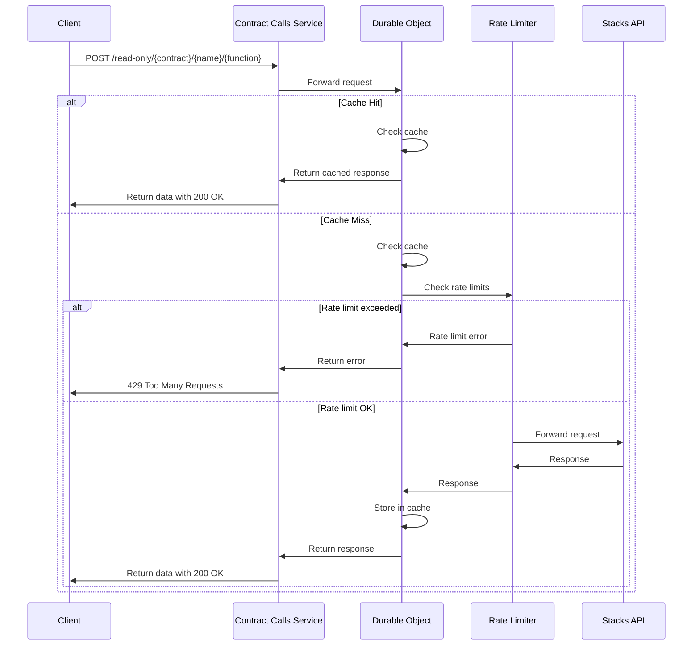

# Contract Calls Endpoint Documentation Example

This is an example of how to apply the cache endpoint documentation template to the Read-Only Function Calls endpoint.

## Read-Only Function Calls

**Purpose**: Make read-only calls to smart contract functions with caching and automatic retries

**Path**: `/contract-calls/read-only/{contractAddress}/{contractName}/{functionName}`

**Method**: POST

## Request Flow



## Request Format

### Path Parameters
- `contractAddress`: The principal address of the contract (e.g., `ST252TFQ08T74ZZ6XK426TQNV4EXF1D4RMTTNCWFA`)
- `contractName`: The name of the contract (e.g., `media3-action-proposals-v2`)
- `functionName`: The name of the function to call (e.g., `get-proposal`)

### Request Body
```json
{
  "functionArgs": [
    {
      "type": "uint",
      "value": "3"
    }
  ],
  "network": "testnet",
  "senderAddress": "ST252TFQ08T74ZZ6XK426TQNV4EXF1D4RMTTNCWFA",
  "strictJsonCompat": true,
  "preserveContainers": false,
  "cacheControl": {
    "bustCache": false,
    "skipCache": false,
    "ttl": 3600
  }
}
```

### Request Body Parameters
- `functionArgs`: Array of arguments to pass to the function (using simplified Clarity value format)
- `network` (optional): The Stacks network to use (`mainnet` or `testnet`, defaults to `testnet`)
- `senderAddress` (optional): The address to use as the sender (defaults to the contract address)
- `strictJsonCompat` (optional): Whether to ensure values are JSON compatible (defaults to `true`)
- `preserveContainers` (optional): Whether to preserve container types in the output (defaults to `false`)
- `cacheControl` (optional): Options to control caching behavior:
  - `bustCache` (optional): If true, bypass the cache and force a fresh request (defaults to `false`)
  - `skipCache` (optional): If true, don't cache the result of this request (defaults to `false`)
  - `ttl` (optional): Custom time-to-live in seconds for this specific request (overrides default TTL)

## Response Format

### Success Response
```json
{
  "success": true,
  "data": {
    "action": "ST252TFQ08T74ZZ6XK426TQNV4EXF1D4RMTTNCWFA.media3-action-send-message",
    "bond": "100000000000",
    "caller": "ST1F8Z1TDZQVP9P0D05VAW5MHKS2EYXZZ1PDE9Q8A",
    "concluded": false,
    "createdAt": "586130",
    "creator": "ST1F8Z1TDZQVP9P0D05VAW5MHKS2EYXZZ1PDE9Q8A",
    "endBlock": "27570",
    "executed": false,
    "liquidTokens": "2104509663564782",
    "metQuorum": false,
    "metThreshold": false,
    "passed": false,
    "startBlock": "27566",
    "votesAgainst": "650503728846681",
    "votesFor": "0"
  }
}
```

### Error Response
```json
{
  "success": false,
  "error": {
    "id": "unique-error-id",
    "code": "ERROR_CODE",
    "message": "Human-readable error message",
    "details": {
      // Optional additional error details
    }
  }
}
```

## Common Error Codes
- `INVALID_CONTRACT_ADDRESS` - The contract address is not a valid Stacks address
- `INVALID_FUNCTION` - The function doesn't exist in the contract ABI
- `INVALID_ARGUMENTS` - The arguments don't match what the function expects
- `UPSTREAM_API_ERROR` - Error from the Stacks API when calling the function
- `VALIDATION_ERROR` - Error validating the request parameters
- `TIMEOUT` - The request to the Stacks API timed out (default timeout: 5 seconds)
- `RATE_LIMIT_EXCEEDED` - The rate limit for Stacks API requests has been exceeded

## Example Requests

### cURL
```bash
curl -X POST \
  https://cache.aibtc.dev/contract-calls/read-only/ST252TFQ08T74ZZ6XK426TQNV4EXF1D4RMTTNCWFA/media3-action-proposals-v2/get-proposal \
  -H "Content-Type: application/json" \
  -d '{"functionArgs": [{ "type": "uint", "value": "3" }]}' \
  -w "\n"
```

### JavaScript with Stacks.js
```javascript
import { uintCV } from '@stacks/transactions';
// Or using the clarity namespace: import { Cl } from '@stacks/transactions';

async function getProposal(proposalId) {
  // Create function arguments using Stacks.js
  const functionArgs = [uintCV(proposalId)];
  
  const response = await fetch(
    'https://cache.aibtc.dev/contract-calls/read-only/ST252TFQ08T74ZZ6XK426TQNV4EXF1D4RMTTNCWFA/media3-action-proposals-v2/get-proposal',
    {
      method: 'POST',
      headers: {
        'Content-Type': 'application/json',
      },
      body: JSON.stringify({ functionArgs }),
    }
  );
  
  const result = await response.json();
  
  if (result.success) {
    return result.data;
  } else {
    throw new Error(`API Error: ${result.error.code} - ${result.error.message}`);
  }
}
```

### Python with Simplified Format
```python
import requests
import json

def get_proposal(proposal_id):
    url = 'https://cache.aibtc.dev/contract-calls/read-only/ST252TFQ08T74ZZ6XK426TQNV4EXF1D4RMTTNCWFA/media3-action-proposals-v2/get-proposal'
    
    payload = {
        "functionArgs": [
            {
                "type": "uint",
                "value": str(proposal_id)
            }
        ]
    }
    
    response = requests.post(
        url,
        headers={'Content-Type': 'application/json'},
        data=json.dumps(payload)
    )
    
    response.raise_for_status()
    result = response.json()
    
    if result.get('success'):
        return result['data']
    else:
        error = result.get('error', {})
        raise Exception(f"API Error: {error.get('code')} - {error.get('message')}")
```

## Integration Examples

### JavaScript Example with Error Handling and Retries
```javascript
/**
 * Call a contract function with comprehensive error handling, timeout handling, and retries
 */
async function callContract(
  contractAddress,
  contractName,
  functionName,
  args,
  options = {}
) {
  const {
    network = "mainnet",
    bustCache = false,
    maxRetries = 3,
    initialRetryDelay = 1000,
  } = options;

  let retries = 0;
  let delay = initialRetryDelay;

  while (true) {
    try {
      const response = await fetch(
        `https://cache.aibtc.dev/contract-calls/read-only/${contractAddress}/${contractName}/${functionName}`,
        {
          method: "POST",
          headers: {
            "Content-Type": "application/json",
          },
          body: JSON.stringify({
            functionArgs: args,
            network,
            cacheControl: {
              bustCache: bustCache || retries > 0, // Bust cache on retries
            },
          }),
        }
      );

      const result = await response.json();

      if (result.success) {
        return result.data;
      } else {
        // Determine if we should retry based on error type
        const shouldRetry =
          (result.error.code === "UPSTREAM_API_ERROR" &&
            result.error.details?.retryable) ||
          result.error.code === "TIMEOUT" ||
          result.error.code === "RATE_LIMIT_EXCEEDED";

        if (shouldRetry && retries < maxRetries) {
          retries++;
          delay *= 2; // Exponential backoff
          console.log(
            `Retrying after error: ${result.error.code} (attempt ${retries}/${maxRetries})`
          );
          await new Promise((resolve) => setTimeout(resolve, delay));
          continue;
        }

        throw new Error(
          `API Error: ${result.error.code} - ${result.error.message}`
        );
      }
    } catch (error) {
      if (retries < maxRetries) {
        retries++;
        delay *= 2; // Exponential backoff
        console.log(
          `Retrying after exception (attempt ${retries}/${maxRetries})`
        );
        await new Promise((resolve) => setTimeout(resolve, delay));
        continue;
      }
      throw error;
    }
  }
}

// Example usage
async function getProposal(id) {
  try {
    const result = await callContract(
      "ST252TFQ08T74ZZ6XK426TQNV4EXF1D4RMTTNCWFA",
      "media3-action-proposals-v2",
      "get-proposal",
      [{ type: "uint", value: id.toString() }],
      {
        network: "testnet",
        maxRetries: 3,
      }
    );
    console.log("Proposal:", result);
    return result;
  } catch (error) {
    console.error("Failed to get proposal:", error);
    throw error;
  }
}
```

### Python Example with Cache Control
```python
import requests
import json
import time
import random

def call_contract(
    contract_address,
    contract_name,
    function_name,
    args,
    network='mainnet',
    bust_cache=False,
    custom_ttl=None,
    max_retries=3
):
    """
    Call a read-only contract function with error handling and cache control
    """
    url = f'https://cache.aibtc.dev/contract-calls/read-only/{contract_address}/{contract_name}/{function_name}'

    # Build the payload with cache control options if needed
    payload = {
        "functionArgs": args,
        "network": network
    }

    # Add cache control options if any are specified
    cache_control = {}
    if custom_ttl is not None:
        cache_control["ttl"] = custom_ttl
    if bust_cache:
        cache_control["bustCache"] = True

    if cache_control:
        payload["cacheControl"] = cache_control

    retries = 0
    delay = 1.0  # Initial delay in seconds

    while True:
        try:
            response = requests.post(
                url,
                headers={'Content-Type': 'application/json'},
                data=json.dumps(payload)
            )

            response.raise_for_status()
            result = response.json()

            if result.get('success'):
                return result['data']
            else:
                error = result.get('error', {})
                error_code = error.get('code', 'UNKNOWN_ERROR')

                # Determine if we should retry based on error type
                should_retry = (
                    error_code == 'UPSTREAM_API_ERROR' or
                    error_code == 'TIMEOUT' or
                    error_code == 'RATE_LIMIT_EXCEEDED'
                )

                if should_retry and retries < max_retries:
                    retries += 1
                    delay *= 2  # Exponential backoff
                    # Add some jitter to prevent thundering herd
                    actual_delay = delay * (0.8 + random.random() * 0.4)
                    print(f"Retrying after error: {error_code} (attempt {retries}/{max_retries} after {actual_delay:.2f}s)")
                    time.sleep(actual_delay)
                    continue

                raise Exception(f"API Error: {error_code} - {error.get('message')}")

        except (requests.exceptions.RequestException, Exception) as e:
            if retries < max_retries:
                retries += 1
                delay *= 2  # Exponential backoff
                actual_delay = delay * (0.8 + random.random() * 0.4)
                print(f"Request failed: {e}, retrying (attempt {retries}/{max_retries} after {actual_delay:.2f}s)")
                time.sleep(actual_delay)
                continue
            raise
```

## Caching Details

- **Default TTL**: Indefinite (cached permanently until explicitly removed)
- **Cache Key Components**: Contract address, contract name, function name, function arguments (hashed), and network
- **Recommended Cache Settings**:
  - For frequently changing data: Set a custom TTL (30 seconds or less)
  - For data that needs periodic refresh: Set a custom TTL (5-15 minutes)
  - For on-demand refresh: Use cache busting when fresh data is needed
  - For one-time queries: Use skipCache to bypass storage entirely

## Performance Notes

- **Typical Response Time**: 
  - Cache hit: < 100ms
  - Cache miss: 500-1500ms for simple calls, 1-5 seconds for complex calls
- **Rate Limit Impact**: Each uncached call counts against the 20 requests per minute limit
- **Heavy Operation Warning**: Complex contract calls with large data structures may take longer to process
