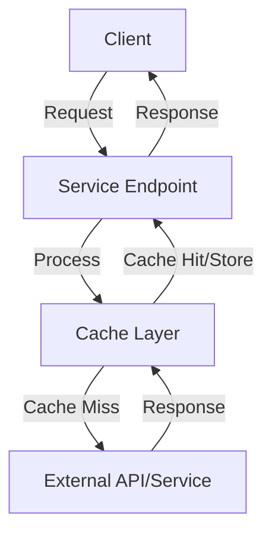

# Cache Service Documentation Template

Use this template when documenting the high-level aspects of a cache service.

## High-Level Overview

```yaml
---
description: [One-line description of the service's purpose]
---
```

# [Service Name]

[1-2 paragraph introduction explaining what this service does and why it matters]

## Key Features

- **[Feature 1]**: [Brief explanation]
- **[Feature 2]**: [Brief explanation]
- **[Feature 3]**: [Brief explanation]

## Service Architecture



[Brief explanation of the architecture]

## Endpoints

| Endpoint               | Method        | Description         |
| ---------------------- | ------------- | ------------------- |
| `/[path]/[endpoint-1]` | [HTTP Method] | [Brief description] |
| `/[path]/[endpoint-2]` | [HTTP Method] | [Brief description] |

## Request/Response Format

### Success Response

```json
{
  "success": true,
  "data": {
    "key1": "value1",
    "key2": "value2"
  }
}
```

### Error Response

```json
{
  "success": false,
  "error": {
    "id": "unique-error-id",
    "code": "ERROR_CODE",
    "message": "Human-readable error message",
    "details": {
      // Optional additional error details
    }
  }
}
```

## Caching Behavior

- **Default TTL**: [Time in seconds]
- **Cache Key Generation**: [How cache keys are generated]
- **Cache Busting**: [How to force a fresh request]
- **Custom TTL**: [How to set a custom TTL]

## Performance Considerations

- **Rate Limiting**: [Description of rate limits]
- **Request Queuing**: [How requests are queued]
- **Timeout Handling**: [How timeouts are handled]
- **Retry Strategy**: [How retries are implemented]

## Related Services

- **[Related Service 1]**: [Brief description of relationship]
- **[Related Service 2]**: [Brief description of relationship]

## Review Checklist

Before submitting documentation:

- [ ] Follows the appropriate template structure
- [ ] Includes all required sections
- [ ] Has exactly one H1 title
- [ ] YAML frontmatter is at the top with description
- [ ] Introduction follows immediately after title
- [ ] Heading levels are used correctly (H1 → H2 → H3)
- [ ] Service architecture diagram is clear with explanation
- [ ] Tables have clear headers and consistent formatting
- [ ] Request/response examples are accurate and complete
- [ ] Links to related documentation are correct
- [ ] No spelling or grammatical errors
- [ ] Technical accuracy has been verified
- [ ] Performance considerations are documented
- [ ] Caching behavior is clearly explained
- [ ] Content is accessible to the target audience

## Versioning and Updates

- Note when documentation was last updated
- Indicate which version of the service the documentation applies to
- Highlight significant changes from previous versions
- Maintain backward compatibility information where relevant
