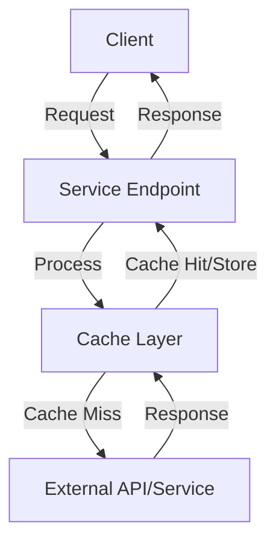

# Cache Service Documentation Template

Use this template when documenting cache services to ensure consistency across all service documentation.

## High-Level Overview

---
description: [One-line description of the service's purpose]
---

# [Service Name]

[1-2 paragraph introduction explaining what this service does and why it matters]

## Key Features

- **[Feature 1]**: [Brief explanation]
- **[Feature 2]**: [Brief explanation]
- **[Feature 3]**: [Brief explanation]

## Service Architecture



[Brief explanation of the architecture]

## Endpoints

| Endpoint | Method | Description |
|----------|--------|-------------|
| `/[path]/[endpoint-1]` | [HTTP Method] | [Brief description] |
| `/[path]/[endpoint-2]` | [HTTP Method] | [Brief description] |

## Request/Response Format

### Request Format

```json
{
  "param1": "value1",
  "param2": "value2"
}
```

### Success Response

```json
{
  "success": true,
  "data": {
    "key1": "value1",
    "key2": "value2"
  }
}
```

### Error Response

```json
{
  "success": false,
  "error": {
    "id": "unique-error-id",
    "code": "ERROR_CODE",
    "message": "Human-readable error message",
    "details": {
      // Optional additional error details
    }
  }
}
```

## Endpoint Details

### [Endpoint 1]

**Purpose**: [What this endpoint does]

**Path**: `/[path]/[endpoint-1]`

**Method**: [HTTP Method]

**Parameters**:
- `[param1]`: [type] - [description]
- `[param2]`: [type] - [description]

**Response**:
```json
{
  "success": true,
  "data": {
    "key1": "value1",
    "key2": "value2"
  }
}
```

**Example Request**:
```bash
curl -X [METHOD] \
  https://cache.aibtc.dev/[path]/[endpoint-1] \
  -H "Content-Type: application/json" \
  -d '{"param1": "value1", "param2": "value2"}'
```

[Additional notes about usage, caching behavior, etc.]

## Integration Examples

### [Example Use Case 1]

```javascript
// JavaScript example
async function exampleFunction() {
  const response = await fetch('https://cache.aibtc.dev/[path]/[endpoint-1]', {
    method: 'POST',
    headers: {
      'Content-Type': 'application/json',
    },
    body: JSON.stringify({
      param1: 'value1',
      param2: 'value2'
    })
  });
  
  const result = await response.json();
  
  if (result.success) {
    return result.data;
  } else {
    throw new Error(`API Error: ${result.error.code} - ${result.error.message}`);
  }
}
```

### [Example Use Case 2]

```python
# Python example
import requests
import json

def example_function():
    url = 'https://cache.aibtc.dev/[path]/[endpoint-1]'
    
    payload = {
        "param1": "value1",
        "param2": "value2"
    }
    
    response = requests.post(
        url,
        headers={'Content-Type': 'application/json'},
        data=json.dumps(payload)
    )
    
    response.raise_for_status()
    result = response.json()
    
    if result.get('success'):
        return result['data']
    else:
        error = result.get('error', {})
        raise Exception(f"API Error: {error.get('code')} - {error.get('message')}")
```

## Error Handling

| Error Code | Description | Resolution |
|------------|-------------|------------|
| `[ERROR_CODE_1]` | [What causes this error] | [How to resolve or avoid] |
| `[ERROR_CODE_2]` | [What causes this error] | [How to resolve or avoid] |

## Caching Behavior

- **Default TTL**: [Time in seconds]
- **Cache Key Generation**: [How cache keys are generated]
- **Cache Busting**: [How to force a fresh request]
- **Custom TTL**: [How to set a custom TTL]

## Performance Considerations

- **Rate Limiting**: [Description of rate limits]
- **Request Queuing**: [How requests are queued]
- **Timeout Handling**: [How timeouts are handled]
- **Retry Strategy**: [How retries are implemented]

## Related Services

- **[Related Service 1]**: [Brief description of relationship]
- **[Related Service 2]**: [Brief description of relationship]
