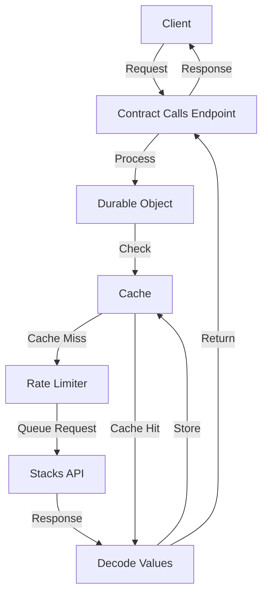

# Contract Calls Service Documentation Example

This is an example of how to apply the cache service documentation template to the Contract Calls service.

```yaml
---
description: Caching layer for interacting with Stacks smart contracts
---
```

# Contract Calls Service

The Contract Calls service provides a caching layer for interacting with Stacks smart contracts. It allows you to make read-only function calls to any Stacks smart contract while benefiting from caching, rate limiting, and automatic retries. This service helps reduce API rate limits, improve performance, and enhance reliability for applications in the AIBTC ecosystem.

## Key Features

- **Caching**: Responses are cached to reduce API calls and improve performance
- **Rate Limiting**: Prevents exceeding Stacks API rate limits
- **Automatic Retries**: Failed requests are automatically retried with exponential backoff
- **Validation**: Contract addresses, functions, and arguments are validated before execution
- **Standardized Responses**: All responses follow a consistent format with success/error handling
- **Error Tracking**: Unique error IDs for easier debugging and tracking

## Service Architecture



The Contract Calls service uses a multi-layered approach:

1. **Request Layer**: Handles incoming requests and routes them to the Durable Object
2. **Durable Object Layer**: Maintains state for rate limiting and caching
3. **Service Layer**: Provides contract fetching, ABI validation, and other services
4. **Utility Layer**: Common utilities for request/response handling and data transformation

## Endpoints

| Endpoint                                                                    | Method | Description                                      |
| --------------------------------------------------------------------------- | ------ | ------------------------------------------------ |
| `/contract-calls/read-only/{contractAddress}/{contractName}/{functionName}` | POST   | Make read-only calls to smart contract functions |
| `/contract-calls/abi/{contractAddress}/{contractName}`                      | GET    | Retrieve the ABI for a smart contract            |
| `/contract-calls/decode-clarity-value`                                      | POST   | Decode Clarity values into JavaScript/JSON       |
| `/contract-calls/known-contracts`                                           | GET    | List all contracts accessed through the cache    |

## Request/Response Format

### Success Response

```json
{
  "success": true,
  "data": {
    // The actual response data
  }
}
```

### Error Response

```json
{
  "success": false,
  "error": {
    "id": "unique-error-id",
    "code": "ERROR_CODE",
    "message": "Human-readable error message",
    "details": {
      // Optional additional error details
    }
  }
}
```

## Caching Behavior

- **Default TTL**: 60 seconds for read-only calls, indefinite for contract ABIs
- **Cache Key Generation**: Based on contract address, contract name, function name, function arguments (hashed), and network
- **Cache Busting**: Set `bustCache: true` in the cacheControl options to force a fresh request
- **Custom TTL**: Set `ttl: seconds` in the cacheControl options to customize the cache duration
- **Skip Caching**: Set `skipCache: true` in the cacheControl options to avoid caching the result

## Performance Considerations

- **Rate Limiting**: Maximum of 20 requests per minute to the Stacks API
- **Request Queuing**: Minimum spacing of 250ms between consecutive requests
- **Timeout Handling**: Default timeout of 5 seconds for all Stacks API calls
- **Retry Strategy**: Automatic retries with exponential backoff (3 retries by default)

## Related Services

- **Contract ABI Service**: Provides contract ABIs for validation and information
- **Clarity Value Decoder**: Converts Clarity values to JavaScript/JSON
- **Known Contracts Registry**: Tracks all contracts accessed through the cache
