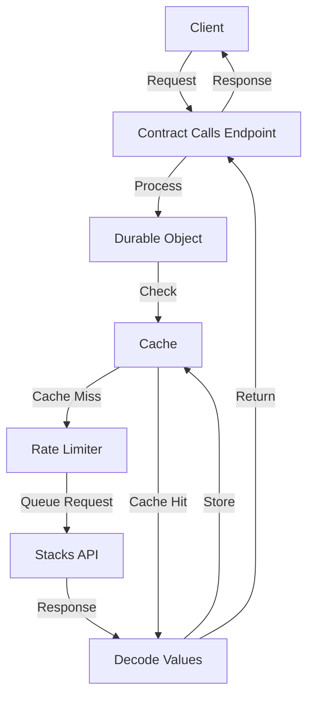

# Contract Calls Service Documentation Example

This is an example of how to apply the cache service documentation template to the Contract Calls service.

---
description: Caching layer for interacting with Stacks smart contracts
---

# Contract Calls Service

The Contract Calls service provides a caching layer for interacting with Stacks smart contracts. It allows you to make read-only function calls to any Stacks smart contract while benefiting from caching, rate limiting, and automatic retries. This service helps reduce API rate limits, improve performance, and enhance reliability for applications in the AIBTC ecosystem.

## Key Features

- **Caching**: Responses are cached to reduce API calls and improve performance
- **Rate Limiting**: Prevents exceeding Stacks API rate limits
- **Automatic Retries**: Failed requests are automatically retried with exponential backoff
- **Validation**: Contract addresses, functions, and arguments are validated before execution
- **Standardized Responses**: All responses follow a consistent format with success/error handling
- **Error Tracking**: Unique error IDs for easier debugging and tracking

## Service Architecture



The Contract Calls service uses a multi-layered approach:
1. **Request Layer**: Handles incoming requests and routes them to the Durable Object
2. **Durable Object Layer**: Maintains state for rate limiting and caching
3. **Service Layer**: Provides contract fetching, ABI validation, and other services
4. **Utility Layer**: Common utilities for request/response handling and data transformation

## Endpoints

| Endpoint | Method | Description |
|----------|--------|-------------|
| `/contract-calls/read-only/{contractAddress}/{contractName}/{functionName}` | POST | Make read-only calls to smart contract functions |
| `/contract-calls/abi/{contractAddress}/{contractName}` | GET | Retrieve the ABI for a smart contract |
| `/contract-calls/decode-clarity-value` | POST | Decode Clarity values into JavaScript/JSON |
| `/contract-calls/known-contracts` | GET | List all contracts accessed through the cache |

## Request/Response Format

### Success Response

```json
{
  "success": true,
  "data": {
    // The actual response data
  }
}
```

### Error Response

```json
{
  "success": false,
  "error": {
    "id": "unique-error-id",
    "code": "ERROR_CODE",
    "message": "Human-readable error message",
    "details": {
      // Optional additional error details
    }
  }
}
```

## Endpoint Details

### Read-Only Function Calls

**Purpose**: Make read-only calls to smart contract functions

**Path**: `/contract-calls/read-only/{contractAddress}/{contractName}/{functionName}`

**Method**: POST

**Parameters**:
- `contractAddress`: (path) The principal address of the contract
- `contractName`: (path) The name of the contract
- `functionName`: (path) The name of the function to call
- `functionArgs`: (body) Array of arguments to pass to the function
- `network`: (body, optional) The Stacks network to use (mainnet/testnet)
- `senderAddress`: (body, optional) The address to use as the sender
- `cacheControl`: (body, optional) Options to control caching behavior

**Response**:
```json
{
  "success": true,
  "data": {
    // The decoded function return value
  }
}
```

**Example Request**:
```bash
curl -X POST \
  https://cache.aibtc.dev/contract-calls/read-only/ST252TFQ08T74ZZ6XK426TQNV4EXF1D4RMTTNCWFA/media3-action-proposals-v2/get-proposal \
  -H "Content-Type: application/json" \
  -d '{"functionArgs": [{ "type": "uint", "value": "3" }]}'
```

The read-only function call endpoint allows you to call any read-only function on any Stacks smart contract. Responses are cached based on the contract address, contract name, function name, and function arguments. You can control caching behavior using the cacheControl options.

## Integration Examples

### JavaScript Example with Error Handling and Retries

```javascript
/**
 * Call a contract function with comprehensive error handling, timeout handling, and retries
 */
async function callContract(
  contractAddress, 
  contractName, 
  functionName, 
  args,
  options = {}
) {
  const {
    network = 'mainnet',
    bustCache = false,
    maxRetries = 3,
    initialRetryDelay = 1000
  } = options;
  
  let retries = 0;
  let delay = initialRetryDelay;
  
  while (true) {
    try {
      const response = await fetch(
        `https://cache.aibtc.dev/contract-calls/read-only/${contractAddress}/${contractName}/${functionName}`,
        {
          method: 'POST',
          headers: {
            'Content-Type': 'application/json',
          },
          body: JSON.stringify({
            functionArgs: args,
            network,
            cacheControl: {
              bustCache: bustCache || retries > 0 // Bust cache on retries
            }
          })
        }
      );
      
      const result = await response.json();
      
      if (result.success) {
        return result.data;
      } else {
        // Determine if we should retry based on error type
        const shouldRetry = 
          (result.error.code === 'UPSTREAM_API_ERROR' && result.error.details?.retryable) ||
          result.error.code === 'TIMEOUT' ||
          result.error.code === 'RATE_LIMIT_EXCEEDED';
        
        if (shouldRetry && retries < maxRetries) {
          retries++;
          delay *= 2; // Exponential backoff
          console.log(`Retrying after error: ${result.error.code} (attempt ${retries}/${maxRetries})`);
          await new Promise(resolve => setTimeout(resolve, delay));
          continue;
        }
        
        throw new Error(`API Error: ${result.error.code} - ${result.error.message}`);
      }
    } catch (error) {
      if (retries < maxRetries) {
        retries++;
        delay *= 2; // Exponential backoff
        console.log(`Retrying after exception (attempt ${retries}/${maxRetries})`);
        await new Promise(resolve => setTimeout(resolve, delay));
        continue;
      }
      throw error;
    }
  }
}

// Example usage
async function getProposal(id) {
  try {
    const result = await callContract(
      'ST252TFQ08T74ZZ6XK426TQNV4EXF1D4RMTTNCWFA',
      'media3-action-proposals-v2',
      'get-proposal',
      [{ type: 'uint', value: id.toString() }],
      { 
        network: 'testnet',
        maxRetries: 3
      }
    );
    console.log('Proposal:', result);
    return result;
  } catch (error) {
    console.error('Failed to get proposal:', error);
    throw error;
  }
}
```

### Python Example with Cache Control

```python
import requests
import json
import time
import random

def call_contract(
    contract_address, 
    contract_name, 
    function_name, 
    args, 
    network='mainnet',
    bust_cache=False,
    custom_ttl=None,
    max_retries=3
):
    """
    Call a read-only contract function with error handling and cache control
    """
    url = f'https://cache.aibtc.dev/contract-calls/read-only/{contract_address}/{contract_name}/{function_name}'
    
    # Build the payload with cache control options if needed
    payload = {
        "functionArgs": args,
        "network": network
    }
    
    # Add cache control options if any are specified
    cache_control = {}
    if custom_ttl is not None:
        cache_control["ttl"] = custom_ttl
    if bust_cache:
        cache_control["bustCache"] = True
        
    if cache_control:
        payload["cacheControl"] = cache_control
    
    retries = 0
    delay = 1.0  # Initial delay in seconds
    
    while True:
        try:
            response = requests.post(
                url,
                headers={'Content-Type': 'application/json'},
                data=json.dumps(payload)
            )
            
            response.raise_for_status()
            result = response.json()
            
            if result.get('success'):
                return result['data']
            else:
                error = result.get('error', {})
                error_code = error.get('code', 'UNKNOWN_ERROR')
                
                # Determine if we should retry based on error type
                should_retry = (
                    error_code == 'UPSTREAM_API_ERROR' or
                    error_code == 'TIMEOUT' or
                    error_code == 'RATE_LIMIT_EXCEEDED'
                )
                
                if should_retry and retries < max_retries:
                    retries += 1
                    delay *= 2  # Exponential backoff
                    # Add some jitter to prevent thundering herd
                    actual_delay = delay * (0.8 + random.random() * 0.4)
                    print(f"Retrying after error: {error_code} (attempt {retries}/{max_retries} after {actual_delay:.2f}s)")
                    time.sleep(actual_delay)
                    continue
                
                raise Exception(f"API Error: {error_code} - {error.get('message')}")
                
        except (requests.exceptions.RequestException, Exception) as e:
            if retries < max_retries:
                retries += 1
                delay *= 2  # Exponential backoff
                actual_delay = delay * (0.8 + random.random() * 0.4)
                print(f"Request failed: {e}, retrying (attempt {retries}/{max_retries} after {actual_delay:.2f}s)")
                time.sleep(actual_delay)
                continue
            raise
```

## Error Handling

| Error Code | Description | Resolution |
|------------|-------------|------------|
| `INVALID_CONTRACT_ADDRESS` | The contract address is not a valid Stacks address | Double-check the contract address format and network prefix |
| `INVALID_FUNCTION` | The function doesn't exist in the contract ABI | Verify the function name against the contract ABI |
| `INVALID_ARGUMENTS` | The arguments don't match what the function expects | Check the contract ABI for the expected argument types |
| `UPSTREAM_API_ERROR` | Error from the Stacks API when calling the function | Implement retry logic with exponential backoff |
| `TIMEOUT` | The request to the Stacks API timed out | Consider using a longer timeout for complex operations |
| `RATE_LIMIT_EXCEEDED` | The rate limit for Stacks API requests has been exceeded | Add rate limiting on your side or implement backoff |

## Caching Behavior

- **Default TTL**: 60 seconds for read-only calls, indefinite for contract ABIs
- **Cache Key Generation**: Based on contract address, contract name, function name, function arguments (hashed), and network
- **Cache Busting**: Set `bustCache: true` in the cacheControl options to force a fresh request
- **Custom TTL**: Set `ttl: seconds` in the cacheControl options to customize the cache duration
- **Skip Caching**: Set `skipCache: true` in the cacheControl options to avoid caching the result

## Performance Considerations

- **Rate Limiting**: Maximum of 20 requests per minute to the Stacks API
- **Request Queuing**: Minimum spacing of 250ms between consecutive requests
- **Timeout Handling**: Default timeout of 5 seconds for all Stacks API calls
- **Retry Strategy**: Automatic retries with exponential backoff (3 retries by default)

## Related Services

- **Contract ABI Service**: Provides contract ABIs for validation and information
- **Clarity Value Decoder**: Converts Clarity values to JavaScript/JSON
- **Known Contracts Registry**: Tracks all contracts accessed through the cache
