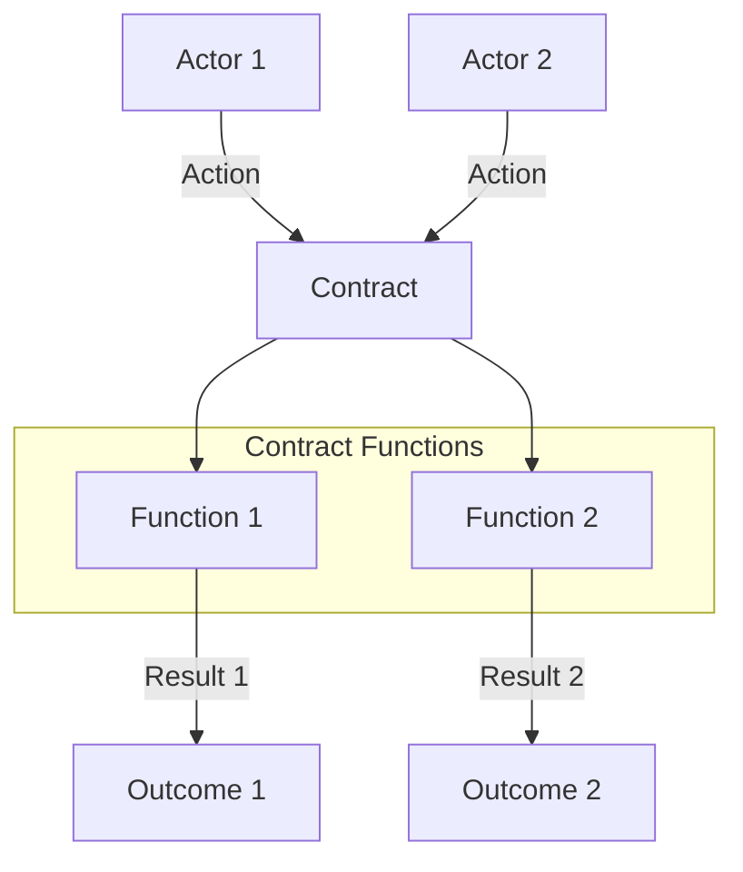

# Smart Contract Documentation Template

Use this template when documenting smart contracts to ensure consistency across all contract documentation.

## High-Level Overview

```yaml
---
description: [One-line description of the contract's purpose]
---
```

# [Contract Name]

[1-2 paragraph introduction explaining what the contract does and why it matters]

## Key Features

- **[Feature 1]**: [Brief explanation]
- **[Feature 2]**: [Brief explanation]
- **[Feature 3]**: [Brief explanation]

## Quick Reference

| Property       | Value                           |
| -------------- | ------------------------------- |
| Contract Name  | `[contract-name]`               |
| Version        | [version number]                |
| Implements     | [traits implemented]            |
| Key Parameters | [important configurable values] |

## How It Works



[Brief explanation of the workflow]

## Public Functions

### `[function-name]`

**Purpose**: [What this function does]

**Parameters**:

- `[param1]`: [type] - [description]
- `[param2]`: [type] - [description]

**Returns**: [return type] - [description]

**Example**:

```clarity
(contract-call? .[contract-name] [function-name] [example-params])
```

[Additional notes about usage, security considerations, etc.]

## Read-Only Functions

### `[function-name]`

**Purpose**: [What this function does]

**Parameters**:

- `[param1]`: [type] - [description]
- `[param2]`: [type] - [description]

**Returns**: [return type] - [description]

**Example**:

```clarity
(contract-call? .[contract-name] [function-name] [example-params])
```

## Print Events

| Event          | Description                | Data                         |
| -------------- | -------------------------- | ---------------------------- |
| `[event-name]` | [What triggers this event] | [Data included in the event] |

## Integration Examples

### [Example Use Case 1]

```clarity
;; Example of how to use this contract for a specific purpose
(contract-call? .[contract-name] [function-name] [params])
```

### [Example Use Case 2]

```clarity
;; Another example showing a different use case
(contract-call? .[contract-name] [function-name] [different-params])
```

## Error Handling

| Error Code | Constant     | Description              | Resolution                |
| ---------- | ------------ | ------------------------ | ------------------------- |
| u[code]    | [ERROR_NAME] | [What causes this error] | [How to resolve or avoid] |

## Security Considerations

- **[Security Feature 1]**: [Explanation]
- **[Security Feature 2]**: [Explanation]
- **[Security Risk 1]**: [Explanation and mitigation]

## Related Contracts

- **[Related Contract 1]**: [Brief description of relationship]
- **[Related Contract 2]**: [Brief description of relationship]

## Review Checklist

Before submitting documentation:

- [ ] Follows the appropriate template structure
- [ ] Includes all required sections
- [ ] Has exactly one H1 title
- [ ] YAML frontmatter is at the top with description
- [ ] Introduction follows immediately after title
- [ ] Heading levels are used correctly (H1 → H2 → H3)
- [ ] Code examples are complete and functional with language identifiers
- [ ] Tables have clear headers and consistent formatting
- [ ] Contract diagram has explanation
- [ ] Links to related documentation are correct
- [ ] No spelling or grammatical errors
- [ ] Technical accuracy has been verified
- [ ] Examples use realistic values
- [ ] Security considerations are addressed comprehensively
- [ ] Error codes and handling are documented
- [ ] Content is accessible to the target audience

## Versioning and Updates

- Note when documentation was last updated
- Indicate which version of the contract the documentation applies to
- Highlight significant changes from previous versions
- Maintain backward compatibility information where relevant
